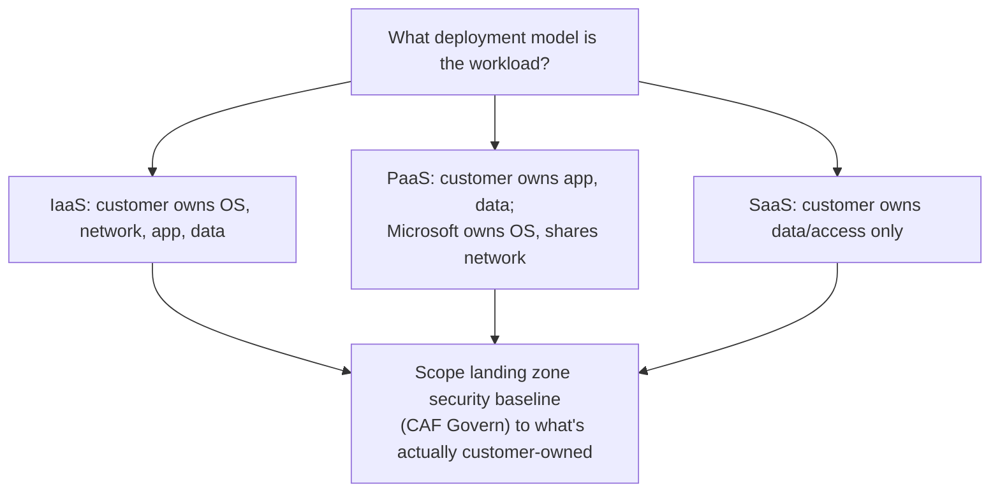

---
tags:
  - sc100
type: concept
domain:
  - infrastructure
status: needs-verification
---
# Shared Responsibility Model

## Purpose

The customer/Microsoft ownership split across on-premises, IaaS, PaaS, and SaaS — the accountability baseline every other control-ownership decision in this vault assumes.

---

## Why Architects Choose It

- It's the single source of truth for "who configures this control" — this vault repeatedly splits responsibility per deployment model (e.g., NSGs/JIT for IaaS vs. Private Link/managed identity for PaaS in [[Securing IaaS and PaaS Services]]); this note is where that split is defined once instead of re-derived per service.
- [[Cloud Adoption Framework (CAF)|CAF]]'s Govern **Security Baseline** discipline assumes this model — a landing zone's enforced policy set only needs to cover what the customer actually owns at each deployment layer present in the estate.
- Compliance scoping (Compliance Manager, regulatory assessments — see [[Compliance and Privacy]]) explicitly maps controls to "Microsoft-managed" vs. "customer-managed." Misreading the split produces either an audit gap (assuming Microsoft covers something it doesn't) or a wasted control (duplicating something Microsoft already handles).
- Moving a workload up the stack (VM → App Service → SaaS) reduces the customer's *operational* burden but never its accountability for data, identity, and access — a distinction the exam tests directly.

---

## When to Use

- Scoping which controls a landing zone's security baseline must enforce, across a mixed IaaS/PaaS/SaaS estate.
- Explaining to a compliance stakeholder why a specific control (e.g., OS patching) is or isn't the customer's job for a given resource type.
- Justifying a migration's security posture claim — moving from IaaS to PaaS removes OS/runtime patching from the customer's plate, but not data governance.

---

## When NOT to Use

- As a reason to under-invest in the controls the customer *does* own at that layer — the model defines the split, it doesn't shrink the customer's actual obligations.
- Confusing "Microsoft secures the platform" with "Microsoft secures your data on the platform" — data, identity, and access management stay customer-owned at every deployment model, including SaaS.

---

## Architecture

| Responsibility | On-premises | IaaS | PaaS | SaaS |
| --- | --- | --- | --- | --- |
| Data, endpoints, accounts, access management | Customer | Customer | Customer | Customer |
| Identity and directory infrastructure | Customer | Customer | Customer | Shared |
| Applications | Customer | Customer | Customer | Microsoft |
| Network controls | Customer | Customer | Shared | Microsoft |
| Operating system | Customer | Customer | Microsoft | Microsoft |
| Physical hosts / network / datacenter | Customer | Microsoft | Microsoft | Microsoft |

- The top row never moves — data and access are always the customer's job, regardless of deployment model. This is the row the exam tests most, because it's the one intuition gets wrong.
- The bottom row is the mirror image — physical infrastructure is Microsoft's job the moment a workload leaves on-premises, regardless of deployment model.
- Everything in between (identity infra, application, network, OS) is where responsibility actually shifts as you move up the stack — this is what [[Securing IaaS and PaaS Services]] operationalizes into concrete controls (NSG/JIT vs. Private Link/managed identity).

---

## Architecture Decisions

---

## Comparison

| Compare | Difference |
| --- | --- |
| IaaS vs. PaaS | Customer stops owning OS/runtime patching moving from IaaS to PaaS — Microsoft manages the host, OS, and runtime; the customer still owns the application, data, and identity. |
| PaaS vs. SaaS | Customer stops owning application code/runtime moving from PaaS to SaaS — Microsoft owns the entire application; the customer still owns data, access, and (for identity infra) a shared responsibility. |
| Shared Responsibility Model vs. [[Zero Trust]] | The model defines *who* configures a given control by deployment layer; Zero Trust defines *how* every configured control should behave (verify explicitly, least privilege, assume breach) — orthogonal, not competing. |
| Shared Responsibility Model vs. CAF Govern Security Baseline | The model defines the ownership boundary; CAF's Security Baseline discipline (see [[Cloud Adoption Framework (CAF)]]) is the concrete policy enforcement of the customer's portion of that boundary. |

---

## AZ-500 Review

AZ-500 (and typically AZ-900/SC-900 before it) already assumes this model as prerequisite knowledge — it's foundational, not new. This note is a deliberately short refresher; the SC-100 addition is *applying* it to landing zone/governance scoping decisions across a mixed-deployment-model estate, not the model itself.

---

## What's New for SC-100

- Use the model to scope a landing zone's security baseline to what the customer actually owns at each deployment type present in the estate — an explicit governance design input (see [[Cloud Adoption Framework (CAF)]]'s Govern methodology), not a slide to memorize.
- Apply it across a *mixed* IaaS/PaaS/SaaS estate rather than one deployment model at a time — a scenario naming several deployment types expects a baseline scoped per type, not one uniform policy.
- Extend the same top-row/bottom-row logic to AI workloads — see [[AI and Copilot Security Architecture]]'s AI Shared Responsibility section for how it maps onto Microsoft 365 Copilot, Azure OpenAI/AI Foundry, and customer-hosted models specifically.

---

## Exam Tips

- "Who patches the OS?" → depends on deployment model: customer for IaaS, Microsoft for PaaS/SaaS.
- "Who is responsible for data classification and access control?" → always the customer, at every deployment model, including SaaS — a frequent distractor implies Microsoft manages data governance once a workload is fully SaaS.
- A scenario mixing IaaS, PaaS, and SaaS workloads expects a security baseline scoped per deployment model, not one uniform policy set applied everywhere.

---

## Common Exam Confusion

- **Shared Responsibility Model vs. Zero Trust** — who owns a control vs. how every control should behave; see Comparison above.
- **"Microsoft manages the platform" vs. "Microsoft manages your data"** — physical/platform ownership never extends to data, identity, or access, at any deployment model.

---

## Keywords

- Shared Responsibility Model
- On-premises vs. IaaS vs. PaaS vs. SaaS
- Data and identity always customer-owned
- Physical infrastructure always Microsoft-owned (cloud)
- Landing zone security baseline scoping

---

## Related Services

- [[Securing IaaS and PaaS Services]]
- [[Cloud Adoption Framework (CAF)]]
- [[Zero Trust]]
- [[AI and Copilot Security Architecture]]
- [[Azure Landing Zones]]
- [[Security Posture Assessments]]
- [[Compliance and Privacy]]

---

## References

- [Shared responsibility in the cloud](https://learn.microsoft.com/en-us/azure/security/fundamentals/shared-responsibility) — Microsoft Learn
- [[Exam Objectives]]

---

## Verification Flag

The responsibility table is transcribed from training-knowledge recall of Microsoft's standard shared-responsibility diagram, not a live re-read of the current Learn page — re-verify row groupings and exact wording against [Shared responsibility in the cloud](https://learn.microsoft.com/en-us/azure/security/fundamentals/shared-responsibility) before treating it as exam-final.
