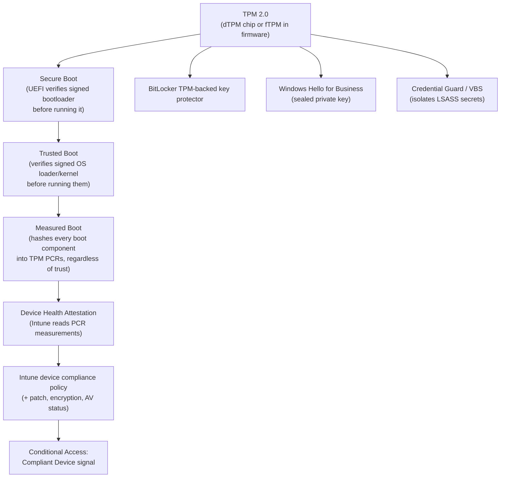
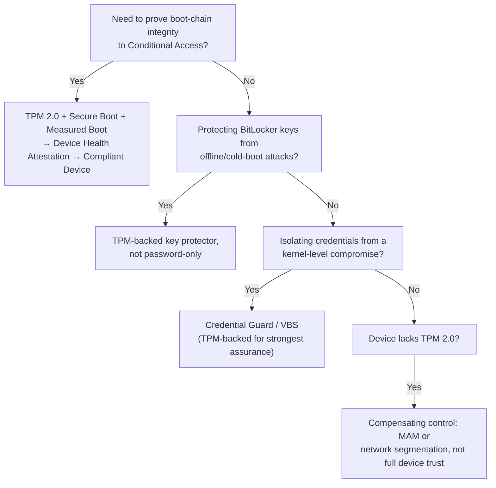

---
tags:
  - sc100
---
# Trusted Platform Module (TPM)

## Purpose

The hardware root of trust that anchors device integrity attestation — the foundation Secure Boot, Measured Boot, BitLocker, Windows Hello for Business, and Credential Guard all build on, and the first link in the chain that ultimately produces the Conditional Access compliant-device signal.

---

## Why Architects Choose It

- Software-only attestation can be spoofed by a compromised OS reporting on itself; a TPM is a discrete (dTPM) or firmware-based (fTPM) component that stores keys and boot measurements outside the OS's reach, so a compromised OS can't lie about its own integrity.
- It's the hardware prerequisite for Credential Guard/Virtualization-Based Security (VBS), which isolate credential material (LSASS secrets) even from a kernel-level compromise — without it, protection falls back to a weaker, software-only level.
- TPM 2.0 is a baseline hardware requirement Microsoft ties directly into the current OS baseline (Windows 11) — architecturally, "no TPM" now means "can't run the current baseline," not just "reduced security posture."
- Feeds real signal into [[Zero Trust]]'s "verify explicitly" principle for the Endpoints pillar — a device-compliance check in [[Conditional Access]] is only as trustworthy as the attestation chain underneath it, and that chain starts at the TPM, not at the compliance policy itself.

---

## When to Use

- Any scenario requiring proof a device's boot chain wasn't tampered with before granting access — the hardware layer backing "Require compliant device" in [[Conditional Access]].
- Protecting BitLocker volume encryption keys — a TPM-backed key protector releases the key automatically only if boot measurements match expected values, with no PIN prompt on an untampered device, and refuses to release it silently if they don't.
- Enabling Windows Hello for Business — the private key for biometric/PIN sign-in is generated and sealed inside the TPM when one is present, never exportable from it.
- Enabling Credential Guard/VBS to isolate LSASS secrets from kernel-level malware — TPM-backed key protection gives this the strongest assurance level.

---

## When NOT to Use

- Treating TPM presence alone as "the device is secure" — TPM proves the boot chain wasn't tampered with; it says nothing about patch level, malware presence, or app-level risk, which still need Intune compliance policy and Defender for Endpoint.
- Assuming TPM state alone satisfies "Require compliant device" — Conditional Access checks the Intune compliance *policy result*, which takes attestation as one input alongside patch status, encryption, and antivirus health, not TPM by itself.
- Legacy/off-lease hardware without TPM 2.0 — compensating controls (MAM instead of full device trust, tighter network segmentation) are the fallback design, not a Zero Trust violation on their own; see [[Securing Server and Client Endpoints]].

---

## Architecture

---

## Architecture Decisions

---

## Comparison

| Compare | Difference |
| --- | --- |
| Secure Boot vs. Trusted Boot vs. Measured Boot | Secure Boot: UEFI firmware verifies the bootloader's signature *before* running it — blocks unsigned/malicious bootloaders outright. Trusted Boot: continues the same verify-before-running model into the OS loader and kernel. Measured Boot: records a cryptographic hash of *every* boot component into TPM PCRs regardless of whether it was trusted or blocked, so a remote attester can later verify exactly what booted — detection/evidence, not gatekeeping. Three complementary stages, often conflated into one. |
| TPM-backed BitLocker vs. password-only BitLocker | TPM-backed releases the key automatically if boot measurements match — transparent to the user, and tamper-evident (a changed boot chain blocks release). Password-only requires manual entry every boot and verifies nothing about boot integrity — TPM adds tamper detection, not just convenience. |
| Device Health Attestation vs. Intune device compliance policy | Device Health Attestation is the narrow TPM/boot-integrity check itself. Device compliance is the broader Intune policy result that combines attestation with patch level, disk encryption, and antivirus status — attestation is one input into compliance, not the whole policy, and it's what actually feeds [[Conditional Access]]'s Compliant Device signal. |
| fTPM vs. dTPM | fTPM (firmware TPM, e.g., Intel PTT, AMD fTPM) runs inside CPU firmware — cheaper, no separate chip. dTPM (discrete TPM) is a physically separate, tamper-resistant chip — higher assurance against physical/hardware-level attacks. Both satisfy the TPM 2.0 requirement; dTPM is the higher-assurance choice for high-security scenarios. |

---

## AZ-500 Review

AZ-500 covers BitLocker and Windows Hello for Business at a configuration level (enabling them, setting policy) and basic Intune device compliance policy creation. It does not cover TPM's role as the underlying hardware root of trust, the Secure Boot/Trusted Boot/Measured Boot chain, or how attestation output specifically becomes the Conditional Access compliant-device signal — that architectural chain is new for SC-100.

---

## What's New for SC-100

- Treat TPM/Secure Boot/Measured Boot as the **foundation** of the device-compliance signal Conditional Access consumes — not an isolated device setting, but the first link in a chain that ends in an identity-layer access decision.
- Recognize TPM 2.0 as a hard baseline tied to current OS/device architecture decisions (Windows 11, Credential Guard/VBS), not an optional hardening add-on.
- Design the compensating-control path explicitly for devices that can't meet the TPM 2.0 baseline (older hardware, some IoT/OT) rather than treating device trust as binary pass/fail across an entire estate.
- *(Verify before the exam: current exact hardware requirements for Credential Guard/VBS assurance levels and any Windows/Intune attestation changes — Microsoft revises these periodically.)*

---

## Exam Tips

- "Prove a device's boot chain wasn't tampered with before granting access" → TPM + Secure Boot + Measured Boot feeding Device Health Attestation, not antivirus status alone.
- "BitLocker key should release automatically only if the device hasn't been tampered with" → TPM-backed key protector, not a password-only protector.
- "Isolate LSASS/credential material from a kernel-level compromise" → Credential Guard/VBS, which depends on TPM for its strongest protection level.
- Don't treat "device has a TPM" as equivalent to "device is compliant" — compliance is the broader Intune policy result; TPM attestation is one input into it.

---

## Common Exam Confusion

- **Secure Boot vs. Trusted Boot vs. Measured Boot** — verify-before-running (twice, firmware then OS stage) vs. record-regardless-for-later-verification; full breakdown above.
- **TPM attestation vs. Intune device compliance policy** — one hardware signal vs. the aggregate policy result Conditional Access actually checks.
- **fTPM vs. dTPM** — firmware-based vs. discrete chip; both meet the TPM 2.0 baseline, different physical-attack assurance level.

---

## Keywords

- Trusted Platform Module (TPM), TPM 2.0
- Secure Boot, Trusted Boot, Measured Boot
- Platform Configuration Registers (PCRs)
- Device Health Attestation
- BitLocker TPM-backed key protector
- Windows Hello for Business (TPM-sealed key)
- Credential Guard, Virtualization-Based Security (VBS)
- fTPM vs. dTPM, hardware root of trust
- Conditional Access compliant device signal

---

## Related Services

- [[Securing Server and Client Endpoints]]
- [[Zero Trust]]
- [[Conditional Access]]
- [[Intune]]
- [[Identity and Access Management (IAM)]]
- [[Identity as the Security Perimeter]]

---

## References

- [Trusted Platform Module technology overview](https://learn.microsoft.com/en-us/windows/security/hardware-security/tpm/trusted-platform-module-overview) — Microsoft Learn
- [Secure Boot and Trusted Boot](https://learn.microsoft.com/en-us/windows/security/operating-system-security/system-security/secure-the-windows-boot-process) — Microsoft Learn
- [Device Health Attestation](https://learn.microsoft.com/en-us/windows/security/hardware-security/how-hardware-based-root-of-trust-helps-protect-windows) — Microsoft Learn
- [BitLocker overview](https://learn.microsoft.com/en-us/windows/security/operating-system-security/data-protection/bitlocker/) — Microsoft Learn
- [[Exam Objectives]]
