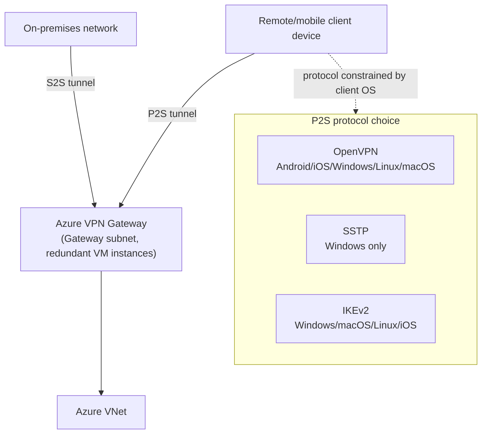
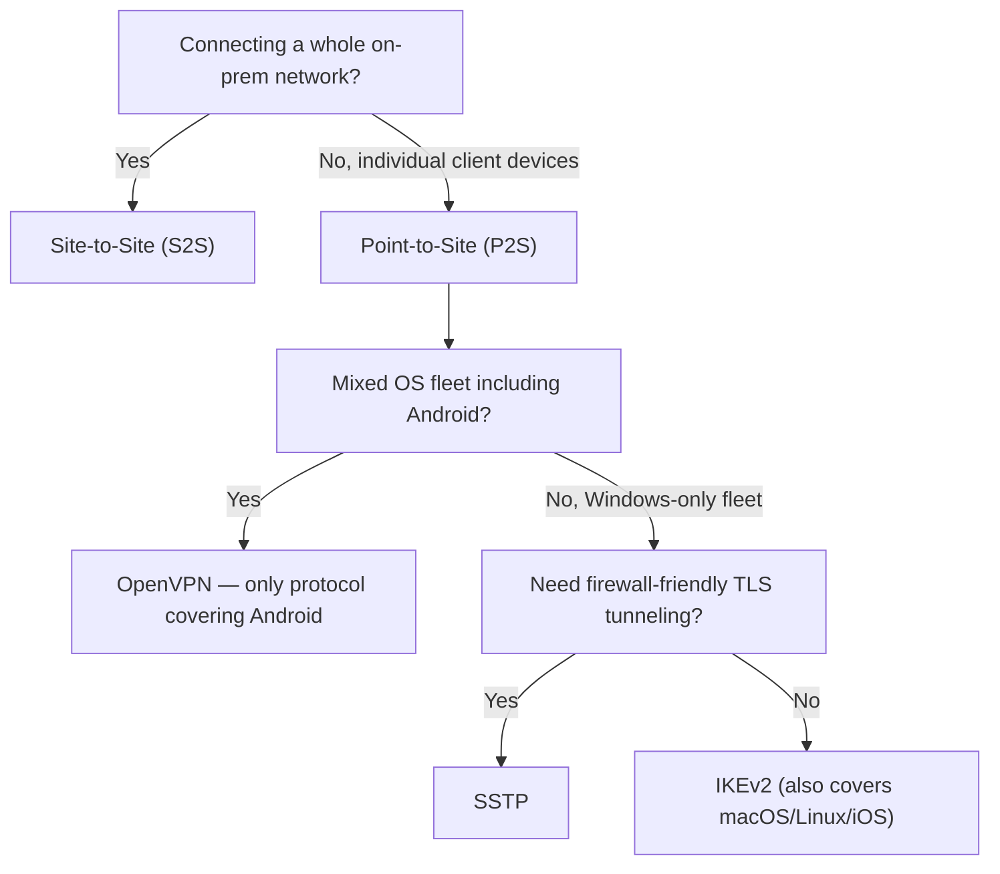

---
tags:
  - sc100
type: concept
domain:
  - infrastructure
aliases:
  - Azure VPN Gateway
  - Point-to-Site VPN
  - P2S
  - Site-to-Site VPN
  - S2S
---

# VPN Gateway

## Purpose

Azure VPN Gateway's two connectivity models — Site-to-Site (network-to-network) and Point-to-Site (client-to-network) — and which tunneling protocol each P2S client OS can actually use, a frequently tested per-OS matrix.

---

## Why Architects Choose It

- A fully-managed VPN gateway (deployed as redundant VMs in a dedicated Gateway subnet) removes the operational burden of running/patching VPN appliances, consistent with the "managed over self-hosted" theme running through [[Securing IaaS and PaaS Services]].
- P2S protocol choice isn't a preference — it's constrained by the client OS. Recommending SSTP for a mixed Android/iOS/Linux fleet simply won't connect those clients; the exam tests whether you know the constraint, not just that VPN Gateway "supports P2S."
- VPN Gateway is the remote-access architecture answer when full Zero Trust per-app access ([[Identity as the Security Perimeter|Entra Private Access]]) isn't yet the target state — a mobile workforce migrating off branch offices (as in the CompanyA-style scenario) may still need classic network-layer P2S during transition.
- Scales client load without manual resizing — Gateway SKU governs both S2S tunnel count and aggregate P2S throughput, a capacity-planning decision distinct from protocol choice.

---

## When to Use

- Connecting an on-premises network to an Azure VNet over the public internet without a private circuit — **Site-to-Site (S2S)**.
- Connecting individual remote/mobile client devices directly to an Azure VNet — **Point-to-Site (P2S)** — the CompanyA "gradually mobile workforce" pattern.
- A mixed-OS client fleet (Windows, macOS, iOS, Android, Linux) needing the broadest P2S protocol compatibility — **OpenVPN**.
- Legacy Windows-only client fleets where TLS-based firewall traversal matters — **SSTP**.
- Cross-platform clients (Windows, macOS, Linux, iOS, Android — **not** the broadest, see matrix) needing a fast, resilient, auto-reconnecting tunnel — **IKEv2**.

---

## When NOT to Use

- Recommending SSTP for any non-Windows client — it is Windows-only.
- Assuming IKEv2 covers every OS — Android support is not part of the core IKEv2 P2S set the exam tests (see matrix); don't over-claim its reach the way OpenVPN's is claimed.
- Treating VPN Gateway P2S as the long-term Zero Trust answer for BYOD/mobile-first strategies — it's flat network-layer access once connected; [[Identity as the Security Perimeter|Entra Private Access]] is the per-app ZTNA replacement architects should be migrating toward.
- Using VPN Gateway for predictable, high-throughput, low-latency connectivity at scale — that's ExpressRoute's use case, not a P2S/S2S internet-tunneled connection.

---

## P2S Protocol Support by OS

| Protocol | Supported client OS |
| --- | --- |
| **OpenVPN** | Android, iOS, Windows, Linux, macOS — the broadest client compatibility of the three. |
| **SSTP (Secure Socket Tunneling Protocol)** | **Windows only.** TLS-based; traverses firewalls well since it looks like ordinary HTTPS traffic. |
| **IKEv2 VPN** | Windows, macOS, Linux, iOS. |

**Exam trap pattern**: statements claiming a protocol is broader or narrower than its actual OS list are the standard "select Yes/No" distractor — verify against this table literally rather than by intuition (e.g., "only Windows and macOS can use IKEv2" is false once Linux/iOS are in scope).

---

## Architecture

---

## Architecture Decisions

---

## Comparison

| Compare | Difference |
| --- | --- |
| **Site-to-Site vs. Point-to-Site** | S2S connects an entire on-prem network (via an on-prem VPN device) to the Azure VNet — many users, one tunnel. P2S connects one client device directly to the VNet — no on-prem VPN device required, used for individual remote/mobile users. |
| **VPN Gateway vs. ExpressRoute** | VPN Gateway tunnels over the public internet (encrypted, variable latency/throughput). ExpressRoute is a private circuit via a connectivity provider (predictable latency/throughput, not internet-routed) — the choice when SLA-grade bandwidth matters more than setup speed. |
| **OpenVPN vs. SSTP vs. IKEv2** | OpenVPN: broadest OS support (includes Android). SSTP: Windows-only, TLS-based, firewall-friendly. IKEv2: strong resume/reconnect behavior, covers Windows/macOS/Linux/iOS but not Android. |
| **VPN Gateway P2S vs. Entra Private Access** | P2S is flat network-layer access to the VNet once connected — classic VPN trust model. Private Access is per-app, per-protocol, Conditional-Access-evaluated on every request — the Zero Trust replacement (see [[Identity as the Security Perimeter]]). |

---

## AZ-500 Review

AZ-500 covers deploying and configuring VPN Gateway (S2S/P2S setup, gateway SKUs, basic troubleshooting) at the implementation level. It doesn't test the P2S protocol-to-OS compatibility matrix as an architectural decision point, or where VPN Gateway sits relative to the Zero Trust identity-perimeter shift — both are the SC-100 layer added here.

---

## What's New for SC-100

- Treat P2S protocol selection as a client-OS-driven design decision, not a default/preference choice — memorize the matrix rather than reasoning from "OpenVPN sounds modern."
- Position VPN Gateway P2S as a transitional/legacy network-layer control relative to [[Identity as the Security Perimeter|Entra Private Access]] when a scenario is explicitly migrating toward Zero Trust remote access.
- Recognize the classic "hybrid migration, branch offices going fully mobile" scenario shape as a VPN Gateway P2S protocol-matching question, distinct from a Global Secure Access ZTNA-replacement question — check whether the scenario asks "which protocol" (VPN Gateway) or "how do we replace VPN" (Private Access).

---

## Exam Tips

- Memorize: **OpenVPN = all five** (Android, iOS, Windows, Linux, macOS). **SSTP = Windows only.** **IKEv2 = Windows, macOS, Linux, iOS** (no Android).
- A true/false or Yes/No statement about protocol-OS support should be checked against the table directly — these questions are designed to include one plausible-sounding but wrong claim per statement (e.g., overstating SSTP's reach, or omitting Linux/iOS from IKEv2).
- "Which protocol supports Android P2S clients" always resolves to OpenVPN — it's the only one of the three that does.
- Don't confuse this with Global Secure Access/Entra Private Access questions — if the scenario asks about replacing VPN with Zero Trust access rather than which tunneling protocol to configure, the answer lives in [[Identity as the Security Perimeter]], not here.

---

## Common Exam Confusion

- **Site-to-Site vs. Point-to-Site** — whole network vs. individual client; see Comparison table.
- **OpenVPN vs. IKEv2 OS coverage** — both are cross-platform, but only OpenVPN includes Android; a scenario requiring Android support that picks IKEv2 is a common wrong answer.
- **VPN Gateway vs. ExpressRoute** — internet-tunneled encrypted connectivity vs. private, provider-delivered circuit; see Comparison table.
- **VPN Gateway P2S vs. Entra Private Access (ZTNA)** — legacy flat network access vs. modern per-app Zero Trust access; a scenario explicitly framed around Zero Trust migration wants Private Access, not a VPN Gateway redesign.

---

## Keywords

- Site-to-Site (S2S) VPN, Point-to-Site (P2S) VPN
- OpenVPN, SSTP (Secure Socket Tunneling Protocol), IKEv2
- Gateway subnet, VPN Gateway SKU
- P2S client OS compatibility: Android, iOS, Windows, Linux, macOS
- ExpressRoute vs. VPN Gateway
- Mobile/remote workforce connectivity

---

## Related Services

- [[Network Security Architecture]]
- [[Identity as the Security Perimeter]]
- [[Azure Firewall]]
- [[Private Link]]
- [[Securing IaaS and PaaS Services]]
- [[Azure Bastion]]
- [[Shared Responsibility Model]]

---

## References

- [What is OpenVPN?](https://openvpn.net/) — referenced via Microsoft Learn P2S documentation
- [About Point-to-Site VPN](https://learn.microsoft.com/en-us/azure/vpn-gateway/point-to-site-about) — Microsoft Learn
- [What is Azure VPN Gateway?](https://learn.microsoft.com/en-us/azure/vpn-gateway/vpn-gateway-about-vpngateways) — Microsoft Learn
