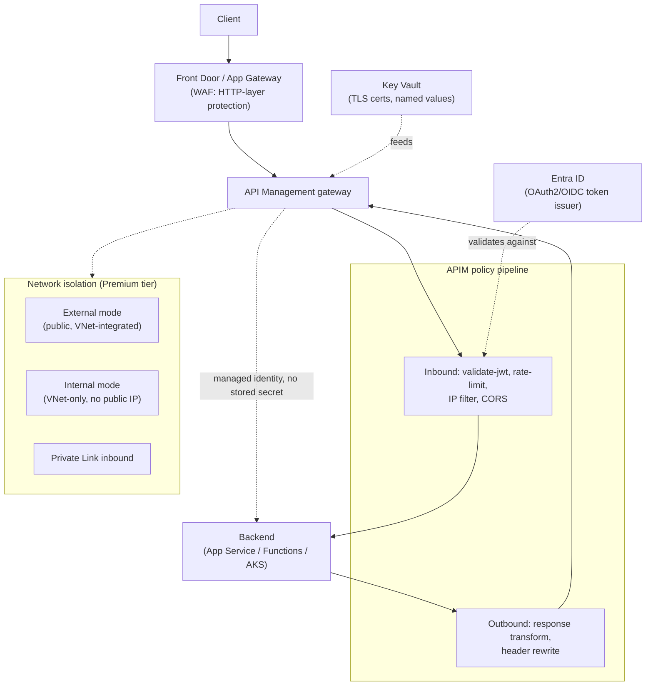
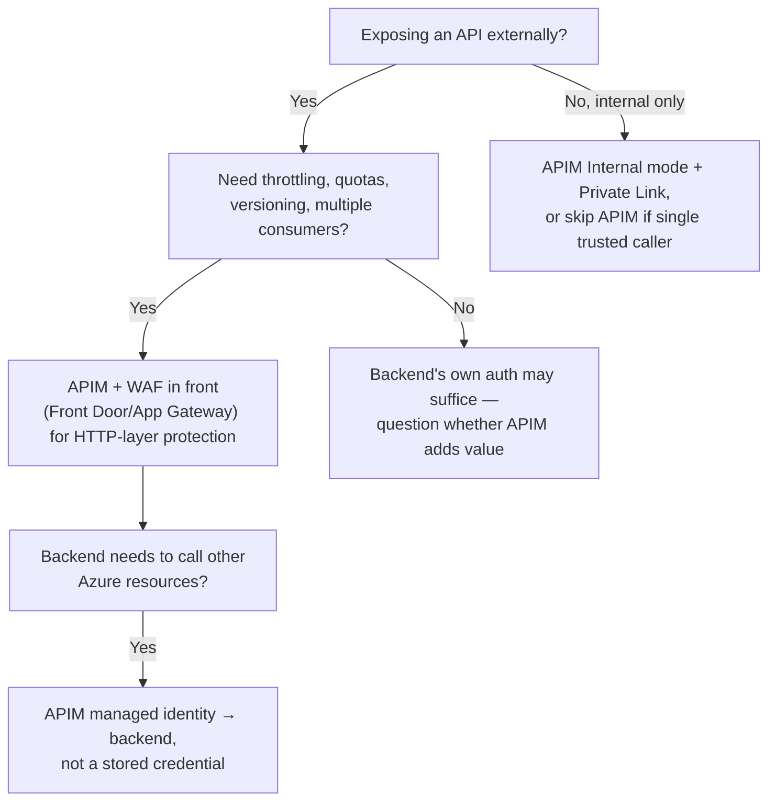

---
tags:
  - sc100
type: concept
domain:
  - apps-data
aliases:
  - APIM
status: needs-verification
---
# API Management and Security

## Purpose

Architecting the API gateway layer — Azure API Management (APIM) — as the policy enforcement point for API-specific authN/authZ, throttling, and lifecycle control in front of backend APIs, distinct from HTTP-layer attack protection ([[Azure Web Application Firewall]]) and from backend-to-Azure authentication ([[Identity and Access Management (IAM)]]).

---

## Why Architects Choose It

- Centralizes API-specific policy (token validation, rate limiting, IP filtering, request/response transformation) in one gateway instead of duplicating it inside every backend service.
- Decouples security policy from application code — a policy change (revoke a key, tighten a rate limit, rotate the JWT issuer) ships without redeploying the backend.
- Integrates natively with [[Entra ID]] for OAuth2/OIDC token validation and with [[Key Vault]] for TLS certificates and secrets referenced in policies — no credential material lives in the gateway config itself.
- Gives per-consumer visibility (products, subscriptions, analytics) that a bare backend endpoint can't produce on its own — necessary once an API has external or third-party consumers.

---

## When to Use

- Publishing an API to external or third-party consumers who need throttling, quotas, versioning, or a developer portal.
- Centralizing OAuth2/OIDC token validation (`validate-jwt` policy against Entra ID) instead of every backend service validating tokens independently.
- Fronting multiple backend versions/revisions behind one stable consumer-facing contract.
- Needing a policy injection point — CORS, IP allow/deny, request/response rewriting — without touching backend code.
- Publishing internal-only APIs privately, with no public exposure — **Internal** VNet mode + Private Link inbound (Premium tier).

---

## When NOT to Use

- Simple, single-consumer service-to-service calls where mutual [[Identity and Access Management (IAM)|workload identity]] plus network restriction ([[Private Link]]) is sufficient — APIM adds cost and an operational layer not justified by one internal caller.
- As a substitute for [[Azure Web Application Firewall|WAF]]'s HTTP-layer attack protection (SQLi, XSS, OWASP Top 10) — APIM governs API-specific concerns, not payload-level exploit detection; pair the two, don't choose one instead of the other.
- Treating a subscription key as authentication — it identifies a caller for quota/analytics purposes, but it's not proof of identity; that's what OAuth2/JWT validation is for.

---

## Architecture

---

## Architecture Decisions

---

## Comparison

| Compare | Difference |
| --- | --- |
| API Management vs. [[Azure Web Application Firewall\|Azure WAF]] | APIM governs API-specific concerns — authN/authZ, throttling, quotas, versioning, request/response transformation — at the API contract layer. WAF protects against HTTP-layer exploits (SQL injection, XSS, OWASP Top 10) at the payload layer. Complementary and commonly layered: WAF (via Front Door/App Gateway) in front of APIM, not instead of it. |
| Subscription key vs. OAuth2/JWT validation | A subscription key identifies *which registered consumer* is calling, for quota tracking and analytics — it is not proof of identity and is trivially shared/leaked. OAuth2/JWT validation (`validate-jwt` policy against Entra ID) is actual authentication/authorization. A scenario needing real access control needs the latter; the former alone is a common exam trap. |
| APIM vs. [[Front Door and Application Gateway]] | Front Door/App Gateway are global/regional L7 reverse proxies and load balancers, with WAF attached — they route and protect traffic generically. APIM is an API lifecycle and policy gateway — versioning, products, developer portal, per-operation policy. Often layered together: Front Door/App Gateway (edge, WAF) → APIM (API policy) → backend. |
| APIM managed identity vs. stored backend credential | APIM can call backend services (or Azure resources like Key Vault) using its own system- or user-assigned managed identity — no stored secret in the policy config. A backend requiring a static API key/connection string from APIM reintroduces exactly the standing-credential risk [[Identity and Access Management (IAM)]] argues against. |

---

## AZ-500 Review

AZ-500 does not cover Azure API Management as a named service or architecture decision — it's outside AZ-500's scope. Basic API security concepts (OAuth2 flows, token validation) are assumed from general identity knowledge, but APIM's gateway architecture, tier/deployment-mode selection, and policy design are entirely new for SC-100.

---

## What's New for SC-100

- Treat APIM as the architectural decision point for API security posture — tier and deployment mode (external/internal/none) chosen based on network isolation and multi-region requirements, not just "add API Management."
- Recommend pairing APIM with WAF (Front Door/App Gateway) for defense in depth — API-contract policy and HTTP-payload protection are different layers, both needed for internet-facing APIs.
- Default to APIM's own managed identity for backend/Azure-resource calls, consistent with the credential-elimination pattern in [[Identity and Access Management (IAM)]].
- Recognize subscription keys as an identification/quota mechanism, not an authentication control — a frequent scenario-matching trap.

---

## Exam Tips

- "Centralize OAuth validation and throttling across multiple published APIs" → API Management, not per-backend implementation.
- "Publish an API for external partners with usage quotas and a developer portal" → APIM.
- "Publish an internal API with no public exposure" → APIM Internal mode + Private Link, not a publicly-routable External deployment locked down after the fact.
- A scenario relying on a subscription key alone for access control is under-secured — the correct answer adds OAuth2/JWT validation.
- "APIM needs to call a backend or Key Vault without a stored secret" → APIM's managed identity.

---

## Common Exam Confusion

- **API Management vs. Azure WAF** — API contract/policy layer vs. HTTP payload attack protection; see Comparison table.
- **Subscription key vs. OAuth2/JWT validation** — consumer identification/quota vs. actual authentication.
- **APIM vs. Front Door/Application Gateway** — API lifecycle gateway vs. generic L7 reverse proxy/edge — usually layered, not either/or.

---

## Keywords

- Azure API Management (APIM), API gateway
- validate-jwt policy, OAuth2/OIDC token validation
- Subscription key, product, developer portal
- Rate limiting, throttling, quota
- API versioning, revisions
- External vs. Internal vs. None deployment mode
- Consumption / Developer / Basic / Standard / Premium tiers
- Private Link inbound, VNet integration
- Named values, managed identity (APIM → backend)

---

## Related Services

- [[Azure Web Application Firewall]]
- [[Front Door and Application Gateway]]
- [[Identity and Access Management (IAM)]]
- [[Key Vault]]
- [[Private Link]]
- [[Conditional Access]]
- [[Entra ID]]
- [[Zero Trust]]
- [[Securing IaaS and PaaS Services]]

---

## References

- [API Management overview](https://learn.microsoft.com/en-us/azure/api-management/api-management-key-concepts) — Microsoft Learn
- [Protect an API using OAuth 2.0 with Microsoft Entra ID](https://learn.microsoft.com/en-us/azure/api-management/api-management-howto-protect-backend-with-aad) — Microsoft Learn
- [API Management security baseline](https://learn.microsoft.com/en-us/security/benchmark/azure/baselines/api-management-security-baseline) — Microsoft Learn
- [[Exam Objectives]]

---

## Verification Flag

Current GA status of APIM's v2 tiers — Basic v2/Standard v2/Premium v2 — and their exact feature parity with the classic tiers; Microsoft has been actively evolving this tier lineup. Re-verify close to exam date.
