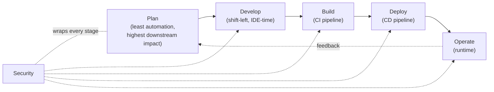
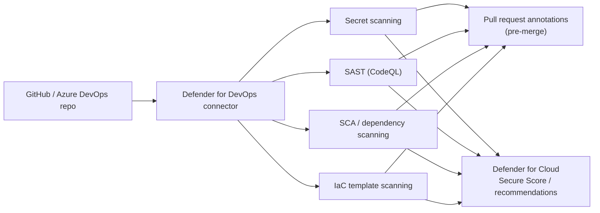
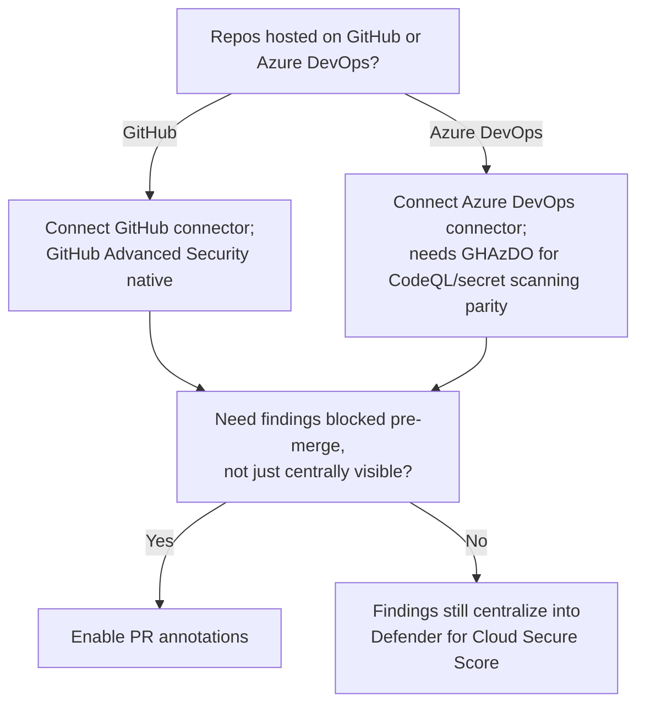

---
tags:
  - sc100
type: concept
domain:
  - best-practices
  - apps-data
aliases:
  - DevSecOps
status: needs-verification
---

# DevOps Security

## Purpose

Centralizing pipeline and repository security findings — secrets, vulnerable code, vulnerable dependencies, misconfigured IaC — into the same Defender for Cloud posture view as cloud resources, via **Microsoft Defender for DevOps**.

---

## Why Architects Choose It

- Defender for DevOps is the concrete product that operationalizes [[Shift left (WAF)|shift left]]/DevSecOps — it connects GitHub and Azure DevOps organizations into [[Microsoft Defender for Cloud]] so pipeline/repo findings surface next to cloud resource findings in the same Secure Score and recommendations, instead of living in a separate DevOps-only tool.
- **Pull request annotations** are the literal enforcement mechanism that makes shift left concrete rather than aspirational — a finding (secret, vulnerable dependency, misconfigured template) is flagged inline in the PR, before merge, not discovered post-deployment.
- One connector covers four distinct attack surfaces a pipeline can leak through — secrets, first-party code, third-party dependencies, and infrastructure-as-code templates — each needing a different scanning technique.
- **GitHub Advanced Security for Azure Devops (GHAzDO)** extends the same CodeQL-based scanning engine GitHub-native repos already have to Azure DevOps repos — the licensing vehicle that closes the parity gap between the two platforms.

---

## Core Capabilities

- **Secret scanning** — detects committed credentials, keys, and tokens across repository history and pipeline logs, before they reach production or a public repo.
- **Static Application Security Testing (SAST)** — CodeQL semantic analysis of first-party code for known vulnerability patterns (injection, insecure deserialization, etc.).
- **Software Composition Analysis (SCA) / dependency scanning** — flags third-party/open-source packages with known CVEs, and can surface OSS license risk.
- **Infrastructure as Code (IaC) scanning** — checks Bicep/Terraform/ARM templates against misconfiguration rules *before* deployment — the same posture rules [[Security Posture Assessments|MCSB]] applies *after* deployment, shifted earlier. Container image scanning is the same shift-left idea applied to a container build — see [[Container and Kubernetes Security]] for the registry-scan-to-admission-control pipeline it feeds into.
- **Pull request annotations** — inline PR comments surface findings from all four scan types at the exact point a merge decision is made.
- **Centralized findings** — DevOps security recommendations feed the same Secure Score and attack-path view in Defender for Cloud that cloud resource findings do (see [[CSPM and CWPP]]).

---

## DevSecOps Lifecycle Stages

Microsoft organizes DevSecOps guidance (including the [AKS-specific DevSecOps architecture](https://learn.microsoft.com/en-us/azure/architecture/guide/devsecops/devsecops-on-aks)) into **five SDLC stages, security wrapped around all of them**: **Plan → Develop → Build → Deploy → Operate**. Every DevSecOps task an exam scenario names maps to exactly one of these — matching the task to the *right* stage (not just recognizing it's "somewhere in DevSecOps") is the tested skill.

| Stage | What belongs here | AKS example task |
| --- | --- | --- |
| **Plan** | Threat modeling (STRIDE), security policy design, **applying [[Azure Well-Architected Framework (WAF)]]** — least automation of any stage, but highest leverage on everything downstream. | Apply Azure Well-Architected Framework (WAF) |
| **Develop** | Shift-left, pre-commit: secure coding standards (OWASP), IDE security plugins, branch protection/precommit hooks, **securing/choosing trusted base container images**. | Secure container images |
| **Build** | CI pipeline automated scanning: SAST (CodeQL), SCA/dependency scanning, secret scanning, IaC scanning, SBOM generation, image signing, **auto-rebuilding images when their base image updates** (Container Registry Tasks). | Build new images on base image updates |
| **Deploy** | CD pipeline controls: branch/environment protection, approval gates, DAST/penetration testing, **securing deployment credentials** (OIDC instead of long-lived secrets, GitOps pull-based credential model), deploying only from trusted registries. | Keep deployment credentials secure |
| **Operate** | Runtime: Defender for Cloud drift/config scanning, Azure Monitor + Sentinel, audit logging, Azure Policy enforcement on the running cluster, **keeping Kubernetes clusters/nodes patched and upgraded**. | Update Kubernetes clusters |

---

## Architecture

---

## Architecture Decisions

---

## Comparison

| Compare | Difference |
| --- | --- |
| Defender for DevOps vs. Defender for Cloud CSPM/CWPP | Defender for DevOps scans source/pipeline *before* deployment (pre-prod, shift-left stage). CSPM assesses and CWPP protects the resource *after* deployment (runtime). Same Defender for Cloud console and Secure Score, different lifecycle stage — see [[Shift left (WAF)]] for the shift-left/shift-right framing this maps to. |
| SAST vs. SCA | SAST (CodeQL) analyzes the organization's *own* code for vulnerability patterns. SCA analyzes *third-party/open-source* dependencies for known CVEs. Different attack surface — a "vulnerable package version" scenario is SCA, a "custom code has an injection flaw" scenario is SAST. |
| GitHub Advanced Security vs. GHAzDO | Same underlying CodeQL/secret-scanning engine; GitHub Advanced Security is native to GitHub-hosted repos, GHAzDO is the licensing product that brings the identical capability to Azure DevOps-hosted repos. A naming/platform distinction, not a capability difference. |
| Defender for DevOps vs. threat modeling | Threat modeling (see [[Threat Modeling]]) reasons about hypothetical design-time threats before code exists; Defender for DevOps scans *actual* code/dependencies/IaC once they exist in a repo. Threat modeling's output (requirements) precedes what Defender for DevOps then continuously verifies. |
| Build phase vs. Deploy phase | Easy to conflate — **Build** is the CI side: compiling/packaging, scanning source and the image *before* it's pushed anywhere runtime-bound (SAST/SCA/secrets/IaC scanning, SBOM, auto-rebuild on base image update). **Deploy** is the CD side: getting an already-built, already-scanned artifact *into* an environment safely (approval gates, deployment credentials/OIDC, DAST against a running instance, trusted-registry enforcement). A "rebuild the image" task is Build; a "protect the credential that pushes it to production" task is Deploy. |
| Deploy phase vs. Operate phase | **Deploy** is the act of shipping a specific release through the CD pipeline. **Operate** is everything after it's running — monitoring, patching, drift detection, audit logging. "Update Kubernetes clusters" is ongoing lifecycle maintenance of something already running, so it's Operate, not Deploy. |

---

## AZ-500 Review

AZ-500 does not cover pipeline or repository security at all — secret scanning, SAST, SCA, and IaC scanning are entirely new territory for SC-100, the same framing as [[Shift left (WAF)]].

---

## What's New for SC-100

- Recommend Defender for DevOps by name as the mechanism that centralizes pipeline/repo findings into the same posture view as cloud resources — not a separate DevOps-only tool.
- Know PR annotations as the specific pre-merge enforcement point that operationalizes shift left, rather than describing shift left only as a principle.
- Map a described leak or vulnerability to the correct scanning category (secrets/SAST/SCA/IaC) — a frequent scenario-matching skill.
- Know GHAzDO as the Azure DevOps equivalent licensing vehicle for GitHub Advanced Security — closing platform parity is a named, testable fact.

---

## Exam Tips

- "Credentials committed to a repository" → secret scanning, not SAST.
- "Known-vulnerable open-source package version" → SCA/dependency scanning, not SAST.
- "Misconfigured Terraform/Bicep template caught before deployment" → IaC scanning, feeding the same posture rules as MCSB.
- "Findings from both GitHub and Azure DevOps need one unified security view alongside cloud posture" → Defender for DevOps.
- Azure DevOps repos needing CodeQL-based scanning parity with GitHub → GHAzDO license, not a manual/custom pipeline task.
- "Apply Azure Well-Architected Framework" → **Plan** phase, not Operate — it's a design-time input, even though its Operational Excellence pillar covers monitoring.
- "Secure/choose trusted container base images" → **Develop** phase (pre-commit, before CI even runs) — don't confuse with the Build-phase task of scanning an already-built image.
- "Automatically rebuild application images when their base image updates" → **Build** phase (Container Registry Tasks), a CI-pipeline automation, not a runtime/Operate concern.
- "Keep deployment credentials secure (e.g., OIDC instead of long-lived secrets)" → **Deploy** phase — it's about the CD pipeline's access to the target environment, not code scanning.
- "Update/patch Kubernetes clusters" → **Operate** phase — lifecycle maintenance of a running resource, tested as the most commonly mismatched stage (people guess Deploy).

---

## Common Exam Confusion

- **SAST vs. SCA** — own code vs. third-party dependencies; full comparison above.
- **Defender for DevOps vs. CSPM/CWPP** — pre-deployment pipeline scanning vs. post-deployment resource assessment/protection.
- **GitHub Advanced Security vs. GHAzDO** — same engine, different host platform.
- **Defender for DevOps vs. threat modeling** — verifying what exists vs. reasoning about what doesn't exist yet.
- **The five DevSecOps lifecycle stages (Plan/Develop/Build/Deploy/Operate)** — a task-to-stage matching exercise; see the table above. The most common mistakes: putting WAF in Operate instead of Plan, and putting cluster updates in Deploy instead of Operate.

---

## Keywords

- Microsoft Defender for DevOps
- GitHub Advanced Security for Azure DevOps (GHAzDO)
- Secret scanning
- Static Application Security Testing (SAST), CodeQL
- Software Composition Analysis (SCA), dependency scanning
- Infrastructure as Code (IaC) scanning
- Pull request annotations
- DevSecOps
- DevSecOps lifecycle stages: Plan, Develop, Build, Deploy, Operate
- Threat modeling, STRIDE (Plan phase)
- SBOM, image signing/notation, Container Registry Tasks base-image rebuild (Build phase)
- OIDC, GitOps pull-based credentials, DAST (Deploy phase)
- Azure Well-Architected Framework (WAF) — Plan phase input

---

## Related Services

- [[Shift left (WAF)]]
- [[Threat Modeling]]
- [[Security Posture Assessments]]
- [[Secure Future Initiative (SFI)]] — Protect engineering systems is SFI's pillar for SDLC/pipeline security.
- [[CSPM and CWPP]]
- [[Azure Policy]]
- [[Microsoft Defender for Cloud]]
- [[Cloud Adoption Framework (CAF)]]
- [[Container and Kubernetes Security]]
- [[External Attack Surface Management (EASM)]]
- [[Azure Well-Architected Framework (WAF)]]
- [[Threat Modeling]]
- [[Identity as the Security Perimeter]]

---

## References

- [Defender for DevOps overview](https://learn.microsoft.com/en-us/azure/defender-for-cloud/defender-for-devops-introduction) — Microsoft Learn
- [GitHub Advanced Security for Azure DevOps](https://learn.microsoft.com/en-us/azure/devops/repos/security/configure-github-advanced-security-features) — Microsoft Learn
- [DevSecOps on Azure Kubernetes Service (AKS)](https://learn.microsoft.com/en-us/azure/architecture/guide/devsecops/devsecops-on-aks) — Microsoft Learn
- [What is Azure Kubernetes Service (AKS)?](https://learn.microsoft.com/en-us/azure/aks/what-is-aks) — Microsoft Learn
- [Secure DevOps environments for Zero Trust](https://learn.microsoft.com/en-us/security/zero-trust/develop/secure-devops-environments-zero-trust) — Microsoft Learn
- [[Exam Objectives]]

---

## Verification Flag

The Plan/Develop/Build/Deploy/Operate stage names and per-stage example tasks are taken from Microsoft's AKS-specific DevSecOps architecture article — re-verify the stage names and task-to-stage mapping against that article close to exam date, since the general DevSecOps guidance elsewhere sometimes labels the fourth stage "Release" instead of "Deploy."
