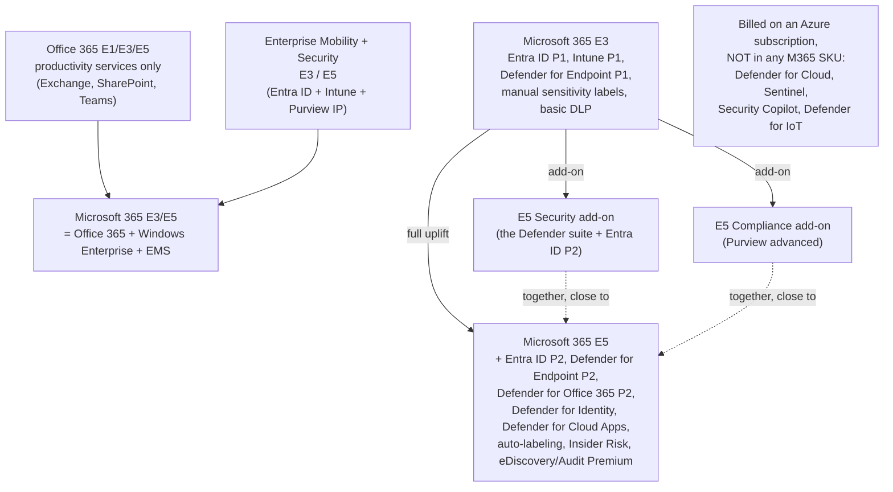
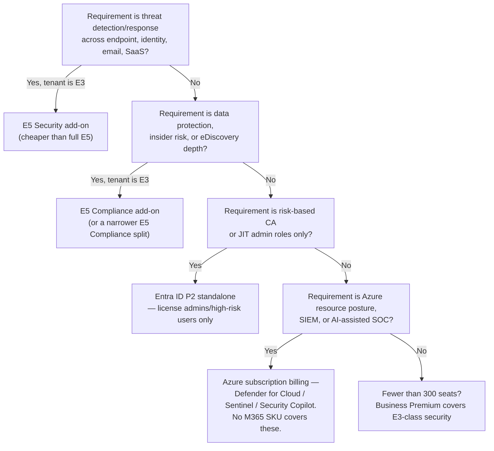

---
tags:
  - sc100
type: cheat-sheet
domain:
  - ops-identity-compliance
aliases:
  - E5
  - E3
  - Microsoft 365 E5
  - Office 365 E5
  - E5 Security
  - E5 Compliance
  - EMS
  - Business Premium
status: needs-verification
---

# Microsoft 365 Licensing

## Purpose

Maps which SC-100 security capability is unlocked by which Microsoft 365 SKU or add-on, so a recommended architecture is actually buyable rather than technically correct but unlicensed.

---

## Why Architects Choose It

- Almost every control this vault recommends has a **license floor**. A design that assumes Defender for Identity, [[PIM]], or Insider Risk Management on an E3 tenant is not a design — it's an unfunded purchase order.
- The exam repeatedly frames scenarios as *"the organization has Microsoft 365 E3 and wants X — what should you recommend?"* The correct answer is often **an add-on**, not a different product.
- Licensing is a genuine architecture constraint: the cheapest path to a requirement may be an E5 add-on on existing E3 seats rather than a full E5 uplift for every user, or an Azure-billed product ([[Microsoft Defender for Cloud]], [[Microsoft Sentinel]]) that no M365 SKU includes at all.
- Per-user licensing means **partial coverage is a real design option** — E5 for admins and high-risk users, E3 for the rest — but only for capabilities licensed per-user, not for tenant-wide ones.

---

## When to Use

- Choosing between an E5 uplift, an E5 Security/Compliance add-on, and a standalone product SKU to meet a stated requirement.
- Validating that a proposed Zero Trust / SOC / data protection design is licensable on the tenant's current SKU.
- Deciding which users need which tier when budget forces a split (admins, executives, frontline).
- Explaining why an Azure-side security product doesn't appear in the M365 bill at all.

---

## When NOT to Use

- As a security design *driver* — license the requirement, don't requirement the license. Start from the risk, then find the SKU.
- To justify skipping a control entirely ("we only have E3, so no privileged access management") — E3 + [[Entra ID]] P2 standalone, or E5 Security, usually closes the gap.
- For Azure resource security scoping — [[Microsoft Defender for Cloud]] is billed per protected resource on an Azure subscription and is **not** in any M365 SKU.
- To infer per-user coverage for tenant-scoped features — some capabilities activate tenant-wide once any qualifying license exists; others strictly require a license per benefiting user.

---

## Architecture

---

## SKU Families

| Family | What it is | Security relevance |
| --- | --- | --- |
| **Office 365** E1 / E3 / E5 | Productivity services only — Exchange Online, SharePoint, Teams, Office apps. No Windows, no [[Intune]], no Entra ID premium. | O365 E5 does include **Defender for Office 365 Plan 2** and advanced Purview eDiscovery/Audit — but *no* endpoint, identity, or CASB protection. |
| **Enterprise Mobility + Security (EMS)** E3 / E5 | The identity + device + information protection bundle, sold standalone. | EMS E3 = Entra ID P1 + Intune. EMS E5 = Entra ID P2 + Intune + Defender for Cloud Apps + Defender for Identity. |
| **Microsoft 365** E3 / E5 | Office 365 + Windows Enterprise + EMS in one SKU. The assumed baseline for most SC-100 scenarios. | The full stack — see the tier table below. |
| **Microsoft 365 Business** Basic / Standard / **Premium** | SMB, capped at **300 seats**. | Business Premium ≈ E3-class security: Entra ID P1, Intune P1, Defender for Office 365 P1, and **Defender for Business** (a simplified Defender for Endpoint, not Plan 2). |
| **F1 / F3 (frontline)** | Shift/deskless workers, no desktop Office in F1. | F5 Security and F5 Compliance add-ons exist as the frontline equivalents of E5 Security/Compliance. |
| **A1 / A3 / A5** (education), **G1 / G3 / G5** (US Government) | Sector-specific mirrors of the E-series. | Feature parity broadly tracks the equivalent E-number; government SKUs land in GCC/GCC High/DoD clouds. |

---

## What E3 Gets vs. What E5 Adds

| Capability | E3 | E5 |
| --- | --- | --- |
| [[Entra ID]] | P1 — [[Conditional Access]], hybrid identity, SSPR writeback | **P2** — [[Identity Protection]], [[PIM]] |
| Endpoint ([[Securing Server and Client Endpoints]]) | Defender for Endpoint **Plan 1** (next-gen AV, ASR rules, manual response) | Defender for Endpoint **Plan 2** (EDR, Advanced Hunting, TVM, automated investigation) |
| Email/collab ([[Securing Microsoft 365]]) | Exchange Online Protection only | **Defender for Office 365 Plan 2** (Threat Explorer, Attack Simulation Training, AIR) |
| Identity threat detection | — | **Defender for Identity** (on-prem AD DS sensor — see [[Securing Active Directory Domain Services (AD DS)]]) |
| SaaS/CASB | — | **Defender for Cloud Apps** ([[SaaS Application Discovery and Control]]) |
| [[Intune]] | Plan 1 (MDM/MAM) | Plan 1 + Endpoint Analytics (Intune **Suite** — EPM, Remote Help — is still a separate add-on) |
| [[Data Classification and Protection\|Information protection]] | Manual/default sensitivity labels, basic DLP for Exchange/SharePoint/OneDrive | **Automatic** labeling, DLP for endpoint/Teams, [[Purview]] Records Management |
| Insider risk / compliance | Basic audit, core eDiscovery | **Insider Risk Management**, Communication Compliance, eDiscovery **Premium**, Audit **Premium**, Customer Key/Lockbox, Privileged Access Management for Office 365 |

---

## Add-Ons Instead of a Full E5 Uplift

| Add-on (sits on E3) | Delivers |
| --- | --- |
| **Microsoft 365 E5 Security** | Entra ID P2, Defender for Endpoint P2, Defender for Office 365 P2, Defender for Identity, Defender for Cloud Apps — i.e. the whole [[Microsoft Defender XDR]] stack. |
| **Microsoft 365 E5 Compliance** | Purview Information Protection & Governance, Insider Risk Management, eDiscovery & Audit Premium, Communication Compliance. |
| Narrower splits of E5 Compliance | E5 Information Protection and Governance / E5 Insider Risk Management / E5 eDiscovery and Audit — buy one discipline rather than all three. |

**Architecture decision** — E5 Security + E5 Compliance on E3 seats gets close to E5 without the productivity uplift (Power BI Pro, Teams Phone). If a scenario asks for *only* threat protection, E5 Security alone is the tighter answer than "upgrade everyone to E5."

---

## Not Included in Any Microsoft 365 SKU

The most-missed exam boundary — these are **Azure subscription-billed**, not per-M365-user:

| Product | Billing model |
| --- | --- |
| [[Microsoft Defender for Cloud]] (CSPM/[[Cloud Workload Protection (CWPP)\|CWPP]] plans) | Per protected resource/hour on an Azure subscription. Foundational CSPM is free; Defender plans are not. |
| [[Microsoft Sentinel]] | Per GB ingested / commitment tiers. **Exception**: the Sentinel benefit for M365 E5/A5/F5/G5 grants a free daily data allowance for eligible M365 connectors — a discount, not inclusion. |
| [[Microsoft Security Copilot]] | Provisioned SCUs (Security Compute Units), hourly. |
| [[OT and ICS Security\|Defender for IoT]] (OT) | Per site/device on an Azure subscription. |
| [[Entra ID]] Governance, Entra Suite (Private/Internet Access), Permissions Management | Separate Entra add-on SKUs — see [[Identity as the Security Perimeter]]. |
| [[Priva]], Purview data governance (Unified Catalog) | Separate SKU / pay-as-you-go. |
| [[Intune]] Suite (EPM, Remote Help, advanced endpoint analytics) | Separate add-on, even on E5. |

---

## Architecture Decisions

---

## Comparison

| Compare | Difference |
| --- | --- |
| **Office 365 E5 vs. Microsoft 365 E5** | Office 365 E5 = productivity services + Defender for Office 365 P2 + advanced compliance. Microsoft 365 E5 = that **plus** Windows Enterprise and EMS E5 (Entra ID P2, Intune, Defender for Endpoint P2, Defender for Identity, Defender for Cloud Apps). A scenario needing endpoint or identity protection is **not** satisfied by Office 365 E5. |
| **Microsoft 365 E3 vs. E5** | E3 is prevention-and-baseline (P1 identity, Defender for Endpoint P1, manual labels). E5 adds detection/investigation depth (P2 identity, EDR, Defender for Identity/Cloud Apps, auto-labeling, insider risk). |
| **E5 uplift vs. E5 Security add-on** | Full uplift buys productivity extras (Power BI Pro, Teams Phone) alongside security. The add-on buys only the Defender suite + Entra ID P2 on existing E3 seats — the right answer when the requirement is purely security. |
| **Business Premium vs. Microsoft 365 E3** | Broadly comparable security posture for ≤300 seats, but Business Premium ships **Defender for Business** (simplified EDR, no Advanced Hunting) rather than Defender for Endpoint P1/P2, and has no E5 Security/Compliance add-on path at scale. |
| **Defender for Business vs. Defender for Endpoint P2** | Defender for Business is SMB-scoped: simplified onboarding and policies, no Advanced Hunting, no custom detection depth. P2 is the full EDR/TVM/hunting product the [[Microsoft Defender XDR]] architecture assumes. |
| **M365 E5 vs. [[Microsoft Defender for Cloud]]** | E5 protects *users, endpoints, and M365 data*. Defender for Cloud protects *Azure/AWS/GCP resources* and is billed on Azure. Neither substitutes for the other — a very common exam distractor. |
| **Sentinel "included in E5" vs. the E5 data grant** | Sentinel is never included. E5/A5/F5/G5 customers get a free daily ingestion allowance for specific M365 connectors; everything else is per-GB. |

---

## AZ-500 Review

AZ-500 largely assumes licenses already exist and focuses on configuring the control. It touches Entra ID P1/P2 tier boundaries but does not cover the Microsoft 365 SKU/add-on landscape, Office 365 vs. Microsoft 365, or the Azure-billed vs. M365-billed split — that framing is new here.

---

## What's New for SC-100

- Treat licensing as a **design constraint with alternatives**, not trivia — the exam's preferred answer is frequently the *narrowest* SKU that meets the requirement (add-on > uplift; standalone Entra ID P2 > E5 for an admins-only requirement).
- Know the Office 365 vs. Microsoft 365 boundary cold — it is the single most exploited distractor in this area.
- Know which security products **no** M365 license includes ([[Microsoft Defender for Cloud]], [[Microsoft Sentinel]], [[Microsoft Security Copilot]], Defender for IoT, Entra Suite, Priva).
- Recognize mixed-tier licensing (E5 for admins/high-risk, E3 for the rest) as a legitimate architecture, subject to per-user licensing rules.

---

## Exam Tips

- "Tenant has Microsoft 365 E3, needs Defender for Identity / Defender for Cloud Apps / risk-based CA" → **E5 Security add-on**, not a full E5 uplift and not a standalone purchase of each product.
- "Tenant has Office 365 E5, needs endpoint detection and response" → Office 365 E5 does **not** include Defender for Endpoint. Add Microsoft 365 E5 / E5 Security or Defender for Endpoint P2 standalone.
- "Needs [[PIM]] for a handful of admins" → Entra ID P2 for those users, not E5 for the whole tenant.
- "Needs Azure VM/SQL/storage protection" → Defender for Cloud plans on the Azure subscription — no M365 SKU answer is correct.
- "Insider Risk Management / Communication Compliance / eDiscovery Premium" → **E5 Compliance**, not E5 Security. The two add-ons are not interchangeable.
- Under 300 seats with a full-stack security ask → **Business Premium** is the intended answer, not E3+add-ons.

---

## Common Exam Confusion

- **Office 365 E5 vs. Microsoft 365 E5** — the former has no Windows, no Intune, no Entra ID P2, no endpoint/identity/CASB Defender products.
- **E5 Security vs. E5 Compliance** — threat protection (Defender + Entra ID P2) vs. data/insider risk ([[Purview]]). Scenarios name one requirement; only one add-on answers it.
- **Defender for Business vs. Defender for Endpoint** — SMB-simplified vs. full EDR with Advanced Hunting.
- **Defender for Endpoint Plan 1 vs. Plan 2** — prevention/ASR vs. EDR + hunting + TVM (mirrors the [[Securing Microsoft 365|Defender for Office 365]] Plan 1/Plan 2 split).
- **"We have E5, so we're covered for Azure"** — E5 covers users and M365 data; Azure resources need [[Microsoft Defender for Cloud]].
- **Entra ID P2 vs. Entra ID Governance** — P2 is in E5; Entitlement Management and tenant-wide Access Reviews are a *separate* add-on even on E5 (see [[Entra ID]]).

---

## Keywords

- Office 365 E1/E3/E5 vs. Microsoft 365 E3/E5
- Enterprise Mobility + Security (EMS) E3/E5
- Microsoft 365 E5 Security add-on / E5 Compliance add-on
- Business Premium, 300-seat cap, Defender for Business
- F1/F3 frontline, F5 Security, A3/A5, G3/G5
- Defender for Endpoint Plan 1 vs. Plan 2
- Sentinel benefit for M365 E5 (free data grant)
- "Azure subscription-billed, not M365-licensed"
- Per-user licensing, mixed-tier assignment

---

## Related Services

- [[Securing Microsoft 365]]
- [[Entra ID]]
- [[Microsoft Defender XDR]]
- [[Microsoft Defender for Cloud]]
- [[Microsoft Sentinel]]
- [[Purview]]
- [[Intune]]
- [[PIM]]
- [[Identity Protection]]
- [[SaaS Application Discovery and Control]]
- [[Securing Server and Client Endpoints]]
- [[Microsoft Security Copilot]]
- [[Securing Active Directory Domain Services (AD DS)]]

---

## References

- [Microsoft 365 plans for business](https://www.microsoft.com/en-us/microsoft-365/enterprise/microsoft365-plans-and-pricing) — Microsoft
- [Microsoft 365 Enterprise service descriptions](https://learn.microsoft.com/en-us/office365/servicedescriptions/microsoft-365-service-descriptions/microsoft-365-tenantlevel-services-licensing-guidance/microsoft-365-security-compliance-licensing-guidance) — Microsoft Learn
- [Microsoft Defender for Endpoint Plan 1 and Plan 2](https://learn.microsoft.com/en-us/defender-endpoint/defender-endpoint-plan-1-2) — Microsoft Learn
- [Microsoft Sentinel benefit for Microsoft 365 E5](https://learn.microsoft.com/en-us/azure/sentinel/billing) — Microsoft Learn
- [[Exam Objectives]]

---

## Verification Flag

Microsoft repackages M365 SKUs and add-ons regularly — plan contents, add-on names, and the exact feature-to-tier boundary (especially Defender for Endpoint P1 in E3, Intune plan naming, and what the Entra Suite absorbs) shift between releases. Re-verify each capability against the current Microsoft 365 service description and licensing guidance close to exam date, and treat the tables above as a structural map rather than a billing source of truth.
