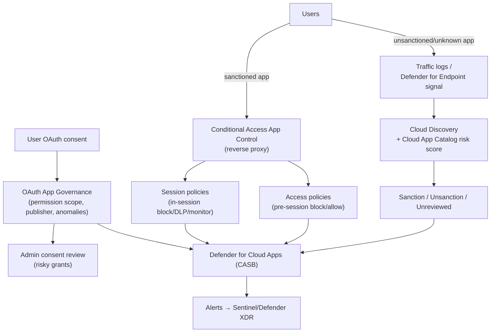
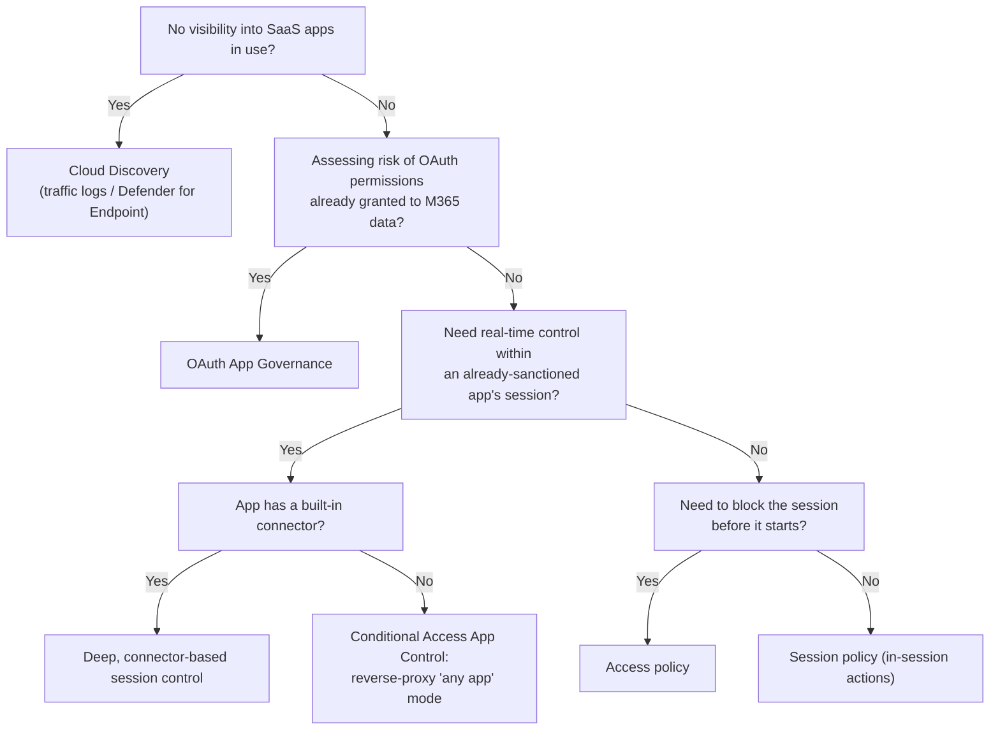

---
tags:
  - sc100
---

# SaaS Application Discovery and Control

## Purpose

Finding unsanctioned SaaS usage (Shadow IT) and applying real-time, in-session control over both sanctioned and unsanctioned apps — via **Microsoft Defender for Cloud Apps (CASB)** — the discovery-and-control layer for application security, distinct from network-perimeter controls.

---

## Why Architects Choose It

- Employees adopt SaaS apps organically; without discovery, security has no visibility into what's actually in use or how risky it is — **Cloud Discovery** closes that blind spot using existing traffic logs or Defender for Endpoint's network signal, with no new network appliance required.
- Not every discovered app deserves equal trust — the **Cloud App Catalog** risk-scores tens of thousands of apps against enterprise-readiness criteria (security, compliance, legal), turning sanction/unsanction into a scored, repeatable decision instead of a gut call.
- **OAuth App Governance** addresses a *different* risk surface than network discovery: third-party apps a user has already *consented to* connect to Microsoft 365 data. A sanctioned tenant and a risky OAuth grant are independent problems, and one control doesn't cover the other.
- **Conditional Access App Control** puts real-time session control (block a download, apply a sensitivity label, require step-up auth) in the actual traffic path of a session — the mechanism that turns a Conditional Access decision into enforced, in-session behavior for a cloud app, not just an allow/block at sign-in.

---

## Cloud Discovery (Shadow IT Discovery)

- **Data sources** — cloud-native traffic signal from Defender for Endpoint-onboarded devices (no extra infrastructure), or uploaded/automated log collection from firewall/proxy logs for network segments without onboarded endpoints.
- Discovered apps are matched against the **Cloud App Catalog** and given a **risk score** based on ~90 factors (compliance certifications, data handling, breach history, etc.).
- Outcome per app: **Sanction** (approved for use), **Unsanction** (blocked — can generate a block script for the firewall/proxy), or left **unreviewed** pending a decision.

## OAuth App Governance

- Evaluates permissions a user has granted a third-party app via Entra ID **app consent** — the risk surface is *delegated/application permission scope*, not network traffic.
- Flags risky patterns automatically: over-broad permission scope, unverified publisher, unusual usage/anomalous behavior after consent — and can require admin review before a grant takes effect.
- Architecture decision: restrict **user consent** for unverified publishers or high-risk permission scopes org-wide, routing those requests to admin consent review instead of leaving default self-service consent open.

## Conditional Access App Control

- A **reverse-proxy** mechanism: Conditional Access routes a sanctioned app's session through Defender for Cloud Apps, enabling real-time session policies without modifying the app itself.
- Two integration depths: apps with a **built-in connector** (deep, API-based visibility and control — e.g., full app-specific actions) vs. **any app** via reverse-proxy URL rewriting (broader coverage, shallower control) for apps with no native connector.

## Access and Session Policies

- **Access policies** — block or allow a session from *starting at all*, based on conditions (device compliance, location, sign-in risk) — a pre-session gate.
- **Session policies** — control specific actions *within* an already-started session: block download/upload/copy-paste, apply DLP content inspection, or monitor-only without blocking.

---

## When to Use

- No visibility into which SaaS apps the org actually uses — Cloud Discovery via existing traffic logs/Defender for Endpoint signal.
- Assessing risk from third-party apps already granted OAuth access to Microsoft 365 data — OAuth App Governance, independent of network discovery.
- Real-time control (block download, force DLP inspection) over a sanctioned app's session, especially one with no native API integration — Conditional Access App Control's reverse-proxy mode.
- Blocking a session before it starts based on device/location/risk — an access policy; controlling what happens *during* a session — a session policy.

---

## When NOT to Use

- Treating Cloud Discovery as complete OAuth risk coverage — it sees network traffic, not consent grants; a fully sanctioned, network-approved app can still carry a risky OAuth permission scope that only App Governance would catch.
- Assuming every sanctioned app automatically gets deep, connector-based session control — apps without a built-in connector only get the shallower reverse-proxy "any app" mode.
- Leaving default self-service user consent open org-wide "for convenience" — the standard recommendation is restricting consent for unverified publishers/high-risk scopes and routing to admin review.
- Using session policies as a substitute for access policies — session policies act only once a session has already started; a scenario needing to prevent the session entirely still needs an access policy.

---

## Architecture

---

## Architecture Decisions

---

## Comparison

| Compare | Difference |
| --- | --- |
| Cloud Discovery vs. OAuth App Governance | Cloud Discovery finds *unknown* SaaS usage from network traffic signal. OAuth App Governance assesses risk from *already-consented* third-party app permissions to Microsoft 365 data. Different risk surface and data source — one doesn't substitute for the other. |
| Access policy vs. session policy | Access policies gate whether a session is allowed to *start*. Session policies control specific actions *during* an already-started session (block/allow download, DLP, monitor). A scenario needing to prevent access outright needs an access policy; one needing to allow access but restrict in-session actions needs a session policy. |
| Connector-based integration vs. Conditional Access App Control (reverse proxy) | A built-in app connector gives deep, API-based visibility and app-specific control actions. Reverse-proxy "any app" mode gives broader coverage (works on apps with no native connector) but shallower, more generic session control. |
| Conditional Access App Control vs. Global Secure Access | Full comparison already in [[Identity as the Security Perimeter]] — App Control governs the SaaS session *after* sign-in (in-session policies); Global Secure Access governs the network *path* to a resource pre-connection. Complementary layers, not repeated here. |

---

## AZ-500 Review

AZ-500 does not cover Defender for Cloud Apps, Cloud Discovery, OAuth App Governance, or Conditional Access App Control at all — CASB is entirely new territory for SC-100.

---

## What's New for SC-100

- Design the discovery-to-sanctioning workflow (Cloud Discovery → risk score → sanction/unsanction) as an explicit, repeatable architecture, not a one-time scan.
- Recognize OAuth App Governance as a distinct control from network-based discovery — a scenario about third-party app *permissions* to M365 data is a different answer than one about *unknown app usage*.
- Choose access vs. session policy deliberately based on whether the requirement is to block a session outright or control actions within an allowed one.
- Know the connector vs. reverse-proxy integration trade-off (depth of control vs. breadth of app coverage) as a stated architecture decision, not an implementation detail.

---

## Exam Tips

- "We don't know what SaaS apps our employees are actually using" → Cloud Discovery, not OAuth App Governance.
- "A third-party app was granted broad Microsoft 365 permissions via user consent — assess its risk" → OAuth App Governance, not Cloud Discovery.
- "Block file download from a sanctioned app on an unmanaged device, but allow the session to start" → a session policy via Conditional Access App Control, not an access policy.
- "Prevent the session from starting at all under certain conditions" → an access policy, not a session policy.
- An app with no built-in connector needing real-time control → Conditional Access App Control's reverse-proxy "any app" mode is still the answer, with the caveat that control is shallower than a connected app.

---

## Common Exam Confusion

- **Cloud Discovery vs. OAuth App Governance** — network-traffic-based shadow IT discovery vs. consent-based permission risk; full comparison above.
- **Access policy vs. session policy** — pre-session gate vs. in-session action control.
- **Connector-based vs. reverse-proxy app integration** — deep API control vs. broad but shallow session control.
- **Conditional Access App Control vs. Global Secure Access** — see [[Identity as the Security Perimeter]] for the full breakdown; don't re-derive it here.

---

## Keywords

- Microsoft Defender for Cloud Apps (CASB)
- Cloud Discovery, Shadow IT, Cloud App Catalog risk score
- Sanctioned vs. unsanctioned vs. unreviewed apps
- OAuth App Governance, app consent, admin consent review
- Conditional Access App Control, reverse proxy
- Access policy vs. session policy
- Connector-based integration vs. "any app" reverse-proxy mode

---

## Related Services

- [[Identity as the Security Perimeter]]
- [[Conditional Access]]
- [[Microsoft Defender]]
- [[Data Classification and Protection]]
- [[Zero Trust]]
- [[Identity and Access Management (IAM)]]

---

## References

- [Microsoft Defender for Cloud Apps overview](https://learn.microsoft.com/en-us/defender-cloud-apps/what-is-defender-for-cloud-apps) — Microsoft Learn
- [Cloud Discovery overview](https://learn.microsoft.com/en-us/defender-cloud-apps/set-up-cloud-discovery) — Microsoft Learn
- [App Governance in Defender for Cloud Apps](https://learn.microsoft.com/en-us/defender-cloud-apps/app-governance-manage-app-governance) — Microsoft Learn
- [Deploy Conditional Access App Control](https://learn.microsoft.com/en-us/defender-cloud-apps/proxy-deployment-aad) — Microsoft Learn
- [[Exam Objectives]]
