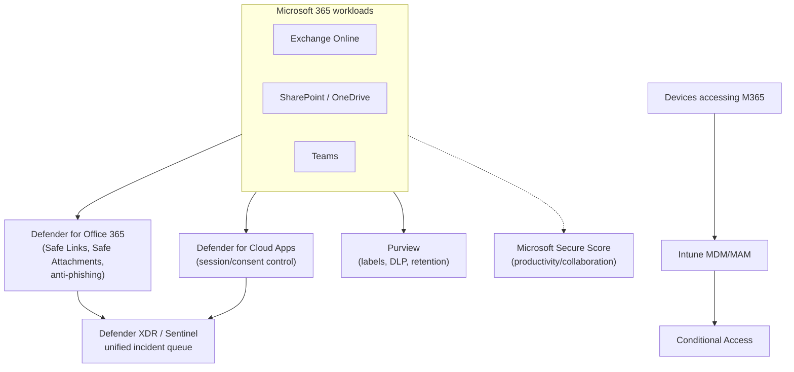
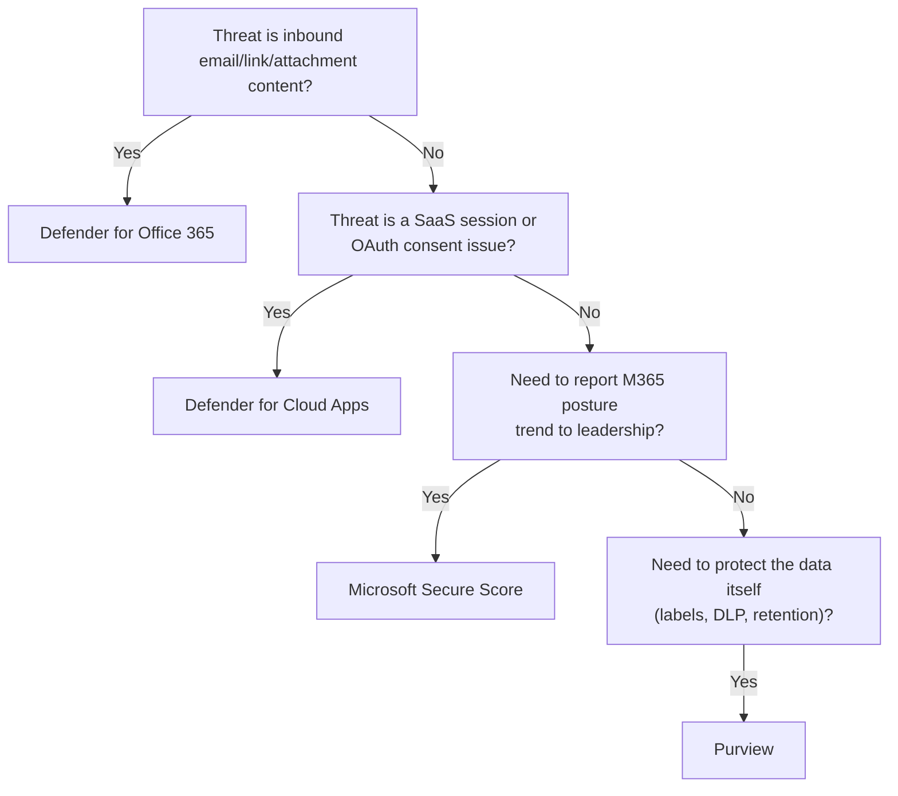

---
tags:
  - sc100
---
# Securing Microsoft 365

## Purpose

Architecting the security posture of Microsoft 365 productivity/collaboration workloads (Exchange Online, SharePoint, OneDrive, Teams) as one coordinated design — mail/collaboration threat protection, posture scoring, device management, and data protection — rather than four unrelated consoles each covered elsewhere in isolation.

---

## Why Architects Choose It

- Email and collaboration are the highest-value phishing/BEC (business email compromise) target in most organizations — this needs its own named threat-protection architecture, not generic endpoint or network controls.
- Productivity/collaboration Secure Score is a distinct measurement domain from Defender for Cloud's resource-configuration score (full comparison in [[Security Scoring Dashboards]]) — leadership reporting has to route to the right one.
- Defender for Office 365 and Defender for Cloud Apps solve different-looking-similar problems: inbound mail/link/attachment threats *before or at delivery* vs. post-sign-in SaaS session/consent control — a scenario has to be matched to the right product, not "Defender" generically.
- M365 threat protection (Defender for Office 365) and M365 data protection (Purview) are two different control families over the same workload — a complete M365 security design needs both, not one standing in for the other.

---

## When to Use

- Protecting Exchange Online/Teams/SharePoint from phishing, malware attachments, and malicious links — **Defender for Office 365** (Plan 1 vs. Plan 2).
- Reporting productivity/collaboration security trend to leadership — **Microsoft Secure Score** (full cross-product comparison in [[Security Scoring Dashboards]]).
- Governing sanctioned/unsanctioned SaaS usage and in-session control layered on top of M365 — **Defender for Cloud Apps**, full depth in [[SaaS Application Discovery and Control]].
- Managing the devices accessing M365 — Intune MDM/MAM, full depth in [[Securing Server and Client Endpoints]].
- Protecting M365 data itself (labels, DLP, retention) — [[Purview]], full pipeline in [[Data Classification and Protection]].
- Assessing Microsoft 365 Copilot's data-access and compliance posture — see [[AI and Copilot Security Architecture]].

---

## When NOT to Use

- Treating Defender for Office 365 as covering third-party SaaS apps connected via OAuth consent — that's OAuth App Governance inside Defender for Cloud Apps, a different product and risk surface ([[SaaS Application Discovery and Control]]).
- Reporting Microsoft Secure Score as if it measures Azure resource configuration — that's Defender for Cloud's separate, non-interchangeable score.
- Assuming Defender for Office 365 Plan 1 gives the same investigation/simulation depth as Plan 2 — Plan 1 is prevention-focused; Plan 2 adds Threat Explorer, Attack Simulation Training, and Automated Investigation and Response (AIR).

---

## Architecture

---

## Architecture Decisions

---

## Comparison

| Compare | Difference |
| --- | --- |
| Defender for Office 365 vs. Defender for Cloud Apps | Defender for Office 365 protects the mail/collaboration content path itself — Safe Links, Safe Attachments, anti-phishing — before or at delivery. Defender for Cloud Apps governs the session and OAuth-consent layer *after* sign-in, across M365 and third-party SaaS (full depth in [[SaaS Application Discovery and Control]]). Different stage of the attack chain, complementary controls. |
| Defender for Office 365 Plan 1 vs. Plan 2 | Plan 1: prevention — Safe Links, Safe Attachments, anti-phishing policies. Plan 2: adds Threat Explorer (hunt/investigate delivered threats), Attack Simulation Training (phishing simulations), and Automated Investigation and Response (AIR) — investigation/response depth, not just more prevention rules. |
| Microsoft Secure Score vs. Defender for Cloud Secure Score | Full comparison in [[Security Scoring Dashboards]] — different scope (identity/device/app/M365 vs. Azure/multicloud resource configuration), not repeated here. |
| Defender for Cloud Apps vs. Global Secure Access | Full comparison in [[Identity as the Security Perimeter]] — post-sign-in SaaS session control vs. pre-connection network path control, not repeated here. |

---

## AZ-500 Review

AZ-500 covers configuring individual Defender for Office 365 policies (Safe Links/Safe Attachments) and reading Secure Score at an implementation level. SC-100 adds: choosing Plan 1 vs. Plan 2 deliberately, treating "securing Microsoft 365" as one coordinated architecture spanning threat protection + posture scoring + device + data (rather than four disconnected consoles), and routing findings into the unified Defender XDR incident queue.

---

## What's New for SC-100

- Treat "Securing Microsoft 365" as its own named exam domain that ties together products covered in full depth elsewhere ([[SaaS Application Discovery and Control|Defender for Cloud Apps]], [[Intune]], [[Purview]]) plus the one piece that's genuinely new here — Defender for Office 365's Plan 1/Plan 2 architecture.
- Route Defender for Office 365 alerts into the same Defender XDR/Sentinel incident queue as every other signal (see [[Security Operations]]), not a siloed mail-security console.
- Recognize Microsoft 365 Copilot data governance as an extension of this domain, not a separate concern — see [[AI and Copilot Security Architecture]].

---

## Exam Tips

- "Protect against malicious links/attachments in email" → Defender for Office 365, not Defender for Cloud Apps.
- "Need automated investigation and phishing attack simulation" → Defender for Office 365 **Plan 2**, not Plan 1.
- "Report productivity workload security trend to leadership" → Microsoft Secure Score, not Defender for Cloud's Secure Score.
- A scenario mixing "third-party app granted OAuth permissions" with M365 data → Defender for Cloud Apps' OAuth App Governance, not Defender for Office 365.

---

## Common Exam Confusion

- **Defender for Office 365 vs. Defender for Cloud Apps** — content/delivery threat protection vs. session/consent governance; full comparison above.
- **Defender for Office 365 Plan 1 vs. Plan 2** — prevention vs. investigation/response depth.
- **Microsoft Secure Score vs. Defender for Cloud Secure Score** — see [[Security Scoring Dashboards]] for the full breakdown; don't re-derive it here.

---

## Keywords

- Defender for Office 365, Safe Links, Safe Attachments, anti-phishing policies
- Plan 1 vs. Plan 2, Threat Explorer, Attack Simulation Training
- Automated Investigation and Response (AIR)
- Microsoft Secure Score (productivity/collaboration domain)
- Business email compromise (BEC), phishing

---

## Related Services

- [[SaaS Application Discovery and Control]]
- [[Security Scoring Dashboards]]
- [[Intune]]
- [[Purview]]
- [[AI and Copilot Security Architecture]]
- [[Microsoft Defender XDR]]
- [[Zero Trust]]
- [[Data Classification and Protection]]

---

## References

- [Microsoft Defender for Office 365 overview](https://learn.microsoft.com/en-us/defender-office-365/mdo-about) — Microsoft Learn
- [Microsoft Defender for Office 365 Plan 1 vs. Plan 2](https://learn.microsoft.com/en-us/defender-office-365/whats-different-about-defender-for-office-365-plan-1-and-plan-2) — Microsoft Learn
- [Microsoft Secure Score](https://learn.microsoft.com/en-us/defender-xdr/microsoft-secure-score) — Microsoft Learn
- [[Exam Objectives]]
