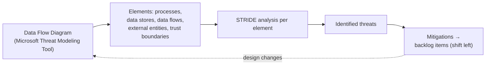
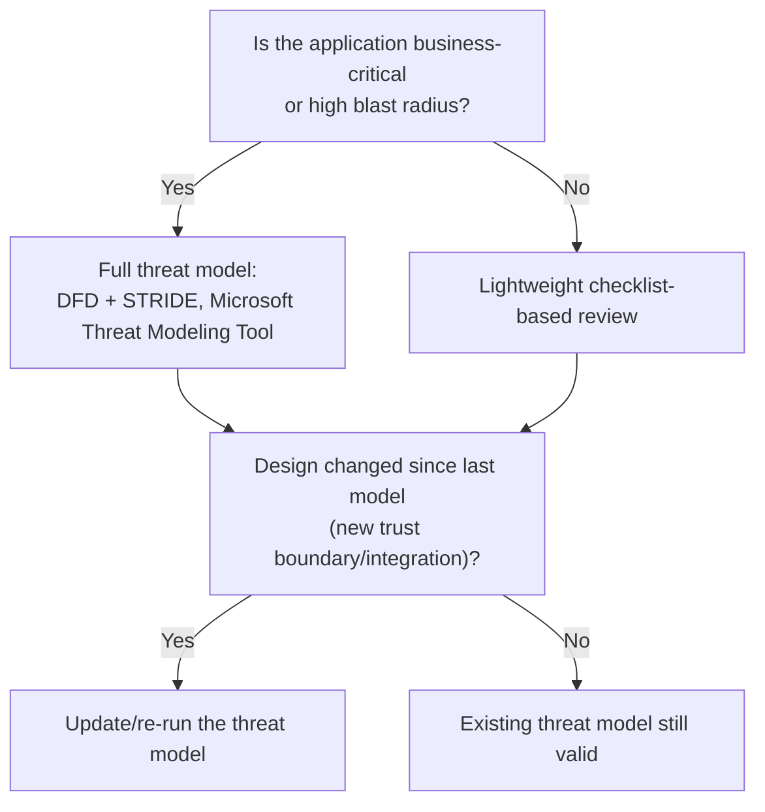

---
tags:
  - sc100
type: concept
domain:
  - apps-data
aliases:
  - STRIDE
status: needs-verification
---
# Threat Modeling

## Purpose

Structured, design-time identification of an application's trust boundaries, data flows, and threats — using STRIDE — so mitigations are designed in before the app is built, prioritized for business-critical workloads.

---

## Why Architects Choose It

- STRIDE gives a repeatable way to reason about threats **per element** of a data flow diagram (DFD), instead of ad hoc "what could go wrong" brainstorming that misses categories.
- The **Microsoft Threat Modeling Tool** (free) builds the DFD and auto-suggests STRIDE-categorized threats per element type (process, data store, data flow, external entity, trust boundary) — it's the concrete tool the exam expects you to recognize.
- It's the anchor activity of the design stage in [[Shift left (WAF)|shift left]] — feeding threats into backlog items as requirements, not an afterthought bolted on after code is written.
- Prioritization matters: the exam objective specifically says **business-critical applications**, not "every application" — full formal threat modeling is proportionate to blast radius, not a uniform requirement.

---

## STRIDE

STRIDE is applied **per DFD element** — every process, data store, data flow, and external entity is walked through all six categories; a trust boundary crossing is where most real threats concentrate, since that's where an attacker actually changes privilege level.

| Threat category | Violates | Example | Typical mitigation |
| --- | --- | --- | --- |
| **S**poofing | Authentication | Impersonating another user or service identity | Strong authN (MFA, [[Entra ID]]-backed identity), mutual TLS between services |
| **T**ampering | Integrity | Modifying data in transit or at rest | TLS in transit, encryption + integrity checks (hashes/signatures) at rest, least-privilege write access |
| **R**epudiation | Non-repudiation | Denying an action with no audit trail to disprove it | Signed, tamper-evident logging (see [[Azure Security Logging]]), timestamps tied to an authenticated identity |
| **I**nformation Disclosure | Confidentiality | Exposing data to an unauthorized party | Encryption, least-privilege RBAC, [[Securing IaaS and PaaS Services|Private Link/network isolation]] |
| **D**enial of Service | Availability | Exhausting a resource so legitimate users can't use it | Rate limiting, autoscale, [[Network Security Architecture|DDoS Protection]] |
| **E**levation of Privilege | Authorization | Gaining capability beyond what was granted | Least privilege, input validation, [[PIM]]-style just-in-time elevation |

- **Process** elements are typically exposed to all six STRIDE categories; **data stores** are mainly Tampering/Information Disclosure/Repudiation (no execution, so no Spoofing/DoS in the classic model); **data flows** are Tampering/Information Disclosure/DoS; **external entities** are usually Spoofing/Repudiation only, since the model doesn't control their internals.
- The mitigation column is deliberately mapped to controls already covered elsewhere in this vault — threat modeling's output is a list of *requirements*, and those requirements resolve to the same architecture patterns used everywhere else, not a new control family.

---

## AI/LLM Threat Modeling

STRIDE's six categories don't name several threats specific to generative AI/LLM systems — for an AI or agent-based application, layer the **OWASP Top 10 for LLM Applications** on top of STRIDE for the model, prompt/context data flow, and any tool-calling elements, instead of replacing STRIDE outright.

| OWASP LLM threat | Example | Mitigation |
| --- | --- | --- |
| Prompt Injection (direct/jailbreak, indirect) | A user tries to override system instructions, or a poisoned document tricks the model into leaking data when summarized | Content Safety / Prompt Shields — see [[AI and Copilot Security Architecture]] |
| Insecure Output Handling | Model output is executed as code or inserted into a downstream query without validation | Treat model output as untrusted input — validate/sanitize before use, same as any external input in classic STRIDE |
| Excessive Agency | An autonomous agent with broad tool/API access acts beyond its intended scope | Scope agent permissions narrowly via [[Microsoft Entra Agent ID]] — least privilege |
| Sensitive Information Disclosure | A response surfaces training data or over-permissioned org content | [[Data Security Posture Management (DSPM)|Purview DSPM]] data risk assessment before rollout |
| Training Data / Model Poisoning | Fine-tuning on unvetted or malicious data skews model behavior | Vet and control training data sources — the same supply-chain discipline as [[DevOps Security]] applied to data instead of code |

- This is an industry framework (OWASP), not a Microsoft one — cite it as the threat taxonomy, but map mitigations to the Microsoft controls above, the same way this note maps STRIDE mitigations to controls elsewhere in the vault.
- Applies at the same proportionality rule as the rest of this note: full OWASP LLM analysis for a business-critical AI application or agent, not every internal chatbot prototype.

---

## When to Use

- Designing a new business-critical or high-blast-radius application, before code is written.
- Any significant architecture change — a new trust boundary, a new external integration, a new data store handling sensitive data — re-running or updating the existing threat model, not treating it as one-time.
- As the design-stage anchor activity inside [[Shift left (WAF)]]'s SDLC pipeline.
- Threat modeling a business-critical AI/LLM application or agent — layer the OWASP Top 10 for LLM Applications on top of STRIDE for the AI-specific elements.

---

## When NOT to Use

- As a one-time exercise never revisited — a threat model is stale the moment the design changes; it needs the same lifecycle discipline as the code it describes.
- As a substitute for runtime detection or attack path analysis — threat modeling reasons about *hypothetical* design-time threats; [[CSPM and CWPP|attack path analysis]] prioritizes *actual*, currently-exploitable paths in a live environment. Different lifecycle stage, both needed.
- Running full formal STRIDE workshops on every trivial internal tool — proportionate effort to business-criticality, per the exam's explicit "business-critical applications" framing.

---

## Architecture

---

## Architecture Decisions

---

## Comparison

| Compare | Difference |
| --- | --- |
| Threat modeling vs. attack path analysis | Threat modeling is proactive and design-time — reasoning about hypothetical threats before the app exists. Attack path analysis (see [[CSPM and CWPP]]) is reactive and data-driven — ranking *actual* exploitable paths in an already-deployed environment. A scenario about a not-yet-built app points to threat modeling; one about a live environment's findings points to attack path analysis. |
| STRIDE vs. DREAD | STRIDE categorizes *what kind* of threat exists (Spoofing, Tampering, etc.). DREAD (Damage, Reproducibility, Exploitability, Affected users, Discoverability) scores *how severe* an already-identified threat is. Complementary — STRIDE finds threats, DREAD (largely legacy now) would rank them — not competing frameworks. |
| Threat modeling vs. penetration testing | Threat modeling is theoretical/design-time analysis of a system that may not exist yet; penetration testing is active, hands-on exploitation attempted against a real, built system. Threat modeling should happen first and narrow what a pen test needs to focus on. |
| Microsoft Threat Modeling Tool vs. MITRE ATT&CK | The Threat Modeling Tool models *application-design* threats via STRIDE/DFD. MITRE ATT&CK (see [[Attack Chain Models]] and [[Security Operations]]) catalogs real-world *adversary TTPs* used to map SOC detection coverage. Different altitude: one shapes an app's design, the other measures a SOC's detection breadth — don't conflate "threat" framework names. |
| STRIDE vs. OWASP Top 10 for LLM Applications | STRIDE is a general-purpose, six-category framework applied per DFD element to any system. OWASP LLM Top 10 is a threat taxonomy specific to generative AI/LLM applications (prompt injection, excessive agency, etc.) that names risks STRIDE's six categories don't map to cleanly. Used *together* for an AI system — OWASP LLM Top 10 isn't a replacement for STRIDE, it's layered on top for the AI-specific elements. |

---

## AZ-500 Review

AZ-500 does not cover threat modeling, STRIDE, or DFDs at all — it's scoped to configuring and administering Azure security controls, not application design methodology. This entire topic is new territory for SC-100.

---

## What's New for SC-100

- Recognize STRIDE and the Microsoft Threat Modeling Tool by name as the expected mechanism when a scenario asks to "identify threats during design."
- Prioritize threat modeling effort by business-criticality/blast radius — an explicit resourcing decision, not a uniform mandate across every app.
- Treat a threat model as a living artifact updated on architecture change, matching the "not a one-time setup" theme that also applies to WAF Security pillar guidance.
- Distinguish design-time threat modeling from runtime attack path analysis as two different, complementary lifecycle stages — the exam rewards knowing which one a scenario is actually describing.
- Layer OWASP Top 10 for LLM Applications onto STRIDE for AI/agent-based systems — a scenario naming prompt injection, excessive agency, or model poisoning is testing this extension, not classic STRIDE alone.

---

## Exam Tips

- "Identify threats before an application is built" → threat modeling / STRIDE, not a runtime scanning tool.
- A scenario naming a new external integration or trust boundary → update the existing threat model, don't treat it as done once.
- If a scenario already has a live environment with real findings to prioritize, that's attack path analysis (see [[CSPM and CWPP]]), not threat modeling — a frequent distractor pair.
- Don't confuse STRIDE (used to find threats) with MITRE ATT&CK (used to map detection coverage) — different exam objective, different note ([[Security Operations]]).
- "Threat model an AI/LLM application or autonomous agent" → STRIDE **plus** OWASP Top 10 for LLM Applications for the model/prompt/agent elements, not STRIDE alone.
- A scenario naming prompt injection, jailbreak, or excessive agent permissions → OWASP LLM Top 10 categories, mitigated by Content Safety/Prompt Shields or Entra Agent ID scoping (see [[AI and Copilot Security Architecture]]) — not a classic STRIDE mitigation.

---

## Common Exam Confusion

- **Threat modeling vs. attack path analysis** — design-time hypothetical vs. runtime actual; full comparison above.
- **STRIDE vs. DREAD** — threat categorization vs. severity scoring.
- **Microsoft Threat Modeling Tool vs. MITRE ATT&CK** — application design threats vs. SOC detection coverage.
- **STRIDE vs. OWASP Top 10 for LLM Applications** — general-purpose DFD-element framework vs. AI/LLM-specific threat taxonomy, used together for AI systems, not as alternatives.

---

## Keywords

- STRIDE (Spoofing, Tampering, Repudiation, Information Disclosure, Denial of Service, Elevation of Privilege)
- Data Flow Diagram (DFD), trust boundary
- Microsoft Threat Modeling Tool
- DREAD (legacy severity scoring)
- Business-critical application prioritization
- Design-time vs. runtime (threat modeling vs. attack path analysis)
- OWASP Top 10 for LLM Applications
- Prompt injection (direct/jailbreak vs. indirect), excessive agency
- Insecure output handling, training data/model poisoning

---

## Related Services

- [[Shift left (WAF)]]
- [[DevOps Security]]
- [[CSPM and CWPP]]
- [[Security Operations]]
- [[Azure Web Application Firewall]]
- [[Zero Trust]]
- [[Cloud Adoption Framework (CAF)]]
- [[AI and Copilot Security Architecture]]
- [[Data Security Posture Management (DSPM)]]
- [[Attack Chain Models]]

---

## References

- [Microsoft Threat Modeling Tool](https://learn.microsoft.com/en-us/azure/security/develop/threat-modeling-tool) — Microsoft Learn
- [Threat Modeling Security Fundamentals](https://learn.microsoft.com/en-us/training/modules/tm-threat-modeling-fundamentals/) — Microsoft Learn
- [OWASP Top 10 for LLM Applications](https://genai.owasp.org/llm-top-10/) — OWASP (industry framework, not Microsoft Learn)
- (https://aka.ms/mssdl)
- (https://aka.ms/stride)
- [[Exam Objectives]]

---

## Verification Flag

OWASP Top 10 for LLM Applications has been revised since its original 2023 draft (category names/numbering shifted in later releases), and it's an OWASP framework, not a Microsoft one — re-verify current category names/numbering against the live OWASP GenAI project page, and confirm whether SC-100 material references it by this exact name, close to exam date.
