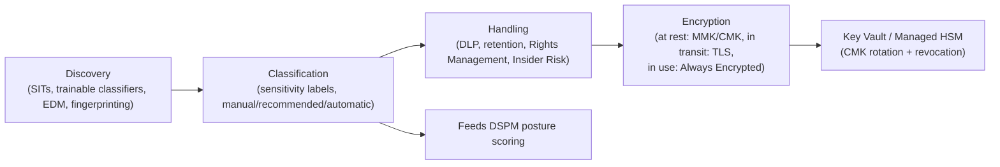
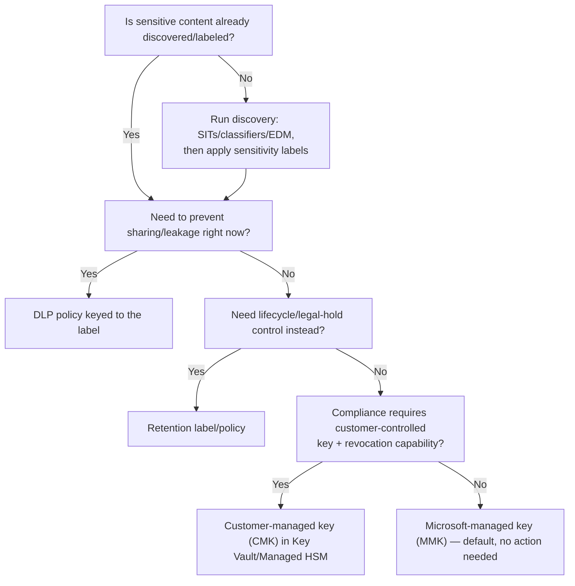

---
tags:
  - sc100
---

# Data Classification and Protection

## Purpose

The mechanical pipeline behind "securing organizational data" — discover it, classify it, enforce handling rules on it, and encrypt it — as distinct architecture decisions, complementing [[Data Security Posture Management (DSPM)|DSPM]]'s posture/scoring view of the same data.

---

## Why Architects Choose It

- [[Data Security Posture Management (DSPM)|DSPM]] answers "where is sensitive data and how exposed is it"; this note answers "how does data actually get found, labeled, governed, and encrypted" — the mechanism DSPM's posture score is built on top of.
- The four stages are sequential and each depends on the one before it: you can't enforce handling on data that isn't classified, and you can't classify what wasn't discovered — a scenario naming one stage usually implies the others already happened.
- Encryption is deliberately the last stage because it's the one control that applies regardless of classification outcome — infrastructure/transport encryption is baseline hygiene, while classification-driven encryption (Rights Management) is an *additional*, label-triggered layer.
- Both AZ-500 and SC-100 touch these mechanisms, but SC-100 asks architects to choose *taxonomy, key ownership, and enforcement scope* — org-wide design decisions AZ-500 doesn't test.
- This pipeline is preventive/static (classify, encrypt, restrict); it doesn't watch for active misuse of already-classified data. Runtime threat detection on the data services themselves — Defender for Storage's malware scanning, Defender for Databases' anomalous-query detection — is the complementary layer, covered in [[Cloud Workload Protection (CWPP)]].

---

## Data Discovery

Finding sensitive content before anything can be labeled or protected.

- **Content matching** — Sensitive Information Types (SITs) use pattern matching (regex, keywords, checksums) to recognize structured data like credit card or national ID numbers.
- **Trainable classifiers** — statistical/ML models that recognize *unstructured* categories pattern matching can't express as a regex (a resume, a contract, source code). They come in two forms:
  - **Built-in (pre-trained)** classifiers — ready to use out of the box (e.g., "Resumes," "Source Code," "Profanity," "Finance") — no training effort, but fixed to Microsoft's definition of the category.
  - **Custom trainable classifiers** — trained on the org's own content: seed the classifier with 50–500 positive examples plus a set of negative examples, publish it, then test/iterate against live traffic before relying on it in enforcement. Needed whenever the sensitive category is specific to the organization (e.g., "our unpublished M&A documents") and no built-in classifier fits.
  - **SITs vs. classifiers, choosing which to use**: SITs suit content with a definable pattern (a number format, a keyword list); classifiers suit content defined by *topic or structure* rather than pattern — a scenario naming a document *type* (resumes, contracts) rather than a data *format* (SSNs, credit cards) points to a classifier, not a SIT.
- **Exact Data Match (EDM)** — matches content against a specific, known dataset (e.g., an actual customer/employee table) rather than a general pattern — eliminates false positives SITs alone would produce.
- **Document fingerprinting** — recognizes a specific template (a standard contract or form) regardless of the values filled into it.
- Discovery output feeds both Purview's Content/Activity Explorer *and* [[Data Security Posture Management (DSPM)|DSPM]]'s posture scoring — discovery is the shared input, DSPM is one consumer of it.

---

## Data Classification

Turning a discovery match into a persistent, portable label.

- **Sensitivity labels** — the unit of classification (e.g., Public, General, Confidential, Highly Confidential), optionally with sublabels for scope (e.g., "Confidential \ Finance").
- **Labeling modes** — manual (user-applied), **recommended** (Purview suggests, user confirms), and **automatic** (applied without user action, based on SIT/classifier match) — an explicit sensitivity/friction trade-off, not just a feature toggle.
- **Default label policies** — a baseline label applied org-wide when no explicit choice is made, so unlabeled content doesn't default to "unprotected."
- **Label inheritance** — an email inherits the highest sensitivity label of its attachments; a container (SharePoint site, Team) can carry its own label that constrains what labels documents inside it may use.
- Labels are the shared vocabulary the rest of the pipeline (handling, encryption) keys off of — a label by itself does nothing until a policy references it.

---

## Data Handling

What actually happens once content is labeled — the enforcement layer.

- **DLP (Data Loss Prevention) policies** — match content by label *or* by direct SIT/classifier detection, then act. Each policy is built from three parts:
  - **Locations** — where the policy applies: Exchange Online, SharePoint, OneDrive, Teams chat/channel messages, Power BI/Fabric, on-prem file shares/SQL (via the Purview scanner), non-Microsoft cloud apps (via Defender for Cloud Apps), and Windows/macOS devices (**Endpoint DLP**).
  - **Conditions** — what counts as a match: a SIT, a trainable classifier, a sensitivity label, an EDM match, or a boolean combination of these, optionally scoped by count/instance thresholds to reduce noise.
  - **Actions** — what happens on a match: block sharing/external send outright, **block with override** (user can proceed after providing a business justification, logged for audit), show a **policy tip** (in-context user education pop-up explaining the restriction), restrict access, or just generate an incident report/notify an admin without blocking the user (audit-only mode).
  - **Endpoint DLP** specifically extends the same policy engine to device-level actions — copy to USB, copy to a network share, print, clipboard copy to an unallowed app, upload to a restricted browser/cloud service — but requires the device to be **onboarded to Microsoft Defender for Endpoint** first; it's a device-management prerequisite, not a policy-only setting.
  - **Adaptive Protection** dynamically raises DLP/label enforcement strictness for a specific user based on their **Insider Risk Management** risk score — the same content can be allowed for a low-risk user and blocked for an elevated-risk user under the identical DLP policy, tying data handling directly to behavioral risk rather than content alone.
  - **Simulation mode** — every DLP policy can run in test/audit-only mode (matches logged, no user-facing block) before switching to enforcement, the same "pilot before enforce" discipline that applies to auto-labeling.
- **Retention labels/policies** — govern the data's *lifecycle* (retain-then-delete, retain-then-review) — a records-management concern, distinct from DLP's in-the-moment blocking.
- **Rights Management protection actions** — a label can bundle encryption, access restriction ("Do Not Forward," "Encrypt-Only my org"), and visual markings (watermark, header/footer) directly into the label definition, so classification and protection happen in one user action.
- **Insider Risk Management** — correlates label sensitivity with user behavior (mass download, print, unusual sharing) to flag risky patterns DLP's content-only matching wouldn't catch alone.
- The architecture choice is *which enforcement mechanism fits the requirement*: DLP for in-the-moment prevention, retention for lifecycle/legal hold, Rights Management for persistent protection that travels with the file even outside the tenant.

---

## Data Encryption

The always-on layer, independent of whether content was ever classified.

- **Encryption at rest (default)** — Microsoft-managed keys (MMK): Microsoft owns and rotates the key, zero customer configuration, the default for nearly every Azure data service.
- **Customer-managed keys (CMK)** — the customer owns the key in [[Key Vault]] (or Managed HSM), controlling rotation *and* revocation — deleting/disabling the key renders the data cryptographically inaccessible ("crypto-shredding"), which is what compliance regimes requiring customer key control actually need. The full HSM tier ladder — Premium's shared HSM pool vs. Managed HSM's dedicated pool vs. Azure Dedicated HSM vs. Payment HSM, and the FIPS 140-2 Level 2 vs. Level 3 distinction behind them — is detailed in [[Key Vault]], not repeated here.
- **Infrastructure encryption (double encryption)** — a second encryption layer at the infrastructure level, using a different algorithm/key than the service-level layer above it — defense in depth against a single algorithm or key implementation being compromised.
- **Encryption in transit** — TLS enforced between client and service; architects set a minimum TLS version and disable legacy protocol fallback as an explicit control, not an assumption.
- **Encryption in use** — **Always Encrypted** (SQL) keeps column-level data encrypted client-side; the key never reaches the server, so even a compromised database engine or DBA can't read protected columns. This is the "in use" state completing the at-rest/in-transit/in-use triad.
- **Key Vault access model** — Azure RBAC (recommended) vs. the legacy vault access policy model; RBAC gives consistent, auditable permission management aligned with the rest of the tenant's [[Identity and Access Management (IAM)|IAM]] design, rather than a per-vault permission list. Vault tiers, named RBAC roles, and soft-delete/purge protection mechanics are detailed in [[Key Vault]].

---

## When to Use

- Any workload holding regulated or business-sensitive data — run discovery first, before deciding on labels or encryption tier.
- Preventing oversharing/exfiltration of already-classified content — DLP policies keyed to sensitivity labels.
- Meeting a compliance requirement that mandates customer control over encryption keys, including the ability to revoke access — CMK in Key Vault/Managed HSM, not the default MMK.
- Protecting specific database columns even from privileged database roles — Always Encrypted.
- A container (site/Team) that should constrain what sensitivity of content can live inside it — container-level sensitivity labels.

---

## When NOT to Use

- Applying automatic labeling org-wide on day one without piloting — over-aggressive auto-labeling generates false positives that train users to ignore label prompts entirely.
- Treating a sensitivity label as protection by itself — a label with no DLP/Rights Management policy attached to it is metadata only, not an enforced control.
- Defaulting to CMK everywhere "for security" — CMK adds customer key-rotation/availability responsibility (lose the key, lose the data); justified only where compliance or crypto-shredding is an actual requirement, not a blanket upgrade.
- Relying on infrastructure (double) encryption as a substitute for access control — it protects against a different threat (key/algorithm compromise at the platform layer), not misconfigured RBAC.

---

## Architecture

---

## Architecture Decisions

---

## Comparison

| Compare | Difference |
| --- | --- |
| Sensitivity label vs. DLP policy | A label is persistent classification metadata attached to content. A DLP policy is the enforcement engine that *acts* on content — matching either a label or raw SIT/classifier detection — to block, warn, or restrict. A label without a referencing DLP/Rights Management policy enforces nothing by itself. |
| DLP vs. retention policy | DLP prevents an action *in the moment* (blocking a risky share). Retention governs the data's *lifecycle* (how long it's kept, whether it can be deleted) — a records-management/legal concern, not a real-time block. |
| Built-in vs. custom trainable classifier | Built-in classifiers are pre-trained, ready to use, but fixed to Microsoft's definition of the category. Custom classifiers are trained on the org's own seed content (positive + negative samples) for categories specific to that organization — more setup, but the only option when no built-in classifier matches the real-world category. |
| DLP (Exchange/SharePoint/OneDrive/Teams) vs. Endpoint DLP | Standard DLP locations govern data *in Microsoft 365 services*. Endpoint DLP governs actions *on the device itself* (USB copy, print, clipboard, browser upload) and requires the device to already be onboarded to Defender for Endpoint — a device-management prerequisite the M365-location policies don't have. |
| Static DLP severity vs. Adaptive Protection | A standard DLP policy applies the same action to every user matching its conditions. Adaptive Protection varies that strictness *per user*, dynamically, based on their Insider Risk Management score — the same content match can be allowed for one user and blocked for another under one policy. |
| Customer-managed key (CMK) vs. Microsoft-managed key (MMK) | MMK: Microsoft owns rotation, zero customer effort, default everywhere. CMK: customer owns the key in [[Key Vault]]/Managed HSM, controls rotation *and* revocation (crypto-shredding) — required by compliance regimes mandating customer key control, at the cost of key-availability responsibility shifting to the customer. Which HSM tier backs that key (Premium/Managed HSM/Dedicated HSM/Payment HSM) is its own decision, covered in [[Key Vault]]. |
| Encryption at rest vs. in transit vs. in use | At rest protects stored data (MMK/CMK); in transit protects data moving over the network (TLS); in use protects data while a process operates on it (Always Encrypted, confidential computing) — the three-state model a complete data protection design must cover, not just the first one people default to. |
| Standard encryption vs. infrastructure (double) encryption | Standard: one encryption layer at the service level. Infrastructure encryption adds a second layer at the platform level with an independent algorithm/key — defense against a single layer's key or algorithm being compromised, not a replacement for access control. |

---

## AZ-500 Review

AZ-500 already covers configuring sensitivity labels, basic DLP policies, TDE, Key Vault creation, and default encryption-at-rest settings at the resource/tenant level. That configuration knowledge is assumed here.

---

## What's New for SC-100

- Design the full discovery → classification → handling → encryption pipeline as one connected architecture, not four unrelated features to configure independently.
- Choose labeling mode (manual/recommended/automatic) as an explicit friction-vs-coverage trade-off, and pilot before org-wide automatic labeling.
- Justify CMK adoption specifically on a named compliance/crypto-shredding requirement, rather than recommending it as a universal hardening step.
- Cover the full at-rest/in-transit/in-use triad (including Always Encrypted) as a completeness check the exam expects, not just "data is encrypted."
- Recognize how this pipeline's discovery/classification output is the shared input [[Data Security Posture Management (DSPM)|DSPM]] scores and prioritizes — same data, two different architectural questions (mechanism here, posture there).

---

## Exam Tips

- "Prevent false positives from generic pattern matching against a known dataset" → Exact Data Match (EDM), not a standard SIT.
- A scenario naming a document *type* specific to the organization (not a standard format) with no built-in classifier fitting it → a custom trainable classifier, trained on the org's own seed content.
- "Block copying sensitive files to a USB drive" → Endpoint DLP, which requires the device to be Defender for Endpoint-onboarded first — a scenario skipping onboarding is missing a prerequisite.
- "Apply stricter data handling only to users flagged as elevated risk" → Adaptive Protection, not a blanket, uniformly stricter DLP policy for everyone.
- "Even our DBAs shouldn't be able to read this column" → Always Encrypted, not TDE (TDE protects against stolen disks/backups, not privileged in-database access).
- "Compliance requires us to be able to revoke access to our own data by destroying the key" → CMK, not MMK.
- A scenario describing a label that exists but content still leaks → missing DLP/Rights Management policy, not a discovery/classification failure.
- Don't confuse this note's classification *mechanism* with [[Data Security Posture Management (DSPM)|DSPM]]'s posture *scoring* — a "where is our exposed sensitive data" scenario is DSPM; a "how do we label/encrypt it" scenario is this note.

---

## Common Exam Confusion

- **Sensitivity label vs. DLP policy** — metadata vs. enforcement engine; full comparison above.
- **Built-in vs. custom trainable classifier** — ready-made category vs. org-specific, seed-trained category.
- **DLP vs. Endpoint DLP** — Microsoft 365 service locations vs. device-level actions requiring Defender for Endpoint onboarding.
- **CMK vs. MMK** — customer-controlled revocation/rotation vs. zero-effort default.
- **TDE vs. Always Encrypted** — at-rest disk/backup protection vs. in-use column-level protection from privileged access.
- **This note vs. [[Data Security Posture Management (DSPM)|DSPM]]** — classification/encryption mechanism vs. exposure/risk posture scoring of the same underlying data.

---

## Keywords

- Sensitive Information Types (SITs), trainable classifiers, Exact Data Match (EDM)
- Built-in vs. custom trainable classifiers, seed content (positive/negative examples)
- Sensitivity labels: manual, recommended, automatic labeling
- Default label policy, label inheritance, container labels
- DLP (Data Loss Prevention) vs. retention labels/policies
- DLP locations, conditions, actions; policy tips; block with override; simulation/audit-only mode
- Endpoint DLP, Defender for Endpoint onboarding
- Adaptive Protection, Insider Risk Management risk score
- Rights Management protection, Insider Risk Management
- Customer-managed key (CMK) vs. Microsoft-managed key (MMK)
- Crypto-shredding, key revocation
- Infrastructure encryption (double encryption)
- Always Encrypted, Transparent Data Encryption (TDE)
- Encryption at rest vs. in transit vs. in use

---

## Related Services

- [[Data Security Posture Management (DSPM)]]
- [[Purview]] — Data Map/classification engine this note's mechanics run on top of.
- [[Key Vault]]
- [[Compliance and Privacy]]
- [[Identity and Access Management (IAM)]]
- [[Zero Trust]]
- [[Ransomware Resiliency and BCDR]]
- [[Cloud Workload Protection (CWPP)]]

---

## References

- [Learn about sensitivity labels](https://learn.microsoft.com/en-us/purview/sensitivity-labels) — Microsoft Learn
- [Learn about Data Loss Prevention](https://learn.microsoft.com/en-us/purview/dlp-learn-about-dlp) — Microsoft Learn
- [Azure encryption overview](https://learn.microsoft.com/en-us/azure/security/fundamentals/encryption-overview) — Microsoft Learn
- [Always Encrypted (SQL)](https://learn.microsoft.com/en-us/sql/relational-databases/security/encryption/always-encrypted-database-engine) — Microsoft Learn
- [[Exam Objectives]]
