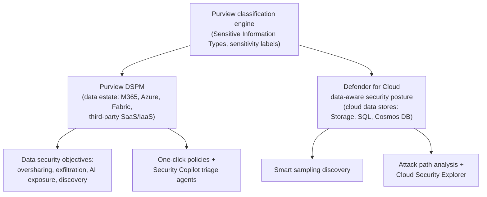
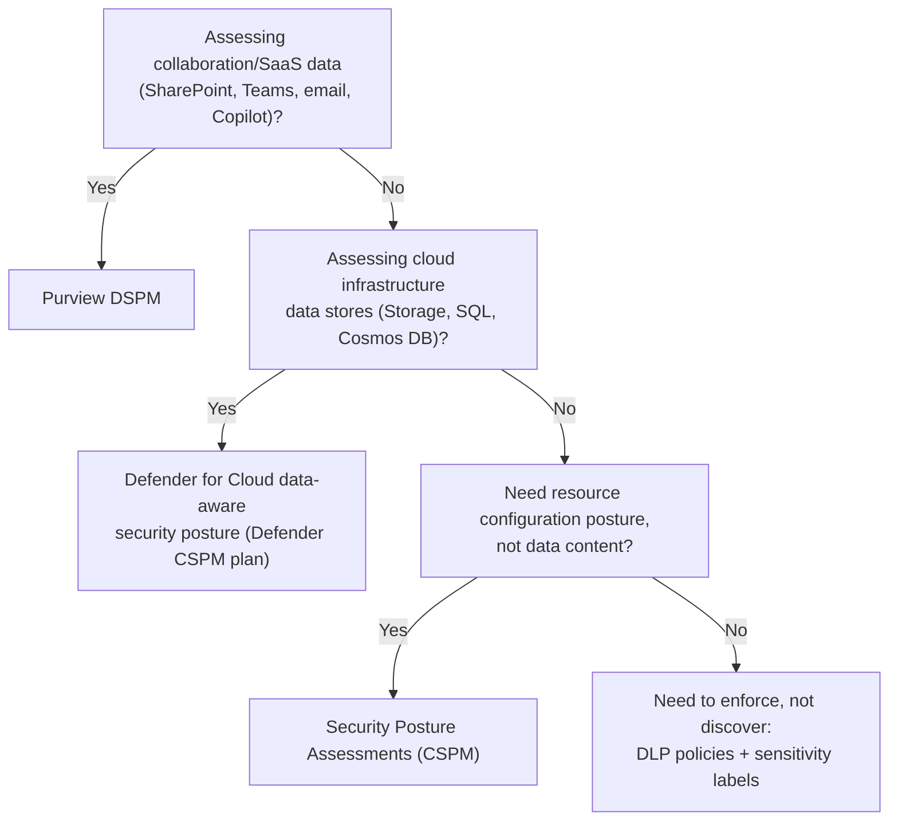

---
tags:
  - sc100
type: concept
domain:
  - apps-data
aliases:
  - DSPM
status: needs-verification
---

# Data Security Posture Management (DSPM)

## Purpose

Continuous discovery, risk-scoring, and exposure-reduction for *sensitive data itself* — where it lives, who can reach it, whether it's protected — implemented by two distinct, similarly-named Microsoft products with different scope.

---

## Why Architects Choose It

- Shifts the posture question from "is the resource configured correctly" ([[Security Posture Assessments|CSPM]]) to "where is my sensitive data, who can reach it, and is it protected" — breaches increasingly hinge on data exposure, not just misconfiguration.
- Both DSPM implementations share one classification taxonomy — the Purview classification engine's Sensitive Information Types (SITs) and sensitivity labels — so a label defined once is recognized consistently whether the data sits in SharePoint or an Azure SQL database.
- Consolidates previously separate Purview tools (DLP, Insider Risk Management, Information Protection, Data Security Investigations) into one posture view organized around outcome-based **data security objectives**, not per-tool consoles.
- Feeds remediation, not just reporting — one-click policies (disable oversharing links, apply DLP) and [[Microsoft Security Copilot|Security Copilot]] triage agents act directly on findings.

---

## When to Use

- Discovering shadow data and answering "what sensitive data do we have, where, who can access it, how is it protected" across Microsoft 365, Azure, Fabric, and third-party SaaS/IaaS (GCP, Snowflake, Databricks) — **Purview DSPM**.
- Prioritizing which cloud data stores (Storage accounts, SQL, Cosmos DB) are reachable via an internet-exposed, lateral-movement attack path — **Defender for Cloud data-aware security posture** (Defender CSPM plan or Defender for Storage).
- Assessing oversharing risk before a Microsoft 365 Copilot rollout — Purview DSPM's Data Risk Assessments and AI observability; AI-specific depth lives in [[AI and Copilot Security Architecture]].
- Feeding data sensitivity context into Defender for Cloud's attack path analysis and Cloud Security Explorer so remediation is prioritized by what's actually reachable *and* sensitive, not raw recommendation count.

---

## When NOT to Use

- As a substitute for [[Security Posture Assessments|CSPM]]/Secure Score — DSPM scores data risk, not resource configuration; run both.
- Expecting Defender for Cloud's sensitive data discovery to fully classify every asset — it uses **smart sampling** (up to 20 MB per file, 300–1,024 rows per table) for cost/coverage efficiency, not exhaustive scanning; use full Purview classification scanning when complete SIT coverage is required.
- As an enforcement mechanism by itself — DSPM discovers and prioritizes risk; DLP policies and sensitivity labels (mechanics detailed in [[Data Classification and Protection]]) are what actually block, encrypt, or restrict.

---

## Architecture

---

## Architecture Decisions

---

## Comparison

| Compare | Difference |
| --- | --- |
| Purview DSPM vs. Defender for Cloud data-aware security posture | Same "DSPM" concept, different product and scope: Purview DSPM covers the collaboration/SaaS/AI data estate and consolidates DLP/Insider Risk/Information Protection into outcome-based objectives; Defender for Cloud's version discovers sensitive data *inside cloud infrastructure resources* via smart sampling and feeds attack path analysis. Both share the same Purview classification engine underneath. |
| DSPM vs. [[Security Posture Assessments|CSPM]] | DSPM scores risk to the *data itself* (sensitivity, exposure, access); CSPM scores the *resource configuration* it sits on. Complementary — a fully-hardened storage account can still hold overexposed sensitive data. |
| DSPM vs. DLP | DSPM discovers and prioritizes data risk (posture); DLP enforces policy against it (block, encrypt, restrict sharing). DSPM objectives commonly recommend a DLP policy as the remediation step. |
| Purview DSPM vs. DSPM for AI (classic) | Current Purview DSPM is the unified successor — AI app/agent risk is now one section ("AI observability") within the same posture experience, not a separate product. "DSPM for AI (classic)" is the deprecated, AI-only predecessor; full AI-specific detail lives in [[AI and Copilot Security Architecture]]. |
| Purview DSPM vs. [[Priva]] Privacy Risk Management | Same M365 data estate, different risk lens: DSPM scores general sensitive-data security exposure across a wider estate (M365, Azure, Fabric, third-party SaaS); Priva Privacy Risk Management flags privacy-law-specific patterns (personal-data overexposure, cross-border transfer, retention minimization) scoped to M365 only. Overlapping on oversharing, but pick based on whether the driver is privacy regulation or general data security posture. |

---

## AZ-500 Review

AZ-500 covers the underlying building blocks — Defender for Cloud/Secure Score fundamentals, basic sensitivity labels, and DLP policy creation. It does not cover DSPM as a named, dedicated posture capability, data-aware attack path analysis, or the outcome-based Purview DSPM experience — all new for SC-100.

---

## What's New for SC-100

- Recognize "DSPM" as two distinct, exam-relevant products sharing a name and a classification engine but different scope — Purview DSPM (data estate) vs. Defender for Cloud data-aware security posture (cloud infrastructure data stores). This is the most likely DSPM exam trap.
- Know that Defender for Cloud's sensitive data discovery requires the **Defender CSPM plan** (or Defender for Storage) and uses smart sampling, not full scanning.
- Understand DSPM's role in **prioritization**: it turns "where is sensitive data" into an input for Security Exposure Management attack paths (see [[Security Posture Assessments]]), so remediation targets what's both exploitable and sensitive.
- Purview DSPM organizes around outcome-based **data security objectives** (prevent oversharing, prevent exfiltration, prevent AI data exposure, discover sensitive data) rather than separate tool consoles — expect scenarios phrased as an outcome, not a tool name.

---

## Exam Tips

- "Discover sensitive data across SharePoint/Teams/third-party SaaS" → Purview DSPM, not Defender for Cloud.
- "Prioritize data breach risk from an internet-exposed VM with access to a storage account" → Defender for Cloud data-aware security posture + attack path analysis, not Purview DSPM.
- A hardened, well-configured resource can still fail a DSPM assessment — configuration posture and data posture are scored independently.
- "Enforce" language (block, encrypt, restrict) points to DLP/sensitivity labels; "discover/prioritize" language points to DSPM.

---

## Common Exam Confusion

- **Purview DSPM vs. Defender for Cloud data-aware security posture** — identical name, different product and data scope; full breakdown above.
- **DSPM vs. CSPM** — data risk vs. resource configuration risk; see [[Security Posture Assessments]] for the CSPM side.
- **DSPM vs. DLP** — discover/prioritize vs. enforce; DSPM findings typically trigger a DLP policy recommendation.

---

## Keywords

- Data Security Posture Management (DSPM)
- Data-aware security posture (Defender for Cloud)
- Sensitive Information Types (SITs), sensitivity labels
- Smart sampling, sensitive data discovery
- Data security objectives (oversharing, exfiltration, AI exposure, discovery)
- Attack paths for data breach risk, Cloud Security Explorer
- Defender CSPM plan
- Shadow data

---

## Related Services

- [[Security Posture Assessments]]
- [[Microsoft Defender for Cloud]]
- [[AI and Copilot Security Architecture]]
- [[Microsoft Security Copilot]]
- [[Purview]]
- [[Compliance and Privacy]]
- [[Priva]]
- [[Microsoft Cloud Security Benchmark (MCSB)]]
- [[Zero Trust]]
- [[Data Classification and Protection]]

---

## References

- [Learn about Microsoft Purview Data Security Posture Management (DSPM)](https://learn.microsoft.com/en-us/purview/data-security-posture-management-learn-about) — Microsoft Learn
- [Data security posture management - Microsoft Defender for Cloud](https://learn.microsoft.com/en-us/azure/defender-for-cloud/concept-data-security-posture) — Microsoft Learn
- [Prevent oversharing with data risk assessments](https://learn.microsoft.com/en-us/purview/data-security-posture-management-oversharing) — Microsoft Learn
- [[Exam Objectives]]

---

## Verification Flag

Purview DSPM moved to a new unified experience (rolling out GA mid-to-late 2026, superseding "DSPM for AI (classic)" and "DSPM (classic)") shortly before this note was written (2026-08-03). Re-verify naming and GA status close to exam date.
