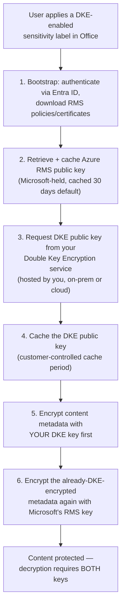
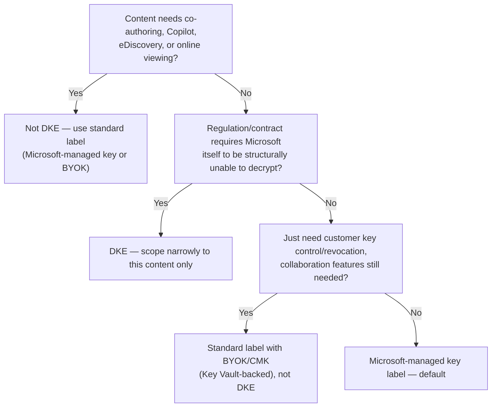

---
tags:
  - sc100
type: concept
domain:
  - apps-data
aliases:
  - DKE
  - Double Key Encryption
---
# Double Key Encryption (DKE)

## Purpose

The Purview Information Protection feature for the roughly 5% of an organization's data — the "crown jewels" — sensitive enough that **Microsoft itself must never be able to decrypt it**, even with full tenant admin/cloud-provider access.

---

## Why Architects Choose It

- It's the architectural answer to a specific, narrow requirement standard sensitivity-label encryption (Azure Rights Management, single key) cannot satisfy: proving that no Microsoft-controlled key, service, or employee can ever read the content — required by some regulatory regimes (data-localization laws, national-security-adjacent contracts) and some contractual "zero third-party access" clauses.
- The trade-off is real and large: DKE-protected content loses co-authoring, AutoSave, eDiscovery, content search/indexing, Office for the web, Delve, mail-flow anti-malware/spam scanning of the attachment, and Copilot — because none of those services can decrypt content DKE is specifically designed to keep them from decrypting. Choosing DKE is choosing to give up those capabilities for that content.
- Applying DKE broadly is a design failure, not extra security — Microsoft's own guidance is to scope it to the smallest possible "highly sensitive" tier and use standard labels (Microsoft-managed key or [[Key Vault|BYOK]]) for the much larger "sensitive" tier that still needs full M365 functionality.

---

## When to Use

- Content subject to regulatory requirements that keys be held within a specific geographic/legal boundary entirely outside a cloud provider's control (data localization laws, certain GDPR/HIPAA/GLBA interpretations, Russia's Federal Law No. 242-FZ, Australia's Privacy Act, New Zealand's Privacy Act).
- An organization's most sensitive "Top Secret"-equivalent classification tier, restricted to a handful of people, where a breach would be reputation- and trust-destroying (M&A documents, source-critical IP, classified government-adjacent content).
- A contractual or regulatory requirement that literally no third party — including the cloud/software provider — can access plaintext content under any circumstance, including legal process against Microsoft.

---

## When NOT to Use

- The bulk of an organization's sensitive-but-not-critical data (Microsoft's own rough split: ~80% non-sensitive, ~15% sensitive, ~5% highly sensitive) — standard sensitivity labels with Microsoft-managed keys or [[Key Vault|customer-managed keys/BYOK]] cover the "sensitive" tier without sacrificing collaboration features.
- Content that needs co-authoring, SharePoint/OneDrive online viewing, eDiscovery, Copilot, or any connected/analyzed-content experience — all are structurally incompatible with DKE, not a configuration gap to work around.
- Teams meetings, chat, or calendar items — DKE labels aren't supported for these; they require Azure Rights Management-based encryption instead.
- As a default posture "to be safe" — it actively degrades productivity tooling for every document it's applied to, and mislabeling ordinary sensitive content as DKE is a common overreach.

---

## Architecture

- **Two keys, two custodians**: one public/private key pair lives in Microsoft's Azure Rights Management service (as with any labeled/protected content); the second lives in a **Double Key Encryption service you host and control** — on-premises or in a cloud location of your choice, entirely outside Microsoft's reach.
- **Both keys are required to decrypt** — Microsoft holding its key alone is insufficient, which is the entire point: Microsoft can never unilaterally decrypt DKE-protected content, including under legal compulsion against Microsoft alone.
- Applied through **sensitivity labels** the same way as any other label — end users don't interact with the two-key mechanics directly, only with a label name.

---

## Architecture Decisions

---

## Comparison

| Compare | Difference |
| --- | --- |
| DKE vs. standard sensitivity label with Microsoft-managed key | Standard: single Microsoft-held key, full M365 feature support (co-authoring, Copilot, eDiscovery). DKE: two keys, one entirely outside Microsoft's control — no M365 feature support requiring content analysis, but Microsoft is structurally unable to decrypt. |
| DKE vs. BYOK/CMK sensitivity labels | BYOK/CMK still uses a *single* key architecture — the key is customer-generated/imported but ultimately held and used by Azure Rights Management, so Microsoft *can* still technically decrypt with proper authorization. DKE requires a second, Microsoft-external key with no such path. |
| DKE vs. [[SQL Data Protection (TDE, Ledger, TDS 8.0)\|TDE customer-managed key]] | Same "customer key control" instinct applied to different data types: DKE protects M365 documents/email content via sensitivity labels; TDE-CMK protects SQL database files at rest. Revoking a TDE protector makes a *database* inaccessible; DKE's external key makes *specific labeled documents* undecryptable by Microsoft from the start. |
| DKE vs. Always Encrypted (SQL) | Both keep the platform provider from reading protected content, but for different data types and mechanisms — Always Encrypted is column-level, client-driver-enforced SQL encryption; DKE is document/email-level, two-key label encryption. Conceptually parallel "even the provider can't read this" answers in two different products. |

---

## AZ-500 Review

AZ-500 doesn't cover Purview Information Protection or DKE at all. All of this — the two-key architecture, licensing, and the collaboration-feature trade-offs — is new territory for SC-100.

---

## What's New for SC-100

- Recognize DKE as the named answer to "Microsoft itself must be structurally unable to decrypt this content" — a materially stronger and different guarantee than BYOK/CMK, which still leaves Microsoft technically capable of decryption.
- Treat the lost feature set (co-authoring, eDiscovery, Copilot, online viewing, mail-flow scanning) as an explicit, unavoidable design trade-off to surface to stakeholders before recommending DKE — not a limitation to "work around."
- Know Microsoft's own ~80/15/5 sensitivity-tier framing as the sizing guidance for scoping DKE narrowly, and match it to a licensing reality: DKE requires **Microsoft 365 E5**.
- Recognize that DKE's customer-hosted service (on-prem or cloud, your choice) is itself an architecture decision — geographic/legal placement of that service is often *why* an organization needs DKE in the first place (data-localization requirements).

---

## Exam Tips

- "A regulation requires that no cloud provider, including Microsoft, can ever access our data" → DKE, not CMK/BYOK — CMK/BYOK still leaves Microsoft technically capable of decryption via Azure Rights Management.
- "Highly sensitive documents need Copilot support and co-authoring" → DKE is disqualifying; use a standard (Microsoft-managed key or BYOK) label instead.
- "Keys must be held within a specific national/geographic boundary the cloud provider doesn't operate in" → DKE, hosting the DKE service in that boundary yourself.
- A scenario applying DKE to routine "Confidential" business documents (not top-secret-tier) is over-scoping — flag it as a productivity-vs-security trade-off applied too broadly.
- DKE requires Microsoft 365 E5 — a scenario citing a lower SKU can't use it without an add-on/trial.

---

## Common Exam Confusion

- **DKE vs. BYOK/CMK** — structurally impossible for Microsoft to decrypt vs. customer-controlled key Microsoft can still technically use; the core distinction the exam tests.
- **DKE vs. Always Encrypted** — document/email-level two-key label encryption vs. SQL column-level client-side encryption; same philosophy, different product and data type.
- **DKE scope** — a narrow, ~5%-of-data tool, not a blanket sensitivity-label upgrade.

---

## Keywords

- Double Key Encryption (DKE), two-key architecture
- Azure Rights Management (RMS) key vs. customer-hosted DKE key
- Double Key Encryption service (customer-hosted, on-prem or cloud)
- Sensitivity labels, Microsoft Purview Information Protection
- Bootstrapping, key caching (30-day default RMS cache)
- Lost features: co-authoring, AutoSave, eDiscovery, content search, Office for the web, Delve, Copilot
- Microsoft 365 E5 licensing requirement
- Data localization, GDPR, HIPAA, GLBA, Russia FZ-242

---

## Related Services

- [[Data Classification and Protection]] — where DKE sits among sensitivity-label protection options.
- [[SQL Data Protection (TDE, Ledger, TDS 8.0)]] — the SQL-side "even the provider/DBA can't read this" analogs (Always Encrypted, TDE-CMK).
- [[Key Vault]] — BYOK/CMK contrast, the single-key model DKE goes beyond.
- [[Purview]]
- [[Compliance and Privacy]]
- [[Priva]]
- [[Microsoft 365 Licensing]] — E5 requirement.
- [[Identity and Access Management (IAM)]] — Entra ID authentication in the DKE bootstrap flow.

---

## References

- [Double Key Encryption (DKE)](https://learn.microsoft.com/en-us/purview/double-key-encryption) — Microsoft Learn
- [[Exam Objectives]]
