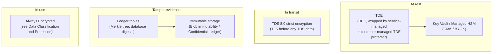
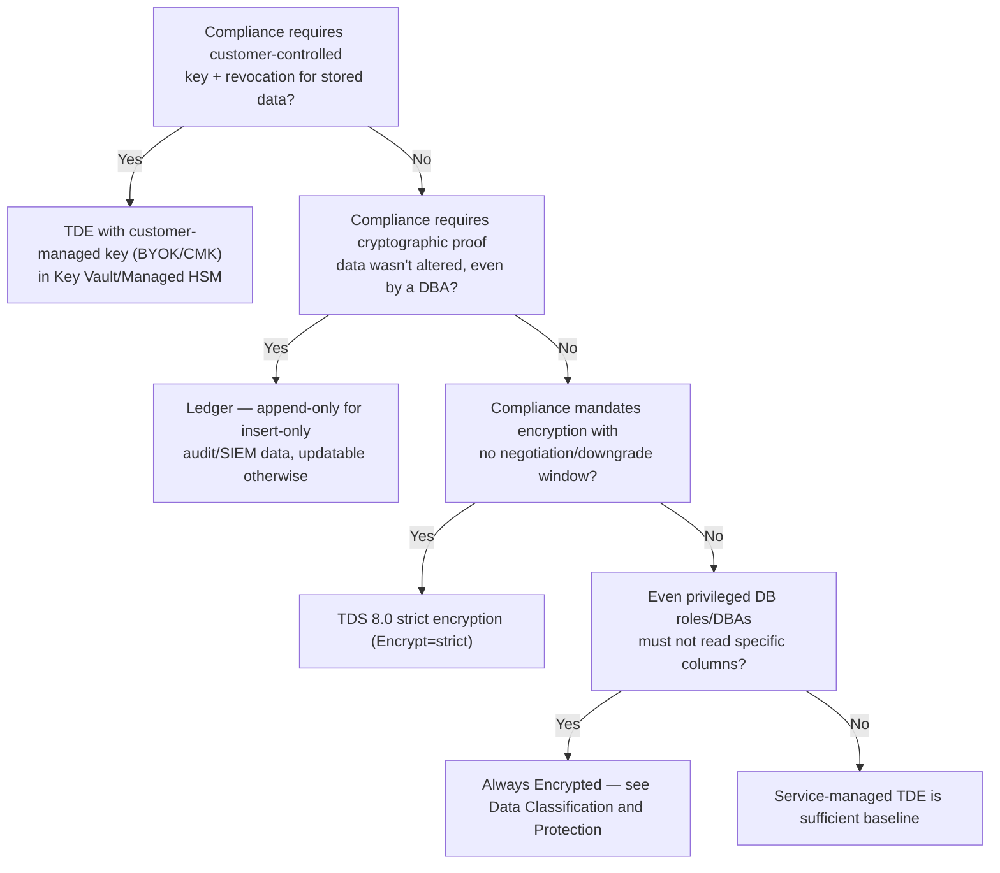

---
tags:
  - sc100
type: concept
domain:
  - apps-data
aliases:
  - TDE
  - Transparent Data Encryption
  - SQL Ledger
  - TDS 8.0
  - Strict encryption
---
# SQL Data Protection (TDE, Ledger, TDS 8.0)

## Purpose

The SQL-engine-native security features [[Data Classification and Protection]] only names in passing — **Transparent Data Encryption (TDE)**, **Ledger**, and **TDS 8.0 strict encryption** — what each actually protects, what it doesn't, and which compliance requirement each one specifically satisfies.

---

## Why Architects Choose It

- These three features protect three *different* threats against the same database — a stolen disk/backup (TDE), a privileged insider tampering with rows (Ledger), and a network attacker intercepting the wire (TDS 8.0) — and a design naming only one of them usually has a gap.
- TDE is table-stakes and mostly invisible; the architectural decision is **who holds the key** (service-managed vs. customer-managed/BYOK), which is what actually satisfies a "customer must control/revoke encryption keys" compliance requirement — not TDE's mere existence.
- Ledger is the answer to a specific, named compliance ask most encryption features can't satisfy: **cryptographic proof that data wasn't altered**, even by a DBA or cloud admin — auditors accept it as attestable evidence, reducing manual audit effort.
- TDS 8.0 closes a real gap in the legacy protocol: pre-8.0 TDS negotiates encryption *after* an initial cleartext handshake, which a downgrade attack can exploit; strict mode removes that window entirely and is what "mandatory encryption, no negotiation" compliance language actually requires.

---

## Transparent Data Encryption (TDE)

Encrypts the database and log **files at rest** — the answer to "someone steals the disk or a backup tape."

- **Mechanism**: a symmetric **Database Encryption Key (DEK)** encrypts data/log pages in real time on write, decrypts on read into memory. Encryption is page-level; it doesn't grow the database.
- **Key hierarchy**: the DEK itself is protected by either a **service-managed certificate** (Microsoft owns and rotates it, zero customer effort — the default) or a **customer-managed key (CMK)** — called the **TDE protector** — held in [[Key Vault]] or Managed HSM.
- **Customer-managed TDE (BYOK/CMK)**: the TDE protector is an asymmetric (or, on Premium/Managed HSM, symmetric AES) key you generate in, import into, or transfer from an on-prem HSM into Key Vault. The server (SQL Database/Synapse: server-level; Managed Instance: instance-level) uses its **managed identity** to send each database's DEK to Key Vault to be wrapped/unwrapped — the key material itself never leaves Key Vault.
- **Revocation is real and immediate in effect**: pull the server's access to the TDE protector (disable/delete the key, or revoke its Key Vault permission) and the database moves to an **Inaccessible** state within roughly 10 minutes (network-type failures) to 30 minutes (permission/4xx-type failures) — the only action left is deleting the database. This is the actual mechanism behind "compliance requires us to be able to revoke access to our data."
- **Rotation** is an online operation (seconds — it only re-wraps the DEK, not the whole database) and can be automated: the server polls Key Vault for new key versions and rotates within 24 hours of a new version appearing.
- **Backups stay bound to the key version active when they were taken** — restoring an old backup requires the *original* TDE protector version still being present in Key Vault, which is why Microsoft's guidance is to **never delete old key versions**, even after switching to a new one or reverting to service-managed keys.
- **What TDE does NOT protect**: data in transit (that's TDS 8.0/TLS below), data in use / privileged in-database access (that's Always Encrypted — see [[Data Classification and Protection]]), and `tempdb`/FILESTREAM edge cases (`tempdb` is encrypted automatically once any user database on the instance uses TDE; FILESTREAM data is never encrypted by TDE).

---

## Ledger

Cryptographic **tamper-evidence** for row-level data history — the answer to "prove to an auditor this data was never altered, including by our own DBAs."

- **What it protects against**: any attacker or *privileged user* — DBA, sysadmin, even a cloud admin with storage access — silently modifying historical data. TDE and Always Encrypted don't address this at all; they protect confidentiality, not integrity/history.
- **Mechanism**: every modified row is SHA-256 hashed into a **Merkle tree**; transactions are chained together the same way, forming an in-database **blockchain**. Periodic **database digests** (the root hash of the latest block) are exported to immutable, tamper-proof storage outside the database — Azure Blob Storage with immutability policies, Azure Confidential Ledger, or on-prem WORM storage.
- **Two table types**:
  - **Updatable ledger tables** — normal update/delete semantics; every change is automatically preserved in a system-generated **history table**, queryable via a ledger view. Fits system-of-record applications that still need to update rows.
  - **Append-only ledger tables** — updates/deletes are blocked at the API level entirely (no history table needed, since nothing is ever overwritten) — fits insert-only patterns like SIEM/audit-log storage, with stronger tamper resistance since there's no "previous version" to forge.
  - A **ledger database** can be created so *every* table in it is a ledger table by default, and once created can never be converted back to a normal database.
- **Verification**: comparing a stored digest against the database's current computed hash detects any tampering, even tampering performed by directly editing files on disk (a privileged attack Ledger can't *prevent* but is guaranteed to *detect*).
- **What Ledger does NOT do**: it doesn't encrypt anything by itself (pair with TDE/Always Encrypted for confidentiality) and doesn't prevent an attacker with OS-level access from modifying data — it guarantees that tampering is **detectable**, not that it's impossible.

---

## TDS 8.0 (Strict Encryption)

Removes the cleartext window in SQL Server's wire protocol — the answer to "attacker on the network path between the app and the database."

- **The problem it fixes**: pre-8.0 Tabular Data Stream (TDS) negotiates encryption *after* an initial cleartext TCP handshake and prelogin exchange (`TCP handshake → TDS prelogin cleartext → TLS handshake → auth encrypted → data exchange`). That unencrypted prelogin window is a downgrade/MITM opportunity, and encryption itself was historically optional.
- **TDS 8.0 flips the order**: `TCP handshake → TLS handshake → TDS prelogin (encrypted) → auth (encrypted) → data exchange (encrypted)` — the TLS tunnel is established *before* any TDS data (including the database name) is ever sent in the clear, aligning SQL's wire protocol with how HTTPS behaves.
- **`Encrypt=strict`** is the new connection-string option (SQL Server 2022+/Azure SQL/Managed Instance, requires updated ADO.NET/ODBC/OLE DB/JDBC/PHP/Python drivers) that forces TDS 8.0. `TrustServerCertificate=true` can't be combined with it — you must instead validate against a specific `HostNameInCertificate`, which is what actually prevents the MITM the cleartext window used to allow.
- **TLS 1.3 support**: TDS 8.0 has no minimum TLS version requirement and supports TLS 1.3 (OS-dependent — Windows 11/Server 2022+); legacy `Encrypt=mandatory`/`true` (TDS 7.x) tops out at TLS 1.2 and is **incompatible** with a TLS-1.3-only OS configuration.
- **Network manageability side-benefit**: because the TLS tunnel wraps the *entire* session from the start, standard network appliances can filter/pass-through SQL traffic the same way they handle HTTPS — not possible when part of the session was cleartext.

---

## Bring Your Own Key (BYOK) as a General Concept

"BYOK" and "customer-managed key (CMK)" are often used interchangeably, but architecturally BYOK is the specific case where the key **originates outside Azure** (generated on-prem or in another HSM) and is imported into [[Key Vault]]/Managed HSM — CMK is the broader umbrella that also includes a key generated natively inside Key Vault. Both put the customer in control of rotation and revocation; only BYOK additionally satisfies a "the key must never have been generated by the cloud provider" requirement some regulators impose. TDE's customer-managed mode (above) is one concrete implementation of this general pattern — the same CMK/BYOK choice recurs for Key Vault-backed encryption across nearly every Azure data service (see [[Data Classification and Protection]] for the general MMK/CMK decision).

---

## Architecture

---

## Architecture Decisions

---

## Comparison

| Compare | Difference |
| --- | --- |
| TDE vs. Always Encrypted | TDE protects data **at rest** (disk/backup theft) with zero application changes; the database engine and any authorized role can still read plaintext once the DEK is unwrapped. Always Encrypted protects data **in use**, client-side, so even the database engine or a privileged DBA never sees plaintext for protected columns. Full detail in [[Data Classification and Protection]]. |
| TDE vs. Ledger | TDE protects **confidentiality** of stored files. Ledger protects **integrity/history** — it doesn't hide data, it proves it wasn't tampered with, including against the very privileged roles TDE assumes are trusted. Complementary, not substitutes. |
| Service-managed TDE vs. customer-managed TDE (BYOK/CMK) | Service-managed: zero customer effort, Microsoft rotates, no revocation capability. Customer-managed: customer owns the TDE protector in Key Vault/Managed HSM, controls rotation *and* revocation (revoking access makes the database Inaccessible within ~10–30 minutes) — required wherever a regulation mandates customer key control. |
| Updatable vs. append-only ledger tables | Updatable: normal update/delete semantics, history preserved automatically in a paired history table — fits system-of-record apps. Append-only: updates/deletes blocked at the API level entirely, no history table needed — stronger tamper resistance, fits insert-only patterns like audit/SIEM logs. |
| TDS 7.x (`Encrypt=mandatory`/`true`) vs. TDS 8.0 (`Encrypt=strict`) | TDS 7.x negotiates encryption *after* a cleartext prelogin phase and tops out at TLS 1.2 — a downgrade/MITM window exists. TDS 8.0 wraps the *entire* session in TLS before any TDS data is sent, requires `HostNameInCertificate` validation instead of blind trust, and supports TLS 1.3. |
| CMK vs. BYOK (general terminology) | CMK is the umbrella: the customer owns/controls the key in Key Vault, however it got there. BYOK specifically means the key material originated **outside** Azure and was imported — satisfies stricter "cloud provider never generated this key" requirements CMK alone doesn't guarantee. |

---

## AZ-500 Review

AZ-500 already covers enabling TDE with service-managed keys and basic Key Vault-backed CMK configuration, plus baseline TLS/connection encryption concepts. Ledger, TDE key-revocation behavior as a compliance mechanism, TDS 8.0 strict encryption, and the CMK-vs-BYOK terminology distinction are new depth for SC-100.

---

## What's New for SC-100

- Treat TDE's **key ownership** (service-managed vs. customer-managed/BYOK) as the actual compliance decision — TDE itself is assumed baseline, not a differentiator.
- Know **Ledger** by name as the SC-100 answer to "prove data integrity/history to an auditor, even against our own privileged users" — a distinct requirement TDE/Always Encrypted don't address.
- Know **TDS 8.0 / `Encrypt=strict`** as the current answer to "mandatory in-transit encryption with no negotiation window," replacing the older `Encrypt=true`/mandatory TDS 7.x answer.
- Recognize TDE key revocation's concrete timing (Inaccessible state within ~10–30 minutes) as the actual mechanism satisfying a "must be able to cryptographically revoke our data" requirement — and the operational obligation it creates (retain every old key version for backup restore).
- Distinguish CMK from BYOK precisely — a regulator asking for proof the cloud provider never generated the key is asking for BYOK specifically, not just "customer-managed."

---

## Exam Tips

- "Even our DBAs shouldn't be able to read this data, and we need proof it was never altered" — two different asks: DBA-blind reads point to **Always Encrypted**; tamper-proof history points to **Ledger**. A scenario may need both.
- "Compliance requires the ability to instantly cut off access to our data by destroying a key" → customer-managed TDE (BYOK/CMK) — revocation makes the database Inaccessible within minutes.
- "Audit logs must be provably unaltered, including against a compromised admin account" → append-only ledger table, not updatable.
- "No negotiation window; encryption must be enforced before any data is exchanged" → TDS 8.0 strict encryption (`Encrypt=strict`), not legacy `Encrypt=true`.
- A scenario emphasizing TLS 1.3 support alongside SQL connections is pointing at TDS 8.0 — TDS 7.x tops out at TLS 1.2.
- "A regulator specifically requires the key was never generated inside Azure" → BYOK, not merely CMK.
- Restoring an old TDE-BYOK-protected backup fails after a key rotation → missing the **old key version** in Key Vault; the fix is retaining every prior TDE protector version, not regenerating a new one.

---

## Common Exam Confusion

- **TDE vs. Always Encrypted** — at-rest file protection vs. in-use, DBA-blind column protection.
- **TDE vs. Ledger** — confidentiality vs. integrity/tamper-evidence; different threat models entirely.
- **Updatable vs. append-only ledger tables** — history-tracked updates vs. insert-only, no history table needed.
- **TDS 7.x mandatory encryption vs. TDS 8.0 strict encryption** — encryption negotiated after a cleartext phase vs. encryption enforced before any protocol data is sent.
- **CMK vs. BYOK** — customer control in general vs. specifically customer-originated key material.

---

## Keywords

- Transparent Data Encryption (TDE), Database Encryption Key (DEK), TDE protector
- Service-managed key vs. customer-managed key (CMK), Bring Your Own Key (BYOK)
- TDE Inaccessible state, key rotation, key revocation
- Ledger, updatable ledger table, append-only ledger table, history table
- Merkle tree, database digest, ledger verification, immutable storage
- TDS (Tabular Data Stream), TDS 8.0, strict encryption, `Encrypt=strict`
- TLS 1.2 vs. TLS 1.3, `HostNameInCertificate`, `TrustServerCertificate`
- Always Encrypted (cross-reference)

---

## Related Services

- [[Data Classification and Protection]] — Always Encrypted, CMK/MMK general model, encryption-at-rest/in-transit/in-use triad this note extends with SQL-specific mechanics.
- [[Double Key Encryption (DKE)]] — the Purview/M365 analog for highest-sensitivity content, contrasted here for SQL vs. document/email data.
- [[Key Vault]] — TDE protector storage, HSM tiers, soft-delete/purge protection requirements.
- [[Purview Compliance Manager]] — where TDE/encryption controls get tracked as compliance evidence.
- [[Assigning Regulatory Compliance Standards]] — the technical-configuration compliance workflow these controls feed into.
- [[Identity and Access Management (IAM)]] — managed identity used by the server to reach Key Vault.
- [[Securing IaaS and PaaS Services]]
- [[Cloud Workload Protection (CWPP)]] — Defender for SQL runtime/vulnerability protection layered on top of these static controls.

---

## References

- [Transparent Data Encryption (TDE)](https://learn.microsoft.com/en-us/sql/relational-databases/security/encryption/transparent-data-encryption) — Microsoft Learn
- [Customer-managed transparent data encryption (TDE)](https://learn.microsoft.com/en-us/azure/azure-sql/database/transparent-data-encryption-byok-overview) — Microsoft Learn
- [Ledger overview](https://learn.microsoft.com/en-us/sql/relational-databases/security/ledger/ledger-overview) — Microsoft Learn
- [TDS 8.0](https://learn.microsoft.com/en-us/sql/relational-databases/security/networking/tds-8) — Microsoft Learn
- [[Exam Objectives]]
