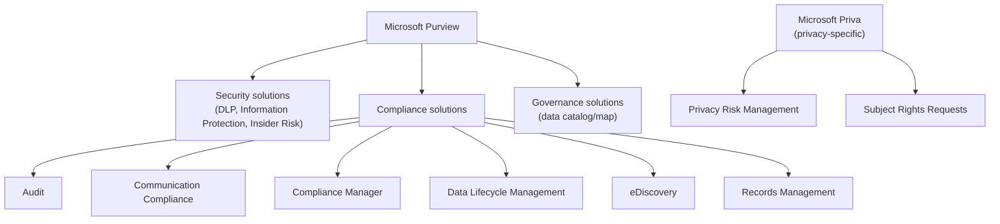
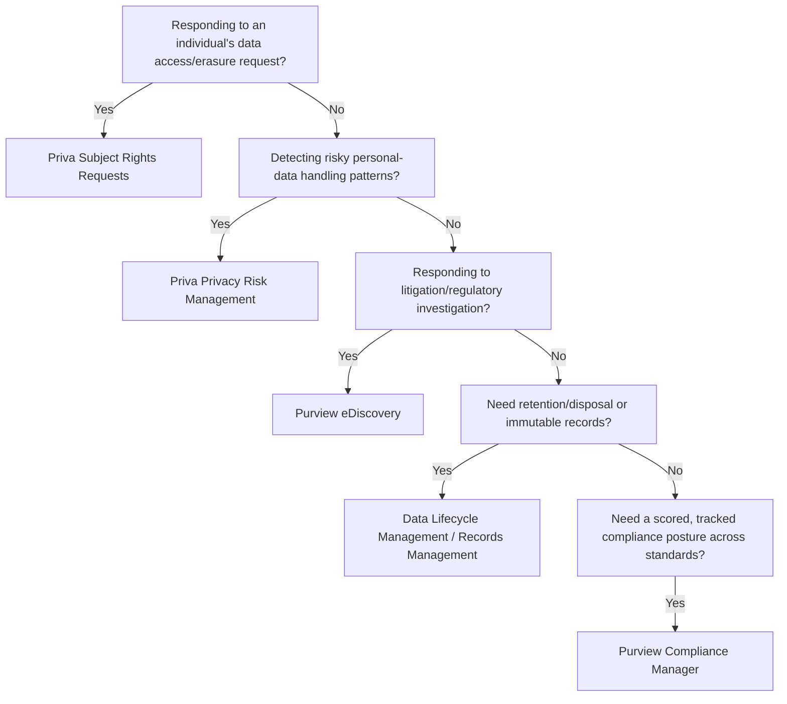

---
tags:
  - sc100
type: concept
domain:
  - ops-identity-compliance
---
# Compliance and Privacy

## Purpose

Translating external regulatory and legal requirements into technical controls, choosing among [[Purview]]'s compliance solutions, [[Priva|Microsoft Priva]]'s privacy-specific tools, [[Azure Policy]], and Defender for Cloud's regulatory dashboard.

---

## Why Architects Choose It

- Regulatory requirements (GDPR, HIPAA, PCI-DSS, etc.) are legal obligations, not optional configuration — architecture must translate them into enforceable controls, not just documentation.
- Compliance (organizational obligations) and privacy (individual data-subject rights) are related but distinct problems requiring different tools — conflating them leaves gaps, since meeting an org-wide compliance standard doesn't automatically satisfy an individual's privacy rights.
- Purview centralizes organizational compliance solutions (audit, eDiscovery, records management); Priva specifically automates privacy risk detection and subject rights requests — picking the right tool for the right obligation matters.
- Azure Policy and the Defender for Cloud regulatory compliance dashboard operationalize the infrastructure side — already covered in [[Security Posture Assessments]]; this note covers the data/legal side those don't reach.

---

## When to Use

- Translating a named regulation into specific technical and organizational controls.
- Responding to legal holds, litigation, or regulatory investigations (eDiscovery).
- Automating subject rights requests — access or erasure — at scale (Priva Subject Rights Requests).
- Detecting privacy risk in how personal data is stored or shared before it becomes an incident (Priva Privacy Risk Management).
- Meeting record-keeping and retention/disposal obligations (Data Lifecycle Management, Records Management).

---

## When NOT to Use

- As a substitute for legal counsel — these tools operationalize requirements a legal/compliance team defines; architects don't originate regulatory interpretation.
- Treating Priva's individual-rights scope as interchangeable with Purview's organizational compliance scope — a subject rights request isn't an eDiscovery case, and a compliance audit isn't a privacy risk assessment.
- Relying on Compliance Manager's score alone as proof of compliance — scoring mechanics and that caveat are already covered in [[Security Scoring Dashboards]].

---

## Architecture

---

## Architecture Decisions

---

## Comparison

| Compare | Difference |
| --- | --- |
| Purview compliance solutions vs. Microsoft Priva | Purview compliance addresses organizational obligations (audit, legal hold, retention, records); Priva addresses individual privacy rights (subject rights requests) and proactive privacy risk detection. |
| eDiscovery vs. Subject Rights Requests | eDiscovery collects evidence for legal cases/investigations across the organization; Subject Rights Requests fulfills an individual's specific data access/erasure request under privacy law. |
| Compliance Manager vs. Defender for Cloud Regulatory Compliance dashboard | Compliance Manager scores organizational/process controls (often attestation-based, spans Microsoft 365 + multicloud); the Defender for Cloud dashboard scores technical resource configuration — full detail in [[Security Posture Assessments]]. |

---

## AZ-500 Review

AZ-500 doesn't cover Purview compliance solutions or Priva at all — it's scoped to Azure infrastructure security. Data governance and privacy tooling is new territory for SC-100.

---

## What's New for SC-100

- Recognize compliance and privacy as related but distinct architecture problems requiring different Purview/Priva tools, not a single "compliance" bucket.
- Know Priva's two products by name — Privacy Risk Management and Subject Rights Requests — as the exam's privacy-specific answer, distinct from Purview's org-wide compliance solutions.
- Translate a named regulation into the specific Purview/Priva/Azure Policy combination that satisfies it, rather than citing the regulation alone as an answer.
- Compliance Manager now explicitly spans multicloud with 360+ prebuilt regulatory assessments — treat it as the cross-cloud compliance posture tool, not an Azure-only one.

---

## Exam Tips

- "An individual is requesting their data be deleted" points to Priva Subject Rights Requests, not eDiscovery.
- "Detect employees oversharing personal data externally" points to Priva Privacy Risk Management, not DLP alone, though the two can complement each other.
- "Preserve content for litigation" points to eDiscovery legal hold, not Records Management, which handles planned retention/disposal rather than litigation preservation.

---

## Common Exam Confusion

- **Priva vs. Purview compliance solutions** — individual privacy rights vs. organizational compliance obligations.
- **eDiscovery vs. Records Management** — reactive legal collection vs. proactive retention/disposal policy.
- **Compliance Manager vs. Defender for Cloud Regulatory Compliance** — process/attestation scoring vs. technical resource configuration scoring.

---

## Keywords

- Purview compliance solutions: Audit, Communication Compliance, Compliance Manager, Data Lifecycle Management, eDiscovery, Records Management
- Microsoft Priva: Privacy Risk Management, Subject Rights Requests (SRR)
- Data subject access request (DSAR)
- Legal hold vs. retention label
- Translating regulatory requirements into technical controls

---

## Related Services

- [[Purview]] — Purview's own product orientation map lives there; this note covers the Risk & Compliance area in depth.
- [[Priva]] — full product depth (Privacy Risk Management, Subject Rights Requests) lives there; this note covers the comparison against Purview.
- [[Security Posture Assessments]]
- [[Security Scoring Dashboards]]
- [[Azure Policy]]
- [[Microsoft Cloud Security Benchmark (MCSB)]]
- [[AI and Copilot Security Architecture]]
- [[Data Security Posture Management (DSPM)]]

---

## References

- [Microsoft Purview data compliance solutions](https://learn.microsoft.com/en-us/purview/purview-compliance) — Microsoft Learn
- [Microsoft Priva](https://learn.microsoft.com/en-us/privacy/priva/priva-overview) — Microsoft Learn
- [[Exam Objectives]]
- https://aka.ms/compliance
- https://aka.ms/servicetrust
