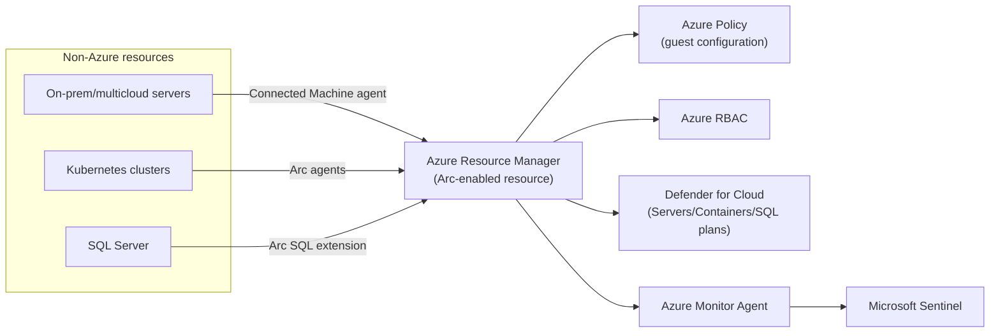

---
tags:
  - sc100
type: cheat-sheet
domain:
  - infrastructure
---

# Azure Arc

Projects non-Azure resources (on-prem servers, multicloud VMs, Kubernetes clusters, SQL Server, VMware/SCVMM) into Azure Resource Manager as first-class Azure resources — the onboarding mechanism that extends [[Azure Policy]], RBAC, [[Microsoft Defender for Cloud]], and [[Microsoft Sentinel]] to anything outside Azure.

## Core Capabilities

- **Arc-enabled servers** — install the **Connected Machine agent** on a Windows/Linux VM (on-prem, AWS, GCP, any hypervisor); the server gets an Azure Resource ID, resource group, tags, and RBAC scope, and becomes eligible for Azure Policy, Update Manager, Change Tracking, and Defender for Servers.
- **Arc-enabled Kubernetes** — onboards any CNCF-conformant cluster (on-prem, other cloud, edge) for centralized **GitOps configuration**, Azure Policy, and Defender for Containers — without moving the cluster's control plane into Azure.
- **Arc-enabled SQL Server** — extends Defender for SQL, automated patching/backup, and best-practice assessment to SQL Server running anywhere, not just Azure SQL/managed instances.
- **Arc-enabled data services** — SQL Managed Instance and PostgreSQL Hyperscale run *on* Arc-enabled infrastructure (on-prem/Azure Local), giving cloud-consistent PaaS data services in a customer's own datacenter.
- **Azure Local (formerly Azure Stack HCI)** — Arc is the control plane for Azure Local clusters; VMs on it are managed the same way as Arc-enabled servers.
- **Arc-enabled VMware vSphere/SCVMM** — projects VM inventory from those platforms into Azure for unified VM lifecycle operations (start/stop/resize) alongside native Azure VMs.

## Security Architecture

- Communication is **agent-initiated, outbound-only HTTPS 443** to Arc endpoints — no inbound firewall rule or open management port is required, which is the reason Arc fits a Zero Trust network posture out of the box.
- Only management metadata (inventory, config, telemetry the agent is told to send) flows to Azure — workload data itself stays put; Arc does not migrate or copy the resource.
- **Azure Arc Private Link Scope** routes that agent traffic over Private Link instead of the public internet — the recommended posture for servers in regulated or sensitive environments (same Private Link pattern covered in [[Securing IaaS and PaaS Services]], applied to management traffic instead of data traffic).
- Once Arc-enabled, a server is just another RBAC- and Policy-scoped resource — it's the reason [[Security Posture Assessments|MCSB scoring]], Defender for Servers, and Sentinel analytics rules can treat a hybrid/multicloud fleet identically to native Azure VMs.

## Key Facts

- Onboarding at scale uses a script, Group Policy/SCCM push, Azure Migrate, or the guest configuration extension via Azure Policy — not one VM at a time in the portal.
- Arc-enabled servers get **Update Manager** and **Change Tracking/Inventory** the same way Azure VMs do — patching and drift detection extend to the hybrid fleet, not just Azure-native compute.
- Arc-enabled Kubernetes' GitOps configuration (via Flux) is the mechanism for pushing consistent policy/config to clusters the customer doesn't run on AKS.
- Defender for Cloud plans (Servers, Containers, SQL) require the resource to be Arc-enabled first if it isn't natively Azure — Arc is the prerequisite projection step, not a separate protection layer itself.

## Exam Notes

- "Extend Defender for Cloud/Sentinel/Azure Policy to on-prem or AWS/GCP VMs" → Azure Arc onboarding is always the first step; a scenario skipping straight to "enable Defender for Servers" on a non-Azure VM is missing the Arc prerequisite.
- Full posture-management decision flow (when multicloud connectors vs. Arc apply) already lives in [[Security Posture Assessments]] — this page is the mechanism, that page is the decision.
- Ties to "design monitoring to support hybrid and multicloud environments" — Azure Monitor Agent running on an Arc-enabled server is the expected collection path into [[Microsoft Sentinel]] (see [[Azure Security Logging]]). Arc is the specific mechanism behind CAF's named **Unified Operations model** for that exam objective — full model in [[Cloud Adoption Framework (CAF)]].
- A scenario needing management traffic to avoid the public internet entirely points to Azure Arc Private Link Scope, not a VPN/ExpressRoute-only answer.

## Comparison

| Compare | Difference |
| --- | --- |
| Azure Arc vs. [[Network Watcher and Lighthouse\|Azure Lighthouse]] | Arc projects *non-Azure resources* into a tenant's own Azure Resource Manager so native Azure tooling can govern them. Lighthouse is cross-*tenant* delegated administration — letting one tenant (typically an MSP) manage resources that already live in a *different* customer's Azure tenant. Different problem: "manage things outside Azure" vs. "manage another tenant's Azure resources." Lighthouse mechanics live in [[Network Watcher and Lighthouse]], not repeated here. |
| Arc-enabled Kubernetes vs. AKS | AKS is Azure's own managed Kubernetes control plane. Arc-enabled Kubernetes onboards a cluster whose control plane already runs elsewhere (on-prem, another cloud, edge) so it can receive the same GitOps/Policy/Defender treatment — Arc doesn't replace or host the control plane. |
| Arc-enabled servers vs. Update Manager alone | Update Manager is one capability *unlocked by* Arc for non-Azure servers; Arc itself is the broader projection/identity layer (RBAC, Policy, Defender eligibility) that Update Manager, Change Tracking, and Defender for Servers all depend on. |

## Related

- [[Security Posture Assessments]]
- [[Cloud Workload Protection (CWPP)]]
- [[Securing IaaS and PaaS Services]]
- [[Azure Security Logging]]
- [[Microsoft Sentinel]]
- [[Microsoft Defender for Cloud]]
- [[Azure Policy]]
- [[Zero Trust]]
- [[Cloud Adoption Framework (CAF)]]
- [[Network Watcher and Lighthouse]]
- [[Exam Objectives]]

## References

- [What is Azure Arc?](https://learn.microsoft.com/en-us/azure/azure-arc/overview) — Microsoft Learn
- [Azure Arc-enabled servers overview](https://learn.microsoft.com/en-us/azure/azure-arc/servers/overview) — Microsoft Learn
- [Azure Arc-enabled Kubernetes overview](https://learn.microsoft.com/en-us/azure/azure-arc/kubernetes/overview) — Microsoft Learn
- [Connect servers via Azure Arc Private Link Scope](https://learn.microsoft.com/en-us/azure/azure-arc/servers/private-link-security) — Microsoft Learn
