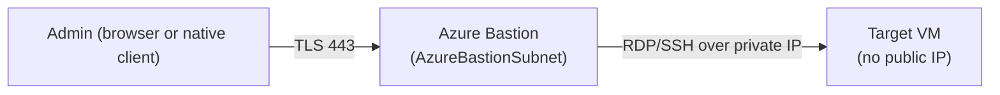

---
tags:
  - sc100
type: cheat-sheet
domain:
  - infrastructure
status: needs-verification
---

# Azure Bastion

Browser- (or native-client-) based RDP/SSH to a VM with **no public IP required on the VM itself** — traffic is brokered through the Bastion host over TLS 443. The *when to use it vs. JIT VM access* decision already lives in [[Securing IaaS and PaaS Services]]; this page is the mechanism and SKU mechanics.

## Core Capabilities

- **Deployment** — one Bastion host per VNet (or a shared hub VNet, reached via peering), in a dedicated **AzureBastionSubnet**. It's a PaaS resource with its own public IP; the *target* VM never needs one.
- **Basic / Standard tier** — Standard adds native client support (connect via your own RDP/SSH client, not just the Azure portal browser session), IP-based connection (reach a VM by private IP across peered/on-prem networks, not just an Azure-registered VM), and scalable host instances.
- **Premium tier** — adds session recording (to a Storage account) and a fully private-only deployment option (no public IP on the Bastion host itself, reached instead via Private Link).
- **Developer SKU** — a free, simplified tier for dev/test scenarios with reduced features (no scaling, fewer connection options) — not the production answer.

## Architecture

## Key Facts

- No inbound NSG rule opening RDP/SSH (3389/22) from the internet is ever needed — Bastion reaches the VM over its private IP inside the VNet.
- Session recording and private-only deployment are Premium-only — a scenario requiring either names that tier specifically.
- Bastion removes the exposure entirely (no public IP/open port, full stop); [[Securing IaaS and PaaS Services|JIT VM access]] narrows the *time window* a port is open when a public IP/direct path still exists — complementary, not interchangeable (full comparison in [[Securing IaaS and PaaS Services]]).

## Exam Notes

- "Eliminate public IP exposure on VM management ports entirely" → Azure Bastion, not just NSG rules or JIT alone.
- "Connect using a native RDP/SSH client, not just the browser" → Standard tier or higher.
- "Record and audit privileged administrative sessions" → Premium tier's session recording.
- "Bastion host itself must have no public IP" → Premium tier's private-only deployment.

## Comparison

| Compare | Difference |
| --- | --- |
| Azure Bastion vs. JIT VM access | Full comparison in [[Securing IaaS and PaaS Services]] — Bastion removes the public IP/open port requirement entirely; JIT narrows the exposure window when direct access still exists. |
| Basic/Standard vs. Premium | Standard adds native client + IP-based connection over Basic. Premium adds session recording and private-only (no public IP on the Bastion host) deployment — the tier to name when audit/recording or a fully private management plane is required. |

## AZ-500 Review

AZ-500 already covers deploying Azure Bastion and connecting to a VM through it at a configuration level. SC-100 adds: choosing the right tier for the scenario (session recording, private-only) and treating Bastion as one layer in a broader IaaS network architecture alongside NSGs, Azure Firewall, and JIT VM access — see [[Securing IaaS and PaaS Services]].

## Keywords

- Azure Bastion, AzureBastionSubnet
- Basic vs. Standard vs. Premium vs. Developer SKU
- Native client support, IP-based connection
- Session recording, private-only deployment
- No public IP on target VM

## Related Services

- [[Securing IaaS and PaaS Services]]
- [[Network Security Group]]
- [[Azure Firewall]]
- [[Private Link]]
- [[PIM]]
- [[Exam Objectives]]

## References

- [Azure Bastion overview](https://learn.microsoft.com/en-us/azure/bastion/bastion-overview) — Microsoft Learn
- [Azure Bastion configuration settings (SKUs/features)](https://learn.microsoft.com/en-us/azure/bastion/configuration-settings) — Microsoft Learn

## Verification Flag

Bastion's SKU lineup (Developer/Basic/Standard/Premium) and per-tier feature split have changed as Microsoft has added tiers over time — re-verify current SKU names and exact feature boundaries against the live configuration-settings page close to exam date.
