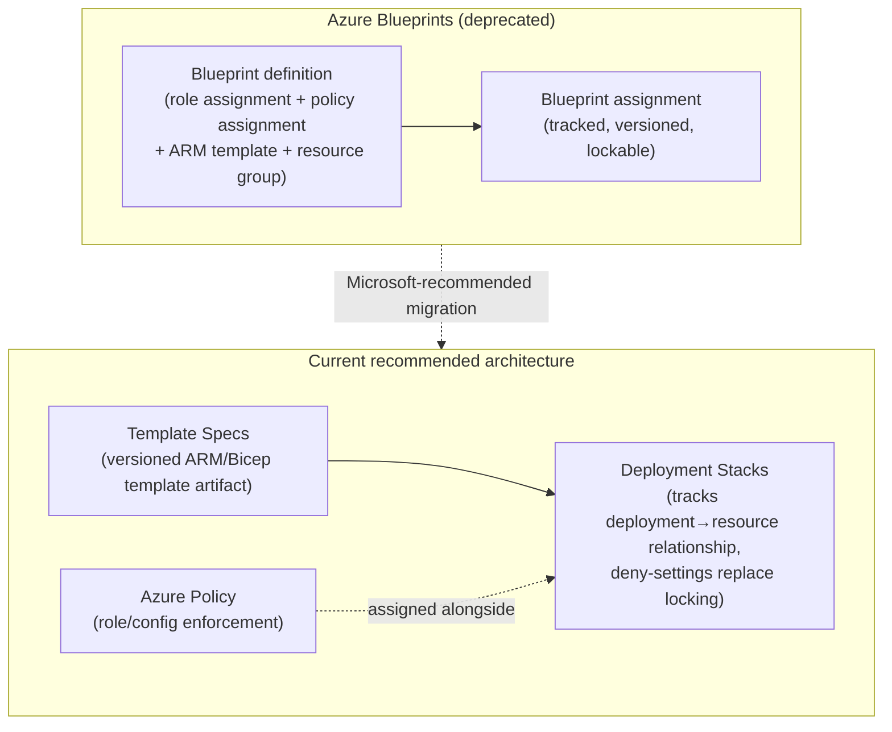
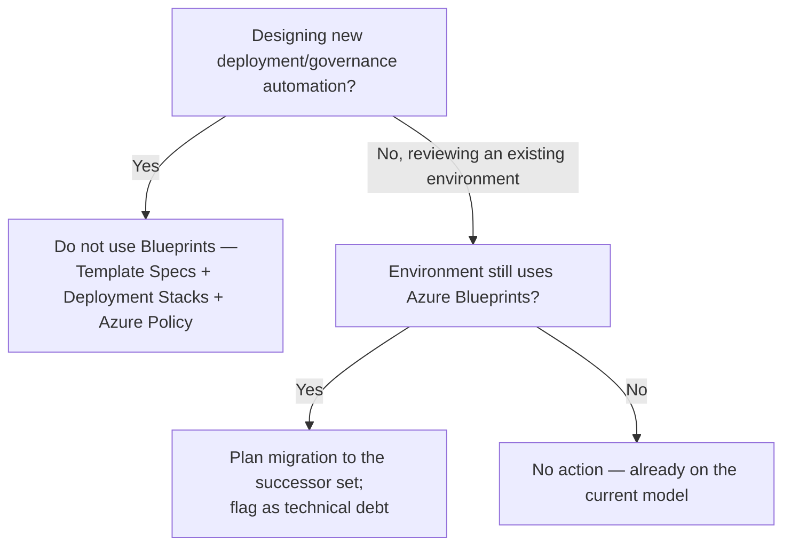

---
tags:
  - sc100
type: cheat-sheet
domain:
  - ops-identity-compliance
aliases:
  - Blueprints
status: needs-verification
---

# Azure Blueprints

## Purpose

A **deprecated** governance-as-code service that packaged role assignments, policy assignments, ARM templates, and resource groups into one versioned, trackable artifact — Microsoft is retiring it in favor of [[Azure Policy]] for enforcement plus **Template Specs** and **Deployment Stacks** for deployment/lifecycle tracking.

---

## Why It Existed (and Why It's Being Retired)

- Blueprints solved a real problem: an ARM template deployment alone creates resources but keeps **no ongoing relationship** to what it deployed — nothing tracks "this resource group exists because of that deployment," and nothing stops someone from deleting a piece of it later.
- A **blueprint definition** bundled four artifact types — role assignment, policy assignment, ARM template, resource group — versioned them together, and could **lock** deployed resources against deletion or modification, giving a tracked, assignable governance package.
- Microsoft has since split that job across purpose-built successors that each do one part better: **Azure Policy** already owns enforcement (see [[Azure Policy]]); **Template Specs** package and version ARM/Bicep templates for reuse; **Deployment Stacks** track the relationship between a deployment and its resources, with **deny-settings** replacing Blueprints' resource locking.
- Landing zone deployment moved the same direction — the [[Azure Landing Zones|Azure Landing Zone Accelerator]] is now Bicep/Terraform-based, not Blueprints-based, reflecting the same shift.

---

## When to Use

- Recognizing an **existing** blueprint-based deployment (older landing zones, legacy governance packages) during an architecture review — you still need to know what it is to plan its migration.
- Answering exam questions that test recognizing Blueprints as a **legacy/deprecated** distractor rather than the correct modern recommendation.

---

## When NOT to Use

- For **any new deployment or governance design** — Microsoft's own guidance directs new work to Template Specs + Deployment Stacks + Azure Policy, or a full IaC tool (Bicep/Terraform).
- As "the" answer to a scenario asking how to package RBAC + Policy + templates together for reuse — that packaging role has moved to Template Specs (artifacts) plus Azure Policy (assignment) as separate, composed steps, not one bundled service.

---

## Architecture

### Migration Mapping

| Blueprint artifact | Successor |
| --- | --- |
| ARM template artifact | **Template Specs** (versioned, shareable template package) |
| Policy assignment artifact | **Azure Policy** assignment, applied directly at the target scope |
| Role assignment artifact | RBAC assignment via [[Azure Policy]] (`roleDefinitionIds` in a DINE policy) or directly in IaC |
| Resource group artifact + resource locking | **Deployment Stacks**, with **deny-settings** as the modern equivalent of Blueprints' lock |
| Blueprint assignment (tracked relationship) | **Deployment Stacks**' own deployment-to-resource tracking |

---

## Architecture Decisions

---

## Comparison

| Compare | Difference |
| --- | --- |
| Azure Blueprints vs. [[Azure Policy]] | Blueprints bundled RBAC + Policy + templates + resource groups into one versioned, trackable package (now deprecated). Azure Policy is the enforcement/compliance-evaluation engine alone — it was always the mechanism Blueprints' policy artifact assigned under the hood, and it's the piece that survives. |
| Azure Blueprints vs. Template Specs | Blueprints tracked a bundle of *multiple* artifact types together. Template Specs package and version *one* ARM/Bicep template for reuse — narrower scope, still actively developed. |
| Azure Blueprints vs. Deployment Stacks | Blueprints locked deployed resources against drift/deletion as part of the assignment. Deployment Stacks track the deployment-to-resource relationship directly and use **deny-settings** to block modification/deletion — the direct functional replacement for locking. |
| Deployment Stacks vs. plain ARM/Bicep deployment | Plain deployment creates resources with no ongoing tracked relationship — delete the deployment record and the resources persist untracked. A Deployment Stack keeps that relationship live, so removing the stack can also remove what it deployed, and deny-settings can block drift in between. |

---

## AZ-500 Review

AZ-500 does not require deep Blueprints knowledge — by the time AZ-500 was last substantially revised, Blueprints was already positioned as legacy for new designs. Treat any AZ-500-era exposure to Blueprints as historical context, not a skill assumed here.

---

## What's New for SC-100

- Recognize Azure Blueprints **by name** as a deprecated service so it's correctly excluded as the answer to "package governance for reuse" scenarios — the current answer is Template Specs + Deployment Stacks + Azure Policy, or a landing zone accelerator built on Bicep/Terraform.
- Understand *why* it was split apart: enforcement (Policy), template packaging (Template Specs), and deployment/lifecycle tracking (Deployment Stacks) are now three separate, independently evolving concerns instead of one bundled product — matches this vault's general pattern of prevent/detect/track being deliberately separate layers.
- Plan a **migration path** for an existing Blueprints-based environment as an explicit architecture deliverable, not a "leave it running" default.

---

## Exam Tips

- A scenario proposing **Azure Blueprints** as the recommended solution for a *new* deployment is very likely a distractor — the modern answer is Template Specs + Deployment Stacks + Azure Policy.
- "Prevent a deployed resource from being deleted or modified outside the pipeline" → **Deployment Stacks with deny-settings**, not Blueprints locking.
- "Package and reuse a versioned ARM/Bicep template" → **Template Specs**, not Blueprints.
- Don't confuse Blueprints (deprecated, deployment/packaging tool) with [[Azure Policy]] (active, enforcement/compliance engine) — Policy is not being retired.

---

## Common Exam Confusion

- **Azure Blueprints vs. Azure Policy** — Blueprints bundled and deployed; Policy enforces and scores compliance. Policy survives Blueprints' retirement because it was always the enforcement layer underneath.
- **Azure Blueprints vs. Template Specs vs. Deployment Stacks** — one deprecated bundle vs. two narrower, actively maintained successors (template packaging vs. deployment/lifecycle tracking).
- **Blueprints locking vs. Deployment Stacks deny-settings** — same protective intent (block drift/deletion), different, non-interchangeable mechanisms tied to different services.

---

## Keywords

- Azure Blueprints — deprecated, retired
- Blueprint definition, blueprint assignment, artifacts (role assignment, policy assignment, ARM template, resource group)
- Template Specs (versioned template packaging)
- Deployment Stacks, deny-settings (successor to Blueprints locking)
- Migration from Blueprints
- Landing Zone Accelerator — now Bicep/Terraform, not Blueprints

---

## Related Services

- [[Azure Policy]]
- [[Azure Landing Zones]]
- [[Cloud Adoption Framework (CAF)]]
- [[Microsoft Cloud Security Benchmark (MCSB)]]
- [[DevOps Security]]
- [[Defender for Cloud REST API]]
- [[Exam Objectives]]

---

## References

- [Azure Blueprints deprecation](https://learn.microsoft.com/en-us/azure/governance/blueprints/overview) — Microsoft Learn
- [What are Template Specs?](https://learn.microsoft.com/en-us/azure/azure-resource-manager/templates/template-specs) — Microsoft Learn
- [Azure Deployment Stacks](https://learn.microsoft.com/en-us/azure/azure-resource-manager/bicep/deployment-stacks) — Microsoft Learn
- [Azure Policy overview](https://learn.microsoft.com/en-us/azure/governance/policy/overview) — Microsoft Learn
- [[Exam Objectives]]

---

## Verification Flag

Blueprints' exact retirement/support-end date and Microsoft's final migration guidance were still firming up as of this vault's last check — re-verify the current deprecation timeline and the recommended migration tooling (Template Specs, Deployment Stacks, or a newer successor) against Microsoft Learn close to exam date, since a retired service occasionally still appears in exam content for a transition period.
