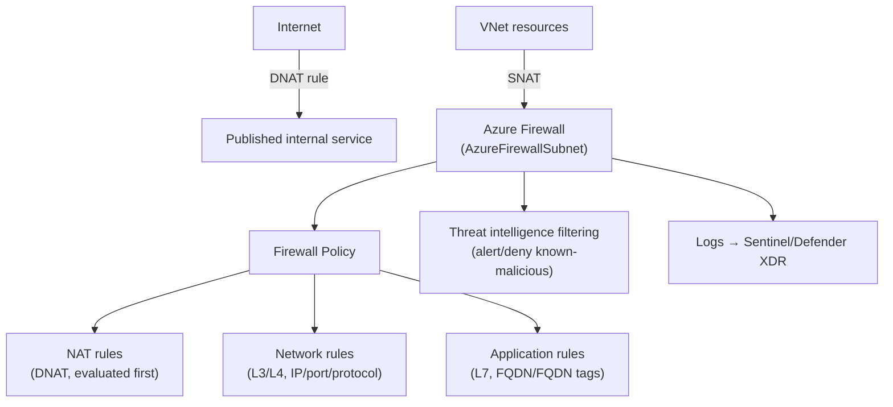
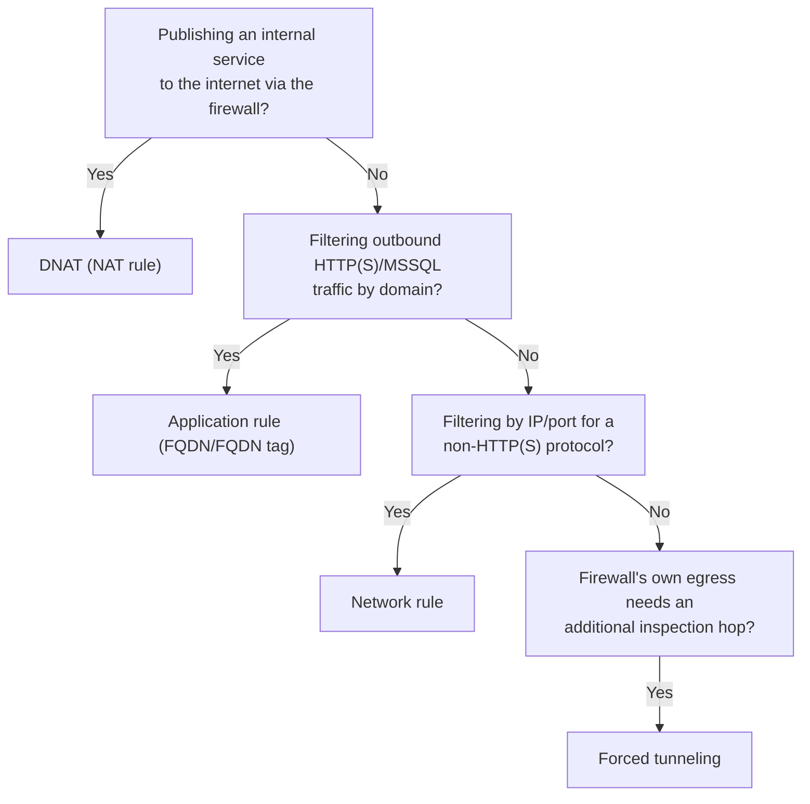

---
tags:
  - sc100
type: cheat-sheet
domain:
  - infrastructure
---

# Azure Firewall

Managed, stateful, highly-available L3–L7 PaaS firewall deployed in its own dedicated subnet. The *when to use it vs. NSG/WAF/NVA* decisions are already covered in [[Securing IaaS and PaaS Services]] and [[Network Security Architecture]]; this page is the rule/deployment mechanics.

## Core Capabilities

- **Deployment** — sits in a dedicated `AzureFirewallSubnet` (minimum /26); fully managed — no customer patching, built-in scaling and availability.
- **Rule types**, held inside a **Firewall Policy**:
  - **NAT rules (DNAT)** — translate and forward inbound traffic from the firewall's public IP to an internal resource (publishing an internal service to the internet through the firewall).
  - **Network rules** — L3/L4 filtering by IP, port, and protocol, for non-HTTP(S) traffic or where FQDN filtering isn't the goal.
  - **Application rules** — L7 filtering by **FQDN or FQDN tag**, for HTTP(S) and MSSQL traffic — the "allow only these domains" control.
  - **Processing order**: DNAT rules apply first (translating the destination), then network rules, then application rules — traffic is evaluated against the *post-translation* address for the later rule types.
- **SNAT** — outbound traffic from VNet resources is source-NAT'd to the firewall's public IP by default; ranges considered "private/internal" can be excluded from SNAT so their original source IP is preserved (relevant for on-prem-bound or private traffic visibility).
- **Firewall Policy** — the current, centralized way to manage rules (superseding older "classic" per-instance rules), supporting **hierarchical policies** (a parent policy with child/local overrides) — the object [[Network Security Architecture|Firewall Manager]] assigns across many hubs at scale; not repeated here.
- **Threat intelligence-based filtering** — a native, built-in option to alert or deny traffic matching Microsoft's threat intelligence feed of known-malicious IPs/domains — distinct from the broader Defender Threat Intelligence architecture in [[Threat Intelligence]] (that note covers *sourcing/operationalizing* TI across the platform; this is one firewall-native consumer of it).
- **SKU tiers** — Basic, Standard, Premium; Premium adds TLS inspection and IDPS — full tier trade-off and the NVA comparison already live in [[Network Security Architecture]].
- **Forced tunneling** — routes the firewall's own outbound traffic through an additional on-prem/NVA hop, for compliance chains requiring a further inspection point.

## Architecture

## Architecture Decisions

## Key Facts

- DNAT rules run *first* — a network or application rule written against the original (pre-translation) destination won't match; think in terms of the translated path.
- SNAT applies by default to all outbound VNet traffic through the firewall; excluding private ranges from SNAT is an explicit configuration choice, not automatic.
- "Classic" per-instance rules still exist but Firewall Policy is the current recommendation — a design still describing classic rules for a new deployment is describing the outdated pattern.

## Exam Notes

- "Publish an internal web server to the internet through the firewall's public IP" → a DNAT rule, not a network rule alone.
- "Restrict outbound traffic to a specific set of allowed domains" → an application rule (FQDN filtering), not a network rule.
- "Filter a non-web protocol by IP and port" → a network rule.
- SKU tier selection (Basic/Standard/Premium), Firewall Manager centralization, and the NVA trade-off are covered in [[Network Security Architecture]] — this page assumes that decision is already made.

## Comparison

| Compare | Difference |
| --- | --- |
| NAT rule vs. network rule vs. application rule | NAT (DNAT): translates and forwards inbound traffic to an internal resource. Network: L3/L4 IP/port/protocol filtering. Application: L7 FQDN/FQDN-tag filtering for HTTP(S)/MSSQL. Different OSI layer and traffic direction each is built for. |
| Classic rules vs. Firewall Policy | Classic rules are configured per firewall instance directly. Firewall Policy is a standalone, reusable object supporting hierarchical parent/child policies — the object Firewall Manager assigns across multiple firewalls/hubs. Policy is the current recommendation. |
| Azure Firewall vs. Azure Firewall Premium | Full trade-off in [[Network Security Architecture]] — Premium adds TLS inspection and IDPS, closing gaps that otherwise required a third-party NVA. Not repeated here. |
| Azure Firewall vs. NSG | Full comparison in [[Securing IaaS and PaaS Services]] — centralized, stateful, FQDN-aware policy vs. free subnet/NIC segmentation. Not repeated here. |

## AZ-500 Review

AZ-500 already covers deploying Azure Firewall, configuring NAT/network/application rules, and basic policy at the resource level — this page's mechanics are assumed knowledge. SC-100's additions (SKU/Premium tier decision, Firewall Manager centralization across hubs, the NVA trade-off) live in [[Network Security Architecture]], not on this page.

## Keywords

- AzureFirewallSubnet
- DNAT (NAT rules) vs. network rules vs. application rules
- FQDN / FQDN tags
- SNAT, private range exclusion
- Firewall Policy, hierarchical (parent/child) policy
- Threat intelligence-based filtering
- Forced tunneling

## Related

- [[Network Security Architecture]]
- [[Securing IaaS and PaaS Services]]
- [[Network Security Group]]
- [[Azure Landing Zones]]
- [[Threat Intelligence]]
- [[Zero Trust]]
- [[Exam Objectives]]

## References

- [What is Azure Firewall?](https://learn.microsoft.com/en-us/azure/firewall/overview) — Microsoft Learn
- [Azure Firewall rule processing logic](https://learn.microsoft.com/en-us/azure/firewall/rule-processing) — Microsoft Learn
- [Azure Firewall Policy overview](https://learn.microsoft.com/en-us/azure/firewall-manager/policy-overview) — Microsoft Learn
