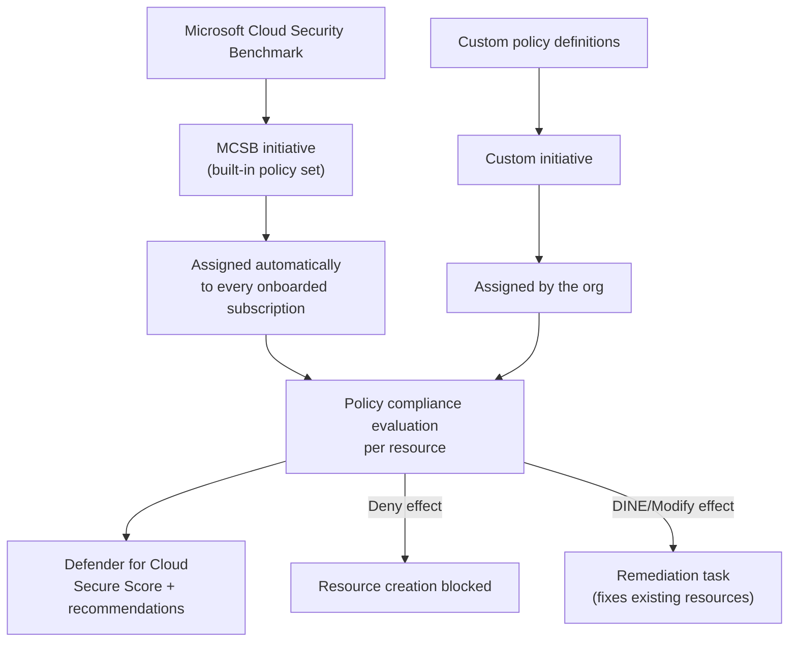
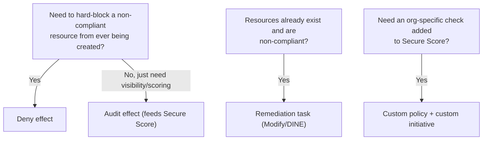

---
tags:
  - sc100
type: cheat-sheet
domain:
  - ops-identity-compliance
---

# Azure Policy

Resource-configuration enforcement and compliance engine — the mechanism underneath Defender for Cloud's Secure Score, not a separate, parallel scoring system. **Azure Policy drives Secure Score**: every recommendation and score in [[Security Posture Assessments]] is built from an Azure Policy initiative evaluating actual resource compliance, not a bespoke check Defender for Cloud invents on its own.

## Core Capabilities

- **Policy definition** — a single rule: a JSON condition matched against resource properties, plus an **effect** to take when a resource matches (or fails to match) it.
- **Effects** — the enforcement vocabulary: **Deny** (block the non-compliant operation outright), **Audit** (allow it, but flag non-compliance for reporting/scoring), **Append/Modify** (add or change a property automatically), **DeployIfNotExists (DINE)** (deploy a companion resource/config if missing), **Disabled**.
- **Initiative (policy set)** — a bundle of policy definitions grouped toward one compliance goal — the **Microsoft Cloud Security Benchmark (MCSB) initiative** is the built-in example every Defender for Cloud-onboarded subscription gets automatically.
- **Assignment** — applying a policy or initiative at a scope (management group, subscription, or resource group), with **exemptions** available for justified, tracked exceptions rather than silently non-compliant resources.
- **Remediation tasks** — for Modify/DINE effects, a remediation task retroactively fixes *already-existing* non-compliant resources; assigning the policy alone only affects resources created or updated going forward.

## Azure Policy Drives Secure Score

- Defender for Cloud's recommendations and Secure Score aren't a separate scoring engine — they're generated from the **MCSB initiative**, an Azure Policy initiative automatically assigned to every onboarded subscription.
- Each Secure Score recommendation corresponds to **one policy definition** inside that initiative; a resource's policy **compliance state** (compliant/non-compliant) *is* the pass/fail signal behind the recommendation and the score.
- Extending Secure Score with org-specific checks means adding a **custom policy definition** to a **custom initiative** and assigning it — Secure Score is not a fixed, closed list Microsoft alone controls.
- **Audit vs. Deny is the prevention-vs-visibility choice**: Audit surfaces a Secure Score recommendation without blocking anything; Deny actually prevents the non-compliant resource from being created at all. An architect picks Deny for hard gates that must never happen, Audit where the goal is scoring/visibility without blocking legitimate work.

## Architecture

## Architecture Decisions

## Key Facts

- The MCSB initiative's assignment is automatic the moment a subscription is onboarded to Defender for Cloud — an architect doesn't manually recreate Secure Score's baseline checks.
- Audit-effect non-compliance shows up in Secure Score; it does **not** stop the resource from existing — a common expectation mismatch to correct in design reviews.
- A policy assignment change doesn't retroactively fix already non-compliant resources by itself for Modify/DINE effects — a remediation task is a separate, explicit step.

## Exam Notes

- "Secure Score shows a recommendation we never configured ourselves" → it's coming from the auto-assigned MCSB initiative, not a manually written policy.
- "Hard-block a non-compliant resource from being created at all" → Deny effect, not Audit (Audit only scores/reports, never blocks).
- "Fix resources that existed before the policy was assigned" → a remediation task, not just the assignment itself.
- "Add a company-specific control to Secure Score" → a custom policy definition inside a custom initiative, not a request to Microsoft or a Defender for Cloud setting.

## Comparison

| Compare | Difference |
| --- | --- |
| Azure Policy vs. Defender for Cloud | Azure Policy is the enforcement/compliance-evaluation engine. Defender for Cloud is the posture-scoring product *built on top of* Azure Policy's compliance data (via the MCSB initiative) — Secure Score is a presentation and prioritization layer over policy compliance, not an independent check. |
| Deny vs. Audit effect | Deny prevents the non-compliant operation from happening at all. Audit allows it but records non-compliance for reporting and Secure Score — prevention vs. visibility, a deliberate choice per control. |
| Built-in MCSB initiative vs. custom initiative | The MCSB initiative is Microsoft-authored and auto-assigned, giving baseline Secure Score coverage. A custom initiative is org-authored, added deliberately to extend Secure Score with requirements Microsoft's baseline doesn't include. |
| Policy assignment vs. remediation task | Assignment governs resources created or changed *going forward*. A remediation task is the explicit, separate action that fixes resources that were already non-compliant *before* the assignment existed. |

## AZ-500 Review

AZ-500 already covers creating and assigning individual policy definitions and initiatives, effects, and exemptions at the resource level — that configuration knowledge is assumed here. SC-100's addition is recognizing Azure Policy as the literal enforcement substrate beneath Secure Score/MCSB scoring (see [[Security Posture Assessments]]), and choosing Deny vs. Audit as a deliberate prevention-vs-visibility governance decision, not just a per-resource setting.

## Keywords

- Policy definition, initiative (policy set), assignment, exemption
- Effects: Deny, Audit, Append, Modify, DeployIfNotExists (DINE)
- Remediation task
- MCSB initiative (built-in, auto-assigned)
- Azure Policy drives Secure Score
- Custom policy / custom initiative

## Related

- [[Security Posture Assessments]]
- [[Microsoft Cloud Security Benchmark (MCSB)]]
- [[Microsoft Defender for Cloud]]
- [[Azure Landing Zones]]
- [[Azure Landing Zones (Beginner Explainer)]]
- [[Cloud Adoption Framework (CAF)]]
- [[Securing IaaS and PaaS Services]]
- [[Exam Objectives]]

## References

- [Azure Policy overview](https://learn.microsoft.com/en-us/azure/governance/policy/overview) — Microsoft Learn
- [Azure Policy effects](https://learn.microsoft.com/en-us/azure/governance/policy/concepts/effects) — Microsoft Learn
- [Remediate non-compliant resources](https://learn.microsoft.com/en-us/azure/governance/policy/how-to/remediate-resources) — Microsoft Learn
- [Security posture in Microsoft Defender for Cloud](https://learn.microsoft.com/en-us/azure/defender-for-cloud/concept-cloud-security-posture-management) — Microsoft Learn
