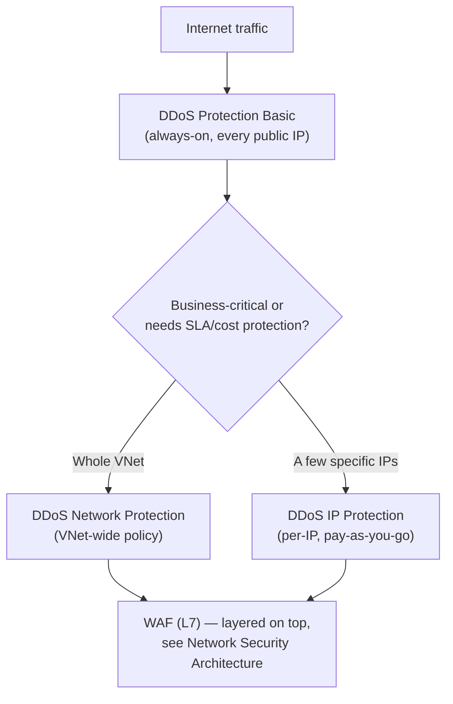
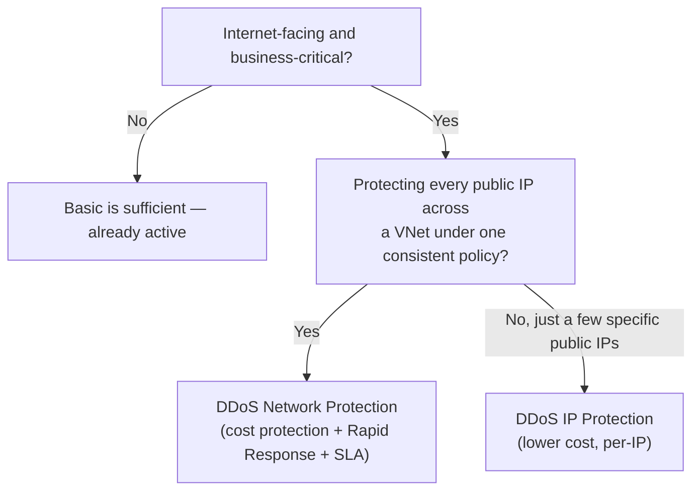

---
tags:
  - sc100
type: cheat-sheet
domain:
  - infrastructure
status: needs-verification
---

# Azure DDoS Protection

Network-layer (L3/L4) volumetric and protocol attack mitigation — a different attack surface than [[Azure Web Application Firewall|WAF]]'s application-layer (L7) protection; the Basic-vs-Standard decision itself is already framed in [[Network Security Architecture]], this page covers the plan mechanics, including the split inside "Standard."

## Core Capabilities

- **Scope** — DDoS Protection mitigates **volumetric** (traffic-flooding) and **protocol** (e.g., SYN flood) attacks at the network layer. It does **not** cover application-layer attacks (SQLi, XSS, bad bots) — that's WAF's job, layered on top, not a substitute.
- **Basic** — automatic, always-on, free, built into the Azure platform for **every public IP** by default. No configuration, no SLA, no cost-protection guarantee, no tuning to a specific app's traffic.
- **DDoS Network Protection** — the full Standard-tier plan, applied to a **virtual network**: every public IP inside the protected VNet is covered under one policy. Adds **adaptive tuning** (learns the specific application's normal traffic profile over time to tailor mitigation thresholds instead of generic ones), attack analytics, mitigation flow logs, Azure Monitor metrics/alerting, an SLA, a **cost-protection guarantee** (credits toward resource scale-out costs incurred during a documented attack), and access to the **DDoS Rapid Response (DRR)** support team during an active attack.
- **DDoS IP Protection** — the same detection/mitigation engine as Network Protection, but applied **per protected public IP** rather than a whole-VNet policy, priced pay-as-you-go per IP — a lower-cost path to Standard-grade protection when only a handful of specific public IPs need it, not an entire VNet's worth.

## Architecture

## Architecture Decisions

## Key Facts

- Basic requires zero action — it's already protecting every public IP in the subscription; the architecture question is only ever whether to *add* Standard-tier coverage on top.
- Adaptive tuning needs a baseline learning period against real traffic — it isn't instantly as effective the moment Standard is enabled.
- Cost-protection credits and Rapid Response support are exclusive to Network Protection — IP Protection gets the same detection engine but not that support/cost package.

## Exam Notes

- "Protect every public IP across a VNet under one policy, with Rapid Response support and a cost-protection guarantee" → DDoS Network Protection, not IP Protection.
- "Protect a handful of specific public IPs without adopting a full VNet-wide plan" → DDoS IP Protection.
- "Zero-config, always-on baseline for every public IP" → Basic — it's already there, no action needed.
- A scenario describing SQL injection or bot traffic against a web app is a WAF question, not a DDoS Protection question — different OSI layer entirely (see [[Network Security Architecture]]).

## Comparison

| Compare | Difference |
| --- | --- |
| Basic vs. Standard (Network/IP Protection) | Basic: free, automatic, always-on, no SLA, no tuning. Standard family: paid, adaptive tuning to the app's real traffic, attack analytics/logs, SLA — justified for specific business-critical, internet-facing workloads, not a universal upgrade. |
| DDoS Network Protection vs. DDoS IP Protection | Network Protection covers every public IP in a protected VNet under one policy, and is the only tier with cost-protection credits and Rapid Response support access. IP Protection applies the same mitigation engine per individual public IP, pay-as-you-go — cheaper and narrower, chosen when only specific IPs (not a whole VNet) need Standard-grade coverage. |
| DDoS Protection vs. WAF | DDoS Protection mitigates network-layer (L3/L4) volumetric/protocol attacks. WAF (see [[Network Security Architecture]]) mitigates application-layer (L7) attacks like SQLi/XSS. Layered together for full-stack coverage, not interchangeable. |

## AZ-500 Review

AZ-500 already covers enabling DDoS Protection Standard on a VNet at the resource level — that configuration knowledge is assumed here. SC-100's addition is choosing **Network Protection vs. IP Protection** as an explicit cost/scope trade-off, and layering DDoS Protection with WAF for combined L3–L7 defense (see [[Network Security Architecture]]).

## Keywords

- DDoS Protection Basic (automatic, free)
- DDoS Network Protection (VNet-wide, cost protection, Rapid Response)
- DDoS IP Protection (per-IP, pay-as-you-go)
- Adaptive tuning
- Volumetric and protocol attacks (L3/L4) vs. application-layer (L7)
- DDoS Rapid Response (DRR)
- Cost-protection guarantee

## Related

- [[Network Security Architecture]]
- [[Azure Web Application Firewall]]
- [[Front Door and Application Gateway]]
- [[Azure Firewall]]
- [[Securing IaaS and PaaS Services]]
- [[Exam Objectives]]

## References

- [Azure DDoS Protection overview](https://learn.microsoft.com/en-us/azure/ddos-protection/ddos-protection-overview) — Microsoft Learn
- [Azure DDoS Protection SKU comparison](https://learn.microsoft.com/en-us/azure/ddos-protection/ddos-protection-sku-comparison) — Microsoft Learn

## Verification Flag

DDoS IP Protection is a comparatively newer SKU alongside the longer-established Network Protection plan — re-verify current naming, pricing model, and exact feature parity against the Microsoft Learn SKU comparison page close to exam date.
