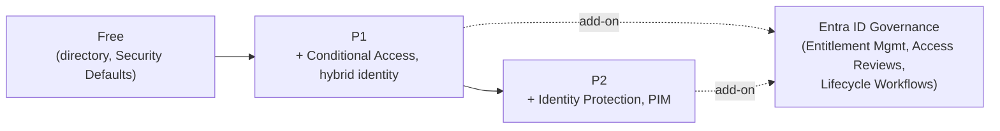

---
tags:
  - sc100
type: cheat-sheet
domain:
  - ops-identity-compliance
aliases:
  - Azure AD
  - Azure Active Directory
status: needs-verification
---

# Microsoft Entra ID

Microsoft's cloud identity platform — the IdP architecture (hybrid sync, external identities, decentralized identity) is covered in [[Identity as the Security Perimeter]]; this page is licensing and product-tier orientation, since a large share of this vault's recommended controls only exist at a specific tier.

## License Tiers

- **Free** — included with any Azure/Microsoft 365 subscription: core directory (users, groups, on-prem sync via Entra Connect/Cloud Sync), basic SSO, self-service password *change* (not reset) for cloud-only accounts, and **Security Defaults** — a one-size-fits-all baseline MFA enforcement for the whole tenant, at no cost and with zero configuration.
- **P1** — adds [[Conditional Access]] (the granular, condition-based replacement for Security Defaults), hybrid identity features (self-service password reset with on-prem writeback), dynamic/self-service group membership and app assignment, and a 99.9% SLA.
- **P2** — adds everything in P1, plus **Identity Protection** (automated, continuous risk detection feeding Conditional Access risk-based policies) and **[[PIM|Privileged Identity Management]]** (JIT role activation) — the two capabilities this vault's privileged-access and risk-based sign-in architecture repeatedly assumes are available.
- **Microsoft Entra ID Governance** — a separately licensable add-on layered on top of *either* P1 or P2, bundling Entitlement Management, tenant-wide Access Reviews, Lifecycle Workflows, and Terms of Use (see [[Securing Privileged Access]] for the architecture role these play) — increasingly sold as its own SKU rather than assumed to come free with P2.

## Architecture

## Key Facts

- Security Defaults and Conditional Access are **mutually exclusive** — a tenant runs one or the other, not both; Conditional Access is the superset an org graduates to once it needs granular, condition-based control.
- Every Conditional Access pattern in this vault ([[Conditional Access]]) assumes at least **P1**; every pattern around risk-based sign-in or JIT privileged roles ([[PIM]], Identity Protection) assumes **P2**.
- Governance-scale capabilities (Entitlement Management, tenant-wide Access Reviews, Lifecycle Workflows) are licensed via the **Entra ID Governance add-on** — don't assume they're automatically included just because a tenant is licensed for P2.

## Exam Notes

- A scenario needing risk-based Conditional Access or JIT role activation, with no license named → the correct answer requires **P2**, not P1.
- A scenario satisfied by baseline, zero-config MFA for the whole tenant → **Security Defaults** (Free), not Conditional Access — a common over-engineering distractor.
- A scenario describing bundled, time-bound access packages or org-wide recertification campaigns → assume the **Entra ID Governance add-on**, not P2 alone.

## Comparison

| Compare | Difference |
| --- | --- |
| Free vs. P1 | Free: baseline directory + Security Defaults MFA (all-or-nothing, zero config). P1: adds Conditional Access, hybrid identity (SSPR + writeback), dynamic groups — the tier this vault's Conditional Access architecture assumes throughout. |
| P1 vs. P2 | P2 adds Identity Protection (automated risk detection) and PIM (JIT privileged role activation) — the two capabilities [[Securing Privileged Access]] and risk-based Conditional Access design depend on. |
| P2 vs. Entra ID Governance add-on | P2 natively includes Identity Protection + PIM. Governance is a separate, additional add-on (purchasable on P1 or P2) for Entitlement Management, tenant-wide Access Reviews, and Lifecycle Workflows — don't conflate "has P2" with "has governance-scale entitlement/review capability." |
| Security Defaults vs. Conditional Access | Security Defaults: one-size-fits-all baseline MFA, Free tier, no configuration, mutually exclusive with CA. Conditional Access: granular, condition-based policy engine (P1) — full architecture in [[Conditional Access]]. |

## Related

- [[Conditional Access]]
- [[PIM]]
- [[Identity as the Security Perimeter]]
- [[Identity and Access Management (IAM)]]
- [[Securing Privileged Access]]
- [[Exam Objectives]]

## References

- [Microsoft Entra ID pricing](https://www.microsoft.com/en-us/security/business/microsoft-entra-pricing) — Microsoft
- [What are security defaults?](https://learn.microsoft.com/en-us/entra/fundamentals/security-defaults) — Microsoft Learn
- [Microsoft Entra ID Governance](https://learn.microsoft.com/en-us/entra/id-governance/identity-governance-overview) — Microsoft Learn

## Verification Flag

License-to-feature mapping — especially the Entra ID Governance add-on boundary — shifts periodically as Microsoft repackages SKUs. Re-verify exact tier/feature assignment against the current Microsoft Entra pricing page close to exam date.
