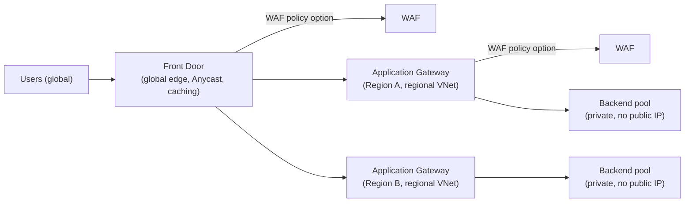
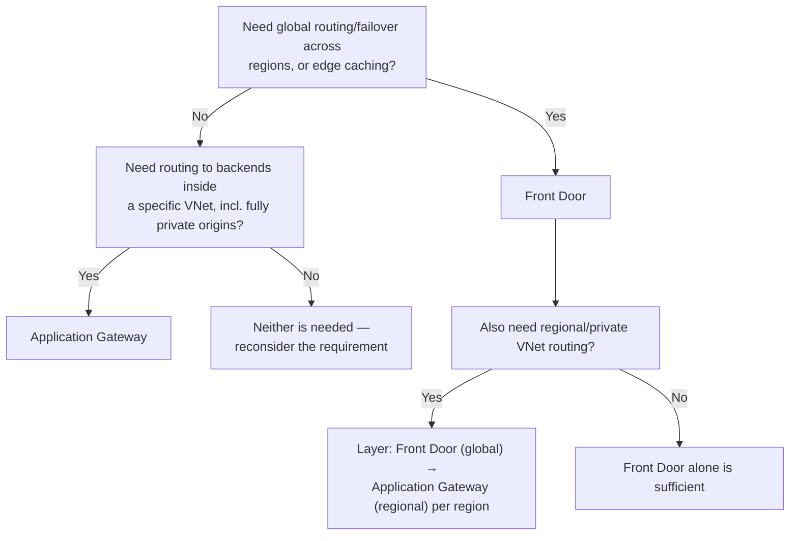

---
tags:
  - sc100
  - cheat-sheet
---

# Front Door and Application Gateway

Two Azure Layer 7 (HTTP/S) reverse proxies that both attach the same [[Azure Web Application Firewall|Azure WAF]] policy engine — the architecture decision between them is **scope** (global edge vs. regional VNet), not features. The WAF-vs-Azure-Firewall placement decision is already covered in [[Network Security Architecture]]; this page covers which of *these two* should host it.

## Why Architects Choose It

- **Front Door** operates at Microsoft's global edge (Anycast, points of presence close to users) — the right layer for global HTTP(S) routing, cross-region failover, and CDN-style caching *before* traffic ever reaches a specific Azure region.
- **Application Gateway** operates inside a single region's VNet — the right layer for routing to backends that live in that VNet (or a peered one), including fully private origins with no public IP at all.
- Both can host the identical Azure WAF policy (OWASP Core Rule Set-based) — a design doesn't choose "WAF or not," it chooses *which reverse proxy* the WAF policy attaches to.
- Layering both is a standard, valid pattern — Front Door at the global edge routing into one or more regional Application Gateways, which then route into the VNet — not a mutually exclusive either/or choice.
- A third layer commonly sits behind either: **API Management**, when the backend is an API needing throttling, token validation, or versioning rather than generic HTTP routing — see [[API Management and Security]] for where that policy layer fits.

## Azure Front Door

- Global entry point at Microsoft's edge; **Anycast**-routed, so users hit the nearest point of presence regardless of which Azure region ultimately serves them.
- Capabilities: URL/path-based routing, session affinity, SSL offload, automatic cross-region failover, CDN-style caching, and a **Rules Engine** for custom traffic manipulation at the edge.
- Backend origins can be **any publicly reachable endpoint** — Azure or non-Azure, even on-prem — Front Door isn't limited to Azure-hosted backends.
- **Standard vs. Premium** — Premium adds **native Private Link connectivity to the origin**, so the backend never needs a public IP at all (the Front Door-specific application of the Private Link pattern in [[Securing IaaS and PaaS Services]]), plus a more advanced bundled WAF/Bot Protection ruleset.

## Application Gateway

- Regional, **VNet-deployed** L7 load balancer/reverse proxy — lives inside the network it routes into.
- Capabilities: path-based and host-based routing, SSL/TLS termination, cookie-based session affinity, and autoscaling (v2 SKU, the current recommendation over the legacy v1).
- Routes directly to backend pools **inside the VNet** (VMs, VM Scale Sets, VNet-integrated App Service, or peered private IPs) — including origins that are entirely private, since Application Gateway itself already sits inside the network.

## Architecture

## Architecture Decisions

## Key Facts

- Front Door's backend doesn't have to be in Azure at all; Application Gateway's backend has to be reachable from inside its VNet — a fundamentally different reach.
- Only Front Door **Premium** gets native Private Link to the origin; Standard tier origins still need some form of public reachability (or a different private-connectivity workaround).
- WAF policy configuration (managed rule sets, custom rules) is conceptually the same engine on both products — the decision is *where* to attach it, not which WAF product to learn twice.

## Exam Notes

- "Global entry point with automatic regional failover and edge caching" → Front Door, not Application Gateway alone.
- "Route to backends inside a specific VNet by path, including origins with no public IP" → Application Gateway.
- "Backend origin should never have a public IP, reachable from a global edge service" → Front Door **Premium** specifically (Private Link origin), not Standard.
- A scenario naming both "global load balancing" and "fully private regional backends" → layer Front Door in front of regional Application Gateway(s), not a single product alone.

## Comparison

| Compare | Difference |
| --- | --- |
| Front Door vs. Application Gateway | Front Door: global edge (Anycast), cross-region failover, CDN caching, backend can be anywhere. Application Gateway: regional, VNet-deployed, routes to backends inside that network including fully private origins. Scope is the deciding factor, not feature overlap. |
| Front Door Standard vs. Premium | Premium adds native Private Link connectivity to the origin (no public IP needed on the backend) and a more advanced bundled WAF/Bot Protection ruleset — the tier to recommend when the origin must stay fully private. |
| Application Gateway v1 vs. v2 | v2 adds autoscaling and better performance/zone redundancy over the legacy v1 SKU — v2 is the current recommendation for any new deployment. |
| Front Door vs. Azure Traffic Manager | Traffic Manager is DNS-based (Layer 4) global routing — no HTTP awareness, no WAF, no caching, just directing clients to a region via DNS response. Front Door is Layer 7, HTTP-aware, and can inspect/route/cache/protect the actual request — the reason Front Door is the current recommendation for HTTP(S) global routing scenarios over Traffic Manager. |

## AZ-500 Review

AZ-500 already covers deploying Application Gateway/Front Door, configuring backend pools, and attaching a basic WAF policy at the resource level — that configuration knowledge is assumed here. SC-100's addition is choosing global vs. regional scope as an explicit architecture decision, layering the two together, and recognizing Premium's Private Link origin as the "no public IP on the backend" pattern shared with [[Securing IaaS and PaaS Services]].

## Keywords

- Azure Front Door: global edge, Anycast, points of presence
- Application Gateway: regional, VNet-deployed
- Front Door Standard vs. Premium, Private Link origin
- Application Gateway v1 vs. v2 (autoscaling)
- WAF policy attachment point (Front Door vs. Application Gateway)
- Rules Engine (Front Door)
- Azure Traffic Manager (DNS-based, Layer 4) vs. Front Door (Layer 7)

## Related

- [[Network Security Architecture]]
- [[Azure Web Application Firewall]]
- [[Securing IaaS and PaaS Services]]
- [[Private Link]]
- [[Azure Firewall]]
- [[Azure Landing Zones]]
- [[API Management and Security]]
- [[Exam Objectives]]

## References

- [Azure Front Door overview](https://learn.microsoft.com/en-us/azure/frontdoor/front-door-overview) — Microsoft Learn
- [Azure Application Gateway overview](https://learn.microsoft.com/en-us/azure/application-gateway/overview) — Microsoft Learn
- [Front Door Private Link origin](https://learn.microsoft.com/en-us/azure/frontdoor/private-link) — Microsoft Learn
- [Application Gateway v1 vs. v2](https://learn.microsoft.com/en-us/azure/application-gateway/v1-v2-migration) — Microsoft Learn
