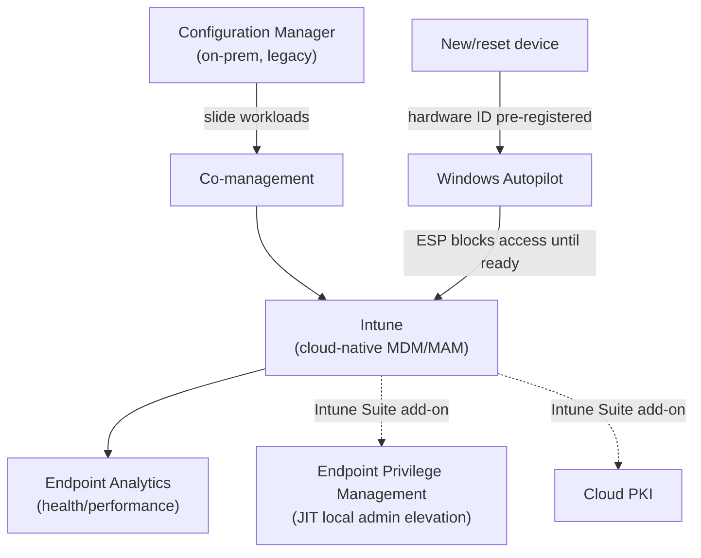
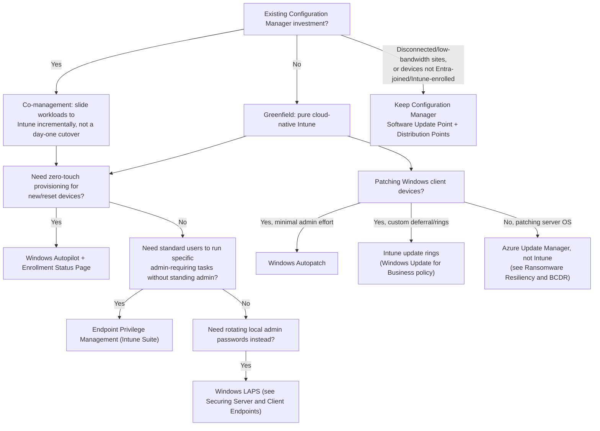

---
tags:
  - sc100
type: cheat-sheet
domain:
  - infrastructure
  - apps-data
aliases:
  - Microsoft Endpoint Manager
  - MEM
status: needs-verification
---

# Microsoft Intune (formerly Microsoft Endpoint Manager)

Cloud-native unified endpoint management platform. **Microsoft Endpoint Manager (MEM)** was the 2019 umbrella brand for Intune + Configuration Manager together; Microsoft retired that marketing name starting late 2023, folding everything back under **Microsoft Intune** — a scenario or older material naming "MEM" or "the Endpoint Manager admin center" is describing the current Intune admin center under its previous name. MDM vs. MAM architecture is already covered in [[Securing Server and Client Endpoints]] — this page covers the rest of the platform.

## Core Capabilities

- **Intune** — cloud-native MDM/MAM (full architecture in [[Securing Server and Client Endpoints]]).
- **Configuration Manager (ConfigMgr)** — the on-prem/legacy management product Intune's cloud-native model is superseding; still relevant for orgs with existing investment.
- **Co-management** — hybrid state where a device is enrolled in *both* ConfigMgr and Intune simultaneously, with individual **workloads** (compliance policies, device configuration, endpoint protection, resource access policies, client apps, Office Click-to-Run apps) independently "slid" from ConfigMgr authority to Intune authority as an org migrates — not an all-or-nothing cutover.
- **Windows Autopilot** — zero-touch device provisioning: a device's hardware ID is pre-registered, so a new/reset machine self-enrolls into Entra ID and Intune out of the box, with the **Enrollment Status Page (ESP)** blocking user access until required compliance policies and apps finish provisioning.
- **Endpoint Analytics** — proactive device health/performance telemetry (startup time, app reliability) to catch degrading endpoints before they become a support or security problem.
- **Intune Suite** — a premium add-on bundling advanced capabilities including **Endpoint Privilege Management (EPM)**, Remote Help, Advanced Endpoint Analytics, Enterprise App Management, and Cloud PKI.
- **Endpoint Privilege Management (EPM)** — lets a **standard (non-admin) user** elevate *specific, approved* applications or tasks to run with admin rights, without the user ever holding standing local admin — the local-device equivalent of the JIT-elevation pattern [[PIM]] applies at the directory/Azure RBAC layer.
- **Software updates (Windows client)** — Intune's native update stack for Windows 10/11 devices:
  - **Update rings (Windows Update for Business policy)** — deferral periods, deadlines, and active hours for feature and quality updates, delivered straight from Microsoft with no on-prem infrastructure; **Delivery Optimization** lets peer devices cache content locally to reduce WAN usage.
  - **Windows Autopatch** — a Microsoft-*managed* automation layer on top of update rings that also handles Microsoft 365 Apps update channels, Microsoft Edge, and Teams rollout; included with Windows Enterprise E3/E5 (part of Microsoft 365 E3/E5) — reduces update rings to something Microsoft operates for you rather than something you tune yourself.
  - **Driver and firmware update policies** — Intune can also manage Windows driver/firmware rollout alongside quality updates.
  - This is **client-only**. Server OS patching (Azure VMs, [[Azure Arc|Arc-enabled]], on-prem) is a different product — **Azure Update Manager** — see [[Ransomware Resiliency and BCDR]].

## Architecture

## Architecture Decisions

## Key Facts

- Co-management workloads move independently — an org can shift device configuration to Intune while ConfigMgr still owns app deployment, and vice versa, during the transition window.
- Autopilot's Enrollment Status Page is what closes the "unmanaged window" gap — a device isn't usable until compliance and required app provisioning finish, not just until enrollment completes.
- EPM is licensed via the **Intune Suite** add-on, not included in base Intune licensing — an explicit cost/scope decision, the same pattern as the Entra ID Governance add-on in [[Entra ID]].
- EPM elevates a *specific approved app or task*, not the user's whole session — a narrower blast radius than making someone a local admin outright.
- Windows Autopatch doesn't replace update rings conceptually — it *is* Microsoft-managed update rings plus Microsoft 365 Apps/Edge/Teams rollout; choosing it trades tuning control for operational effort.
- Configuration Manager stays relevant for software updates specifically where Intune has no on-prem content-caching equivalent at scale (very large, bandwidth-constrained, or disconnected sites) or where devices aren't Entra-joined/hybrid-joined and Intune-enrolled at all.
- Neither Intune update rings nor Windows Autopatch patch Windows **Server** — that's [[Ransomware Resiliency and BCDR|Azure Update Manager]], a completely separate product and control plane.

## Exam Notes

- A scenario naming "Microsoft Endpoint Manager" or "the Endpoint Manager admin center" is testing the retired brand name — current architecture answers should say Intune.
- "Migrate from Configuration Manager without a disruptive cutover" → co-management with workload sliding, not a forced full migration.
- "New laptops should self-provision with zero on-site IT touch, and stay locked down until compliant" → Windows Autopilot + Enrollment Status Page.
- "Let a developer run one specific installer that needs admin rights, without making them a local admin" → Endpoint Privilege Management, not Windows LAPS and not a standing local admin group membership.
- "Patch Windows 10/11 clients with minimal ongoing admin effort" → Windows Autopatch, not a hand-tuned update ring or ConfigMgr.
- "Patch Windows Server across Azure, Arc-enabled, and on-prem" → Azure Update Manager — naming Intune here is a distractor, Intune update rings don't cover Server SKUs.
- "Branch office with poor bandwidth needs locally cached update content at scale" → keep/retain Configuration Manager's Software Update Point + Distribution Points, not pure cloud-delivered update rings.

## Comparison

| Compare | Difference |
| --- | --- |
| MEM (legacy name) vs. Microsoft Intune (current) | Same product; Microsoft retired the "Microsoft Endpoint Manager" umbrella brand in late 2023 and consolidated back to "Microsoft Intune" as the name for the whole suite (Intune + Configuration Manager + Autopilot + Intune Suite). A naming trap, not a product distinction. |
| Configuration Manager vs. Intune vs. Co-management | Configuration Manager: on-prem, legacy management. Intune: cloud-native MDM/MAM. Co-management: both simultaneously, with individual workloads incrementally shifted from ConfigMgr to Intune authority — the migration path, not a third permanent architecture. |
| Endpoint Privilege Management vs. Windows LAPS vs. PIM | Three different layers reducing standing privilege: **EPM** elevates a specific app/task on a device for a standard user, without granting local admin. **Windows LAPS** (see [[Securing Server and Client Endpoints]]) rotates and randomizes the *local admin account's password* per device — a different local admin doesn't get created or avoided, the credential is just managed. **PIM** (see [[Securing Privileged Access]]) governs standing *directory/Azure RBAC role* privilege, JIT-activated — a completely different scope (cloud roles, not the local device). |
| Windows Autopilot vs. standard MDM enrollment | Autopilot: zero-touch, hardware-ID-pre-registered, self-provisioning with an Enrollment Status Page gate. Standard MDM enrollment: a user or IT admin manually enrolls the device into Intune after imaging/setup — more manual effort, no built-in "block until compliant" provisioning gate. |
| Intune update rings vs. Windows Autopatch vs. Configuration Manager (SUP/WSUS) vs. Azure Update Manager | **Update rings**: self-managed Windows client deferral/deadline policy, cloud-delivered. **Windows Autopatch**: Microsoft-managed automation over update rings + M365 Apps/Edge/Teams. **ConfigMgr SUP/WSUS**: on-prem content caching and staged rollout for Windows client at scale, disconnected sites, or non-Entra-joined devices. **Azure Update Manager**: the unrelated product that patches **Server** OS across Azure/Arc-enabled/on-prem — never a Windows-client answer. |

## AZ-500 Review

AZ-500 doesn't cover Intune Suite, co-management workload sliding, Windows Autopilot, or Endpoint Privilege Management at all — device management deployment architecture is new territory for SC-100, consistent with [[Securing Server and Client Endpoints]]'s existing AZ-500 framing for MDM/MAM.

## Keywords

- Microsoft Endpoint Manager (MEM) — retired brand name for Microsoft Intune
- Configuration Manager (ConfigMgr), co-management, workload sliding
- Windows Autopilot, Enrollment Status Page (ESP), hardware ID pre-registration
- Endpoint Analytics
- Intune Suite (premium add-on)
- Endpoint Privilege Management (EPM), JIT local admin elevation
- Cloud PKI
- Update rings, Windows Update for Business policy, deferral/deadlines, active hours
- Windows Autopatch, Delivery Optimization
- Configuration Manager Software Update Point (SUP), WSUS, Distribution Points
- Azure Update Manager (Windows Server — not Intune's scope)

## Related

- [[Securing Server and Client Endpoints]]
- [[Securing Privileged Access]]
- [[PIM]]
- [[Entra ID]]
- [[Conditional Access]]
- [[Securing Microsoft 365]]
- [[Ransomware Resiliency and BCDR]]
- [[Azure Arc]]
- [[Exam Objectives]]

## References

- [What is Microsoft Intune?](https://learn.microsoft.com/en-us/mem/intune/fundamentals/what-is-intune) — Microsoft Learn
- [Co-management for Windows devices](https://learn.microsoft.com/en-us/mem/configmgr/comanage/overview) — Microsoft Learn
- [Windows Autopilot overview](https://learn.microsoft.com/en-us/autopilot/windows-autopilot) — Microsoft Learn
- [What is Endpoint Privilege Management?](https://learn.microsoft.com/en-us/mem/intune/protect/epm-overview) — Microsoft Learn
- [Manage Windows software updates in Intune](https://learn.microsoft.com/en-us/mem/intune/protect/windows-update-for-business-configure) — Microsoft Learn
- [What is Windows Autopatch?](https://learn.microsoft.com/en-us/windows/deployment/windows-autopatch/overview/windows-autopatch-overview) — Microsoft Learn

## Verification Flag

Windows Autopatch's included licensing, its third-party/driver update coverage, and Intune's own application update management capability are all areas Microsoft actively expands — re-verify current scope and licensing against Microsoft Learn close to exam date.
