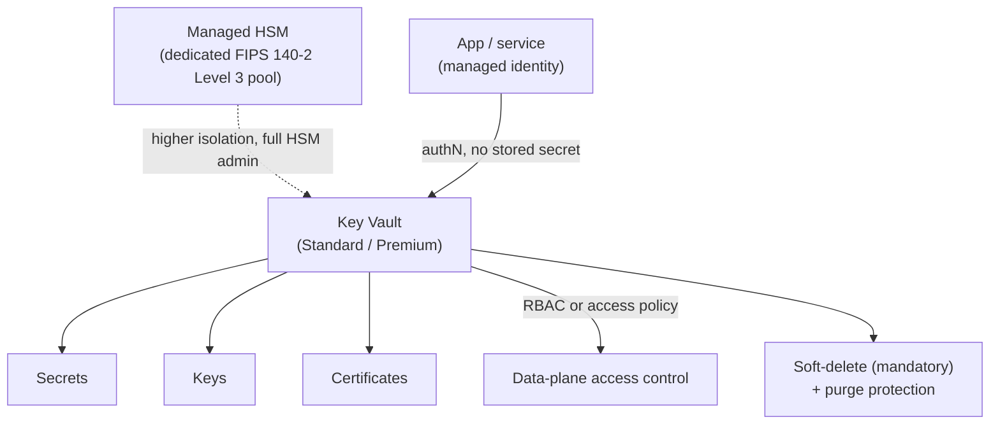
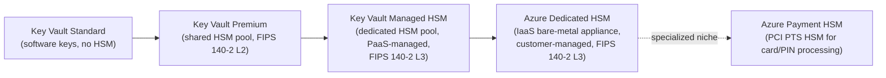

---
tags:
  - sc100
  - cheat-sheet
---

# Azure Key Vault

Stores and manages secrets, keys, and certificates centrally, backed by HSM-grade protection at the Premium/Managed HSM tiers. The customer-managed-key (CMK) architecture decision itself is covered in [[Data Classification and Protection]] — this page is the vault mechanism underneath it.

## Core Capabilities

- **Three object types**, each with a distinct purpose: **Secrets** (connection strings, API keys, passwords — opaque blobs the app retrieves), **Keys** (cryptographic keys used for encrypt/decrypt/sign/verify operations, the key material itself never leaves the vault), **Certificates** (TLS/client certs, with Key Vault handling renewal and tying the private key to a managed key object).
- **Service tiers** — **Standard** (software-protected keys), **Premium** (HSM-protected keys, FIPS 140-2 Level 2), and **Managed HSM** (a separate resource type: a dedicated, single-tenant pool of FIPS 140-2 Level 3 HSMs giving full administrative control over the HSM itself) — an escalating compliance/isolation ladder, not just a pricing tier. Full HSM background and the two additional non-Key-Vault HSM services (Dedicated HSM, Payment HSM) are below.
- **Soft-delete** — deleted objects (and now entire vaults) are retained for a configurable period (7–90 days) before permanent purge; this is mandatory on all vaults, not an opt-in setting anymore.
- **Purge protection** — during the soft-delete retention window, blocks *permanent* deletion even by an Owner/Global Admin — the specific control that stops a compromised or malicious admin from destroying key material outright (see [[Ransomware Resiliency and BCDR]]).
- **Access model** — Azure RBAC (recommended) with vault-specific data-plane roles (**Key Vault Administrator**, **Key Vault Secrets User**, **Key Vault Crypto Officer/User**, **Key Vault Reader**) vs. the legacy **vault access policy** model, which grants all-or-nothing permissions per vault with no per-object scoping.
- **Network security** — firewall rules (trusted Microsoft services, selected VNets) and Private Link; full mechanism detail in [[Private Link]] and [[Securing IaaS and PaaS Services]], not repeated here.
- **Managed identity** is the recommended way for an app to authenticate to Key Vault — full comparison against service principals in [[Identity and Access Management (IAM)]].

## Architecture

---

## Hardware Security Modules (HSM) and the Full Tier Ladder

An HSM is dedicated, tamper-resistant/tamper-evident hardware purpose-built to generate, store, and use cryptographic keys — key material is created and used *inside* the device and never exported in plaintext, even to the service operating it. Azure offers HSM-backed protection across **four** distinct services, forming a ladder from fully-managed/shared to fully self-managed/dedicated:

- **FIPS 140-2 Level 2 vs. Level 3** is the certification distinction behind Premium vs. everything above it: Level 2 requires role-based authentication and tamper-*evidence*; Level 3 adds tamper-*resistance*, physical/logical separation between interfaces, identity-based authentication, and zeroization of key material if tampering is detected. This is why Premium (L2, shared pool) can't satisfy a requirement that specifically demands L3 isolation.
- **Key Vault Premium** — HSM-protected keys, but the HSM hardware itself is a **shared, multi-tenant pool** Microsoft operates; the customer gets key-level isolation from other tenants, not hardware-level isolation.
- **Key Vault Managed HSM** — a dedicated, **single-tenant** partition of FIPS 140-2 Level 3 HSMs, still delivered as a fully-managed PaaS resource (Microsoft handles patching, availability, scaling). The customer gets its own **security domain** — an encrypted blob capturing the HSM's cryptographic state, used to initialize or restore the HSM to a known security posture — and full local RBAC over it, but not physical/firmware-level control.
- **Azure Dedicated HSM** — a completely separate service, **not part of Key Vault at all**: an IaaS bare-metal HSM appliance (Thales Luna) leased entirely to one customer. The customer manages partitioning, firmware, and patching directly via the vendor's own APIs (PKCS#11, JCE/JCA, KSP/CNG) — maximum control and isolation, but the full operational burden that comes with it. Chosen only when a requirement mandates direct hardware/firmware control or a specific cryptographic API Managed HSM's REST interface doesn't expose.
- **Azure Payment HSM** — a specialized PCI PTS-certified HSM (Thales payShield 10K) for payment card and PIN processing — a narrow compliance niche; know it exists as the named answer for PCI payment-processing HSM scenarios, not a general-purpose key store.

---

## Key Facts

- Managed HSM is a **separate Azure resource**, not a Key Vault tier setting — it's provisioned independently and used when a compliance requirement mandates dedicated (not multi-tenant-shared) HSM hardware and full administrative control over it.
- Purge protection is what actually closes the ransomware/insider gap soft-delete alone doesn't: soft-delete alone still lets a sufficiently privileged identity *purge* (permanently delete) during the retention window; purge protection removes that option entirely until the retention period expires.
- Vault access policies can't scope permission to an individual secret/key/certificate — only to the vault as a whole; Azure RBAC roles can be scoped down to a specific object, which is why RBAC is the current recommendation over access policies for any new design.
- App Service and Azure Functions can reference a Key Vault secret directly in app settings (`@Microsoft.KeyVault(...)`), so the secret value is never stored in the app's own configuration.

## Exam Notes

- "A compliance requirement mandates a dedicated, single-tenant HSM with full administrative control" → Managed HSM, not Premium tier (Premium is still a shared, multi-tenant HSM pool from the customer's perspective).
- "Prevent even a compromised admin account from permanently destroying our keys" → purge protection, not soft-delete alone.
- A scenario needing to scope access to *one specific secret* rather than the whole vault → Azure RBAC, not vault access policies (access policies can't express that scope).
- The CMK-vs-MMK *architecture decision* (when to use a customer-managed key at all) is covered in [[Data Classification and Protection]] — this page is the vault mechanism, not that decision.
- "Requirement mandates FIPS 140-2 Level 3 but stay fully-managed (no firmware/patching burden)" → Key Vault Managed HSM, not Dedicated HSM.
- "Requirement mandates direct control over the physical HSM, its firmware, or a specific PKCS#11/JCE/CNG API" → Azure Dedicated HSM, not Managed HSM.
- "PCI-DSS payment card PIN processing HSM" → Azure Payment HSM specifically, not a general Key Vault tier.

## Comparison

| Compare | Difference |
| --- | --- |
| Standard vs. Premium vs. Managed HSM | Standard: software-protected keys. Premium: HSM-protected keys, FIPS 140-2 Level 2, still a shared/multi-tenant HSM pool. Managed HSM: a separate resource type — dedicated, single-tenant FIPS 140-2 Level 3 HSM pool with full administrative control — needed when compliance requires isolation Premium doesn't provide. |
| Managed HSM vs. Azure Dedicated HSM | Managed HSM is a fully-managed PaaS resource — Microsoft handles patching/availability/scaling, customer gets a dedicated security domain and local RBAC. Dedicated HSM is IaaS — a bare-metal appliance leased entirely to the customer, who manages firmware/patching/partitioning directly via vendor APIs (PKCS#11, JCE/JCA, KSP/CNG). Choose Dedicated HSM only when a requirement mandates that direct hardware control or a specific crypto API Managed HSM doesn't expose. |
| Azure Dedicated HSM vs. Azure Payment HSM | Dedicated HSM is a general-purpose customer-managed HSM appliance. Payment HSM is a narrow, PCI PTS-certified HSM specifically for payment card/PIN processing (Thales payShield 10K) — a compliance-specific product, not a general key-management substitute. |
| Azure RBAC vs. vault access policies | RBAC: Azure-native roles (Key Vault Administrator, Secrets User, Crypto Officer/User, Reader), scopable down to an individual object, consistent with the rest of the tenant's [[Identity and Access Management (IAM)\|IAM]] design. Access policies: legacy, all-or-nothing per vault, no per-object scoping — the reason RBAC is now the default recommendation. |
| Soft-delete vs. purge protection | Soft-delete retains a deleted object/vault for a recovery window but still allows an authorized identity to purge it permanently during that window. Purge protection removes that ability entirely until the retention period naturally expires — the control that actually stops intentional or coerced permanent destruction. |
| Secrets vs. Keys vs. Certificates | Secrets are opaque values an app retrieves and uses directly (connection strings, passwords). Keys are cryptographic material used for operations (encrypt/decrypt/sign/verify) performed *inside* the vault — the key itself never has to leave. Certificates combine a managed key with a TLS/client cert and add Key Vault-managed renewal. |

## Keywords

- FIPS 140-2 Level 2 vs. Level 3
- Key Vault Standard vs. Premium vs. Managed HSM
- Security domain (Managed HSM initialization/recovery)
- Azure Dedicated HSM (Thales Luna, PKCS#11/JCE/CNG)
- Azure Payment HSM (PCI PTS, Thales payShield 10K)
- Soft-delete, purge protection
- Azure RBAC data-plane roles vs. vault access policies

## Related

- [[Data Classification and Protection]]
- [[Identity and Access Management (IAM)]]
- [[Private Link]]
- [[Securing IaaS and PaaS Services]]
- [[Ransomware Resiliency and BCDR]]
- [[Zero Trust]]
- [[Exam Objectives]]

## References

- [About Azure Key Vault](https://learn.microsoft.com/en-us/azure/key-vault/general/overview) — Microsoft Learn
- [Azure Key Vault soft-delete overview](https://learn.microsoft.com/en-us/azure/key-vault/general/soft-delete-overview) — Microsoft Learn
- [Azure Key Vault RBAC guide](https://learn.microsoft.com/en-us/azure/key-vault/general/rbac-guide) — Microsoft Learn
- [What is Azure Key Vault Managed HSM?](https://learn.microsoft.com/en-us/azure/key-vault/managed-hsm/overview) — Microsoft Learn
- [What is Azure Dedicated HSM?](https://learn.microsoft.com/en-us/azure/dedicated-hsm/overview) — Microsoft Learn
- [What is Azure Payment HSM?](https://learn.microsoft.com/en-us/azure/payment-hsm/overview) — Microsoft Learn
