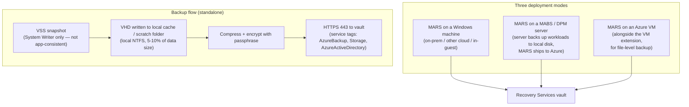

---
tags:
  - sc100
type: service
domain:
  - infrastructure
aliases:
  - Microsoft Azure Recovery Services agent
  - Azure Backup agent
  - MARS
---

# MARS Agent

## Purpose

The **Microsoft Azure Recovery Services (MARS) agent** backs up files, folders, volumes, and Windows **system state** from a Windows machine **directly to a Recovery Services vault** — no backup server in between.

---

## Why Architects Choose It

- The only Azure-native way to protect **on-premises / other-cloud Windows** data to Azure without deploying [[Microsoft Azure Backup Server (MABS)|MABS]] or System Center DPM infrastructure.
- **Semi-offline by design**: no continuous connection, scheduled backups only (≤3/day), and data leaves the source solely as a compressed, encrypted VHD. An attacker with a foothold on the source network cannot browse or delete the recovery points — they live in the vault, reachable only through the agent's registered identity + security PIN.
- **Customer-held encryption passphrase**: data is encrypted on the source before upload with a passphrase **Microsoft never stores**. Combined with [[Key Vault]] passphrase escrow, this is customer-controlled key material by default.
- **Security PIN + soft delete** gate destructive operations — the hybrid analogue of [[Resource Guard|Multi-User Authorization]] for the legacy backup path.
- Low protected-instance cost + Azure Storage; well suited to branch offices and domain-controller **system state** protection for [[Ransomware Resiliency and BCDR|forest recovery]].

---

## When to Use

- On-prem or hosted **Windows** servers/clients needing file / folder / volume / system-state protection straight to Azure.
- **Domain controller system state** backup for Tier 0 / AD forest recovery (see [[Securing Active Directory Domain Services (AD DS)]]).
- Backing up **specific files/folders inside an Azure VM**, in addition to the full-VM extension.
- Tiering [[Microsoft Azure Backup Server (MABS)|MABS]] / DPM data to Azure — the MARS agent runs *on* the backup server for the Azure leg.
- Minimal footprint — no appetite for running a dedicated backup-server VM.

---

## When NOT to Use

- **Application-consistent** workload backup (SQL, Exchange, SharePoint, Hyper-V / VMware VMs) — MARS uses only the Windows **System Writer**, no application VSS writers. Use MABS / DPM, or the SQL / SAP HANA in-VM workload extension.
- **Whole Azure IaaS VM** protection → use the Azure VM backup extension.
- **Linux** — MARS is Windows-only. Protect Linux via MABS / DPM or Azure VM backup.
- **Bare-metal / one-step whole-machine recovery**, or large-scale centralized backup administration → MABS / DPM.
- Vaults encrypted with **customer-managed keys (CMK)** — not supported by the MARS agent.
- **Windows Server Core**, Nano Server, or 32-bit Windows — unsupported.
- Sub-hourly RPO / near-CDP — maximum **3 backups per day** for files/folders; system state is a full backup every run.

---

## OS Compatibility

Operating systems must be **64-bit** and on the latest service packs.

| Operating system | Files / folders / volume | System state |
| --- | --- | --- |
| Windows 11 / 10 / 8.1 / 8 (Enterprise, Pro, Home, IoT Enterprise) | Yes | **No** |
| Windows Server 2025 / 2022 / 2019 / 2016 (Standard, Datacenter, Essentials, IoT) | Yes | Yes |
| Windows Server 2012 / 2012 R2 (past end-of-support — upgrade) | Yes | Yes |
| Windows Storage Server 2016 / 2012 R2 / 2012 | Yes | No |
| Windows 7 / Server 2008 R2 SP1 / 2008 SP2 (past end-of-support) | Yes | 2008 R2: Yes; others: No |

**Not supported:** Server Core SKUs, Nano Server, 32-bit Windows, any Linux, non-NTFS file systems, network shares, read-only / offline / BitLocker-locked volumes, and **CMK-encrypted vaults**.

**Prerequisites (Server):** .NET 4.8, Windows PowerShell, latest VC++ Redistributable, MMC 3.0. Instant Restore needs .NET Framework 4.5.2+ on the machine. Restore can only target the **same or a newer** Windows version than the source.

---

## Architecture

- **Initial backup** = full, unoptimized (full volume scan). **Subsequent** = incremental, optimized via the USN change journal. **System state** = full every time (no incrementals).
- **Offline seeding** (Azure Data Box) is supported for large initial file/folder backups — not for system state.
- **Private endpoints** to the vault are supported; Microsoft Entra ID still needs allow-listed public access.

---

## Security Model (SC-100 core)

| Control | What it does |
| --- | --- |
| **Encryption passphrase** (min 16 chars) | Client-side encryption before upload. Microsoft never stores it — a lost passphrase means **unrecoverable data**. Save it to [[Key Vault]]. |
| **Security PIN** | Portal-generated, valid 5 minutes, requires vault-level Azure RBAC + valid Entra credentials. Required for: stop-protection-with-delete-data, change passphrase, reduce retention, move to a less-frequent schedule, add volume exclusions. |
| **Soft delete** (14 days) | Deleted backup data is retained 14 days at no cost; with security features on, deletion is *delayed*, not immediate. |
| **Security features for hybrid backups** | Vault toggle that enables soft delete + security PIN for MARS/MABS/DPM. **Cannot be disabled once enabled.** |
| **Immutable vault** | Immutability applies to MARS recovery points. |
| **Networking** | Outbound HTTPS 443 only, to `AzureBackup` / `Storage` / `AzureActiveDirectory`; ExpressRoute Microsoft peering or private endpoints supported. |

---

## Comparison

| Compare | Difference |
| --- | --- |
| **MARS agent vs. [[Microsoft Azure Backup Server (MABS)\|MABS]] / DPM** | MARS = files/folders/volume/system state only, direct to vault, no app consistency, no local copy. MABS/DPM = **application-consistent** workloads (SQL, Exchange, SharePoint, Hyper-V/VMware VMs), keeps a short-term copy on local disk, then uses the MARS agent internally to tier to Azure — at the cost of running an extra server. |
| **MARS agent vs. Azure VM backup extension** | Extension = whole Azure IaaS VM, managed (no install), crash/app-consistent. MARS = granular files + system state, on-prem or in-guest, customer-installed and managed. |
| **MARS agent vs. SQL / SAP HANA in-VM backup** | Those use a workload-specific extension for log and differential app-aware backup with low RPO; MARS cannot do transaction-log backup. |
| **Security PIN vs. [[Resource Guard]] / MUA** | PIN = one shared secret any vault-access holder can generate; protects the **legacy hybrid** path. MUA = a second permission on a **separately owned** resource, activated JIT via [[PIM]] — the ARM-native successor for Recovery Services / Backup vault operations. |
| **Passphrase encryption vs. CMK** | The MARS passphrase is a **mandatory** client-side key the customer alone holds; MARS does **not** support CMK-encrypted vaults. Azure VM backup supports platform-managed keys or CMK. |
| **System state vs. bare-metal / full VM** | System state = AD DS, registry, COM+, certificate store, IIS metabase, boot files — enough to rebuild a DC's identity role, not a bootable image. Whole-machine / BMR needs MABS or DPM. |

---

## AZ-500 Review

AZ-500 covers installing the MARS agent, creating a Recovery Services vault, backup and retention policy, soft delete, the encryption passphrase, and backup RBAC roles at the implementation level. Assume the "how."

---

## What's New for SC-100

- Choose the **right hybrid backup mechanism** as a design decision: MARS (granular, serverless, Windows-only) vs. MABS/DPM (app-consistent, needs a server) vs. the Azure VM extension (Azure IaaS) — matched to workload type and RPO.
- Treat MARS's **semi-offline, encrypted-at-source, customer-held-passphrase** model as a deliberate ransomware property, layered with soft delete + security PIN + immutability + [[Key Vault]] passphrase escrow ([[Ransomware Resiliency and BCDR]]).
- Position the **security PIN** as the legacy-hybrid equivalent of [[Resource Guard]] MUA, and recognize when a scenario has outgrown it.
- Use MARS **system state** backups of domain controllers as part of [[Securing Active Directory Domain Services (AD DS)|AD DS]] / Tier 0 forest-recovery planning — not just VM restore.
- Know the hard constraints that force an alternative: no CMK, no Server Core, no Linux, no application consistency, ≤3 backups/day.

---

## Exam Tips

- "Back up an on-prem Windows file server to Azure with no additional infrastructure" → **MARS agent** direct to a Recovery Services vault.
- "Application-consistent backup of on-prem SQL / Exchange / SharePoint / Hyper-V" → **MABS or DPM** (MARS alone cannot).
- "Protect Linux servers" → **not MARS** — MABS/DPM or Azure VM backup.
- "The vault uses customer-managed keys" → MARS agent is **not supported**; use another method.
- "Prevent a compromised admin from deleting hybrid backups" → enable **Security features** (soft delete + security PIN); for Recovery Services / Backup **vault** operations use [[Resource Guard]] MUA.
- "Ensure the encryption key for on-prem backups can't be lost" → store the **passphrase in [[Key Vault]]** — Microsoft keeps no copy.
- "Recover Active Directory after forest-wide ransomware" → domain controller **system state** backups + a documented forest-recovery runbook, not just a VM restore.
- Server Core / Nano / 32-bit in a scenario → MARS is unsupported; call out the OS constraint.

---

## Common Exam Confusion

- **MARS agent vs. MABS/DPM vs. Azure VM backup extension** — granularity, where the agent runs, and application consistency.
- **Security PIN vs. Resource Guard / MUA** — a shared secret on the legacy path vs. two-party JIT authorization on an independently owned resource.
- **System state vs. bare-metal recovery vs. full VM backup** — identity/OS configuration vs. bootable image vs. whole machine.
- **Passphrase (client-side, customer-only) vs. vault encryption / CMK** — MARS mandates the former and forbids the latter.

---

## Keywords

- MARS agent, Microsoft Azure Recovery Services agent, Azure Backup agent
- Recovery Services vault, direct backup to Azure
- Files / folders, volume, Windows **system state**
- MABS / Microsoft Azure Backup Server, System Center DPM
- Encryption **passphrase**, save passphrase to Key Vault, minimum 16 characters
- **Security PIN**, critical / destructive operations, "Security features for hybrid backups"
- Soft delete (14 days), immutable vault
- No application-consistent backup, Windows System Writer only
- 64-bit only, no Server Core, Windows-only (no Linux)
- **CMK not supported** with MARS
- Offline seeding / Azure Data Box
- Up to 3 backups per day

---

## Related Services

- [[Ransomware Resiliency and BCDR]]
- [[Resource Guard]] — Multi-User Authorization, the vault-operation successor to the security PIN.
- [[Key Vault]] — recommended store for the backup passphrase.
- [[Securing Active Directory Domain Services (AD DS)]] — DC system state backup as Tier 0 recovery.
- [[PIM]] — JIT activation of the second authorization when MUA replaces the PIN.
- [[Securing Server and Client Endpoints]]
- [[Securing IaaS and PaaS Services]]
- [[Azure Policy]] — can audit/enforce that backup and soft delete are configured.
- [[Microsoft Defender for Cloud]] — surfaces "resources should have backup enabled" recommendations.
- [[Azure Arc]] — brings on-prem/multicloud servers under Azure management alongside MARS protection.

---

## References

- [About the MARS agent](https://learn.microsoft.com/en-us/azure/backup/backup-azure-about-mars) — Microsoft Learn
- [Support matrix for the MARS agent](https://learn.microsoft.com/en-us/azure/backup/backup-support-matrix-mars-agent) — Microsoft Learn
- [Security features that protect hybrid backups](https://learn.microsoft.com/en-us/azure/backup/backup-azure-security-feature) — Microsoft Learn
- [Save the MARS agent passphrase securely in Azure Key Vault](https://learn.microsoft.com/en-us/azure/backup/save-backup-passphrase-securely-in-azure-key-vault) — Microsoft Learn
- [Manage and monitor MARS agent backups](https://learn.microsoft.com/en-us/azure/backup/backup-azure-manage-mars) — Microsoft Learn
- [[Exam Objectives]]
