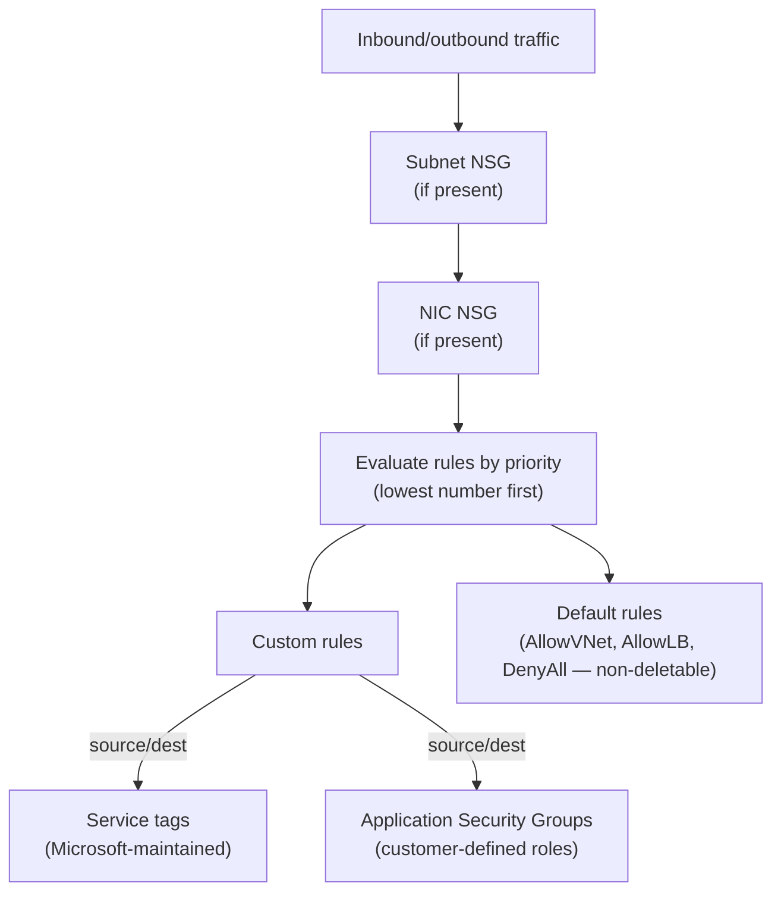
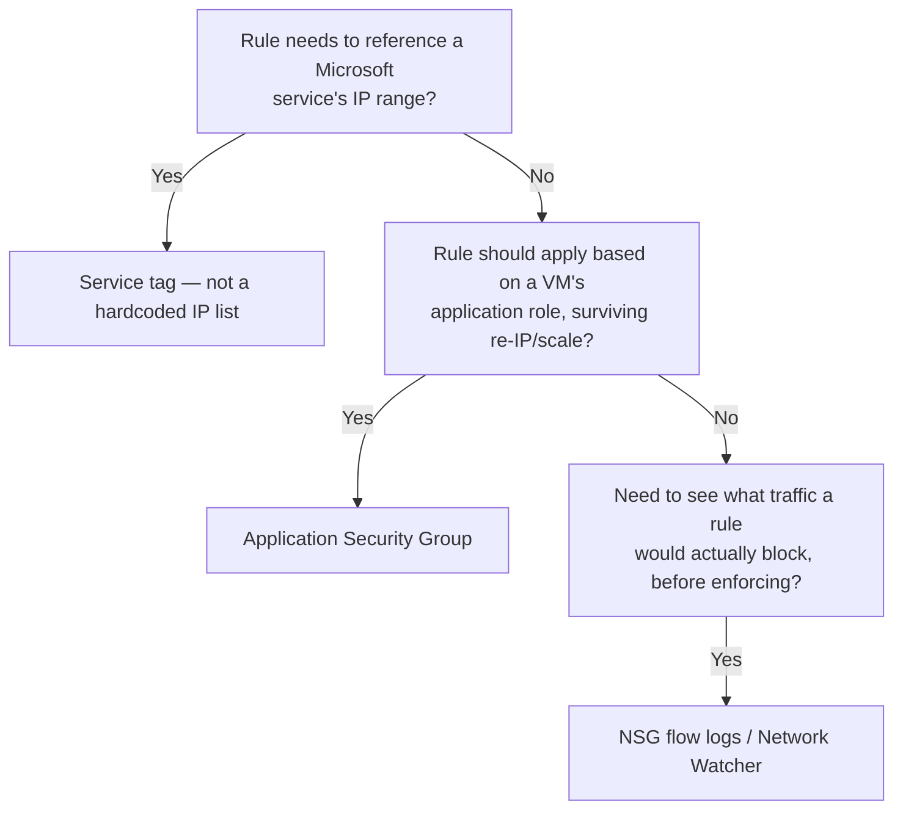

---
tags:
  - sc100
  - cheat-sheet
---

# Network Security Group (NSG)

Subnet/NIC-level, stateful L3–L4 traffic filter — a 5-tuple (source, destination, port, protocol, direction) allow/deny engine. The *when to use it vs. Azure Firewall* decision is already covered in [[Securing IaaS and PaaS Services]] and [[Network Security Architecture]]; this page is the rule mechanics.

## Core Capabilities

- **Rule anatomy** — priority (100–4096, **lower number wins**), source/destination (IP range, service tag, or Application Security Group), port, protocol, direction (inbound/outbound), action (allow/deny).
- **Default rules** — every NSG ships with non-deletable defaults: `AllowVNetInBound`, `AllowAzureLoadBalancerInBound`, `DenyAllInBound` (and the outbound equivalents `AllowVNetOutBound`, `AllowInternetOutBound`, `DenyAllOutBound`). Custom rules only take effect by being given a **higher priority** (lower number) than the default they need to override.
- **Association points** — a NSG can attach to a **subnet**, a **NIC**, or both simultaneously; when both are present, traffic is evaluated against *both* NSGs, and a deny at either layer blocks the traffic.
- **Service tags** — Microsoft-maintained named groups of IP prefixes (`Internet`, `VirtualNetwork`, `AzureLoadBalancer`, `Storage`, `Sql`, `AzureCloud`, etc.) that auto-update as the underlying ranges change — rules reference the tag, not a hardcoded IP list that goes stale.
- **Application Security Groups (ASGs)** — group VMs/NICs by application role (e.g., "WebTier," "DBTier") and reference the *group* in a rule instead of individual IPs; membership can change without touching the rule itself.
- **Augmented rules** — a single rule can list multiple IPs, ports, or ASGs at once, reducing rule sprawl versus one rule per address.
- **NSG flow logs** feed traffic visibility into the broader logging design — full source detail in [[Azure Security Logging]], not repeated here.

## Architecture

## Architecture Decisions

## Key Facts

- Two NSGs (subnet + NIC) apply **cumulatively**, not as alternatives — don't assume only one governs a given path.
- Default rules can't be deleted, only outranked by a custom rule at a lower (higher-priority) number — a scenario expecting to "remove" a default rule is testing whether you know to override it instead.
- Service tags cover *Microsoft/Azure* IP ranges; ASGs cover *the customer's own* resources grouped by role — different purpose, not interchangeable.

## Exam Notes

- "A rule needs to keep working as an Azure service's IP ranges change" → service tag, not a static IP list.
- "Firewall rules should follow a VM's role (web tier, DB tier), even as VMs are added/removed" → Application Security Group.
- Full NSG vs. Azure Firewall architecture decision lives in [[Securing IaaS and PaaS Services]] — this page only covers NSG's own rule mechanics.

## Comparison

| Compare | Difference |
| --- | --- |
| Subnet-level vs. NIC-level NSG association | Subnet NSG applies to every resource in the subnet; NIC NSG applies to just that network interface. Both can be present on the same path and are evaluated cumulatively — not a choice between the two. |
| Service tag vs. hardcoded IP range | Service tags are Microsoft-maintained and auto-update as the underlying ranges change. A hardcoded IP range goes stale the moment the service's addresses shift — the reason service tags are the default recommendation. |
| Application Security Group vs. service tag | ASGs group the *customer's own* VMs/NICs by role. Service tags group *Microsoft/Azure service* IP ranges. Same mechanical idea (name a group instead of an IP), different side of the connection. |
| NSG vs. Azure Firewall | Full comparison in [[Securing IaaS and PaaS Services]] — free, stateless-ish subnet/NIC segmentation vs. managed, stateful, FQDN-aware centralized policy. Not repeated here. |

## AZ-500 Review

AZ-500 already covers creating NSG rules, subnet/NIC association, service tags, ASGs, and enabling flow logs at the resource level — this page's mechanics are assumed knowledge. SC-100's addition is *where* NSGs fit in a layered network architecture, which lives in [[Network Security Architecture]] and [[Securing IaaS and PaaS Services]], not on this page.

## Keywords

- 5-tuple rule (source, destination, port, protocol, direction)
- Priority (lower number wins)
- Default rules: AllowVNetInBound, AllowAzureLoadBalancerInBound, DenyAllInBound
- Service tags
- Application Security Groups (ASG)
- Augmented rules
- Subnet vs. NIC association (cumulative evaluation)

## Related

- [[Securing IaaS and PaaS Services]]
- [[Network Security Architecture]]
- [[Azure Firewall]]
- [[Azure Security Logging]]
- [[Private Link]]
- [[Zero Trust]]
- [[Exam Objectives]]

## References

- [Network security groups overview](https://learn.microsoft.com/en-us/azure/virtual-network/network-security-groups-overview) — Microsoft Learn
- [Azure service tags overview](https://learn.microsoft.com/en-us/azure/virtual-network/service-tags-overview) — Microsoft Learn
- [Application security groups](https://learn.microsoft.com/en-us/azure/virtual-network/application-security-groups) — Microsoft Learn
