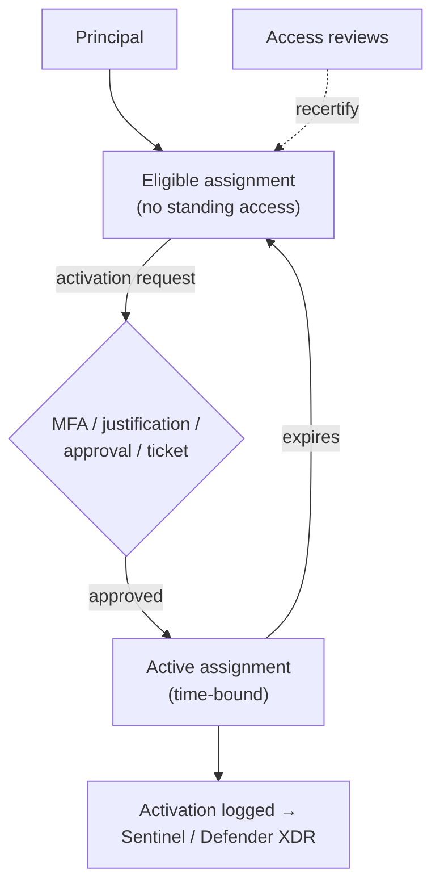

---
tags:
  - sc100
  - cheat-sheet
---

# Microsoft Entra Privileged Identity Management (PIM)

Just-in-time activation engine for Entra ID roles, Azure RBAC roles, and group membership — requires **Microsoft Entra ID P2** (see [[Entra ID]] for licensing). PIM's *architectural role* against entitlement management and CIEM is covered in [[Securing Privileged Access]]; this page is the mechanism itself.

## Core Capabilities

- **Eligible vs. Active assignment** — eligible means a principal *can* activate the role but holds no standing access; active means the role is currently exercisable, either as a discouraged permanent active assignment or as a time-bound state following activation.
- **Activation requirements** (configurable per role) — MFA re-authentication, a business justification, approval from a designated approver, a maximum activation duration, and an optional ticket-number requirement.
- **Scope** — Entra ID directory roles, Azure RBAC roles at any scope (management group/subscription/resource group/resource), and **PIM for Groups**.
- **PIM for Groups** — makes membership or ownership of a security/Microsoft 365 group itself eligible and JIT-activatable, extending JIT to *anything* that group grants (an app role, a SharePoint site, or an Azure RBAC role assigned to the group) — one mechanism reaching far beyond directory/Azure roles.
- **Alerts** — built-in detections for risky standing patterns (too many permanent role owners, roles activated without MFA, duplicate assignments) as a continuous hygiene signal, not a one-time audit.
- **Access reviews** can target PIM-eligible assignments specifically, recertifying who should remain eligible — the recurring-control link to [[Securing Privileged Access]].

## Architecture

## Key Facts

- An approver can be a different principal than the requester, and the whole activation workflow (MFA/justification/approval/ticket/duration) is configurable **per role**, not one tenant-wide setting.
- PIM for Groups is the concrete answer whenever JIT needs to reach something a role assignment alone doesn't cover — app access, SharePoint, or a group-assigned Azure RBAC role.
- PIM requires **P2** (or the Entra ID Governance add-on layered on top of P1) — see [[Entra ID]].
- PIM controls *when* a role is active, not whether the role is scoped correctly in the first place — an over-broad role activated JIT is still over-broad; see [[Securing Privileged Access]]'s PIM-vs-CIEM comparison, not repeated here.

## Exam Notes

- "Require approval and MFA before an admin role becomes usable, only for a limited time" → PIM role activation, not Conditional Access MFA alone.
- "Extend JIT access to an app or SharePoint site, not just a directory role" → PIM for Groups.
- Full PIM-vs-entitlement-management and PIM-vs-CIEM comparisons already live in [[Securing Privileged Access]] — this page covers only the activation mechanism itself.

## Comparison

| Compare | Difference |
| --- | --- |
| Eligible vs. Active assignment | Eligible: the principal can activate the role but holds zero standing access. Active: currently held — either a discouraged permanent assignment, or the bounded window following a JIT activation. |
| PIM for roles vs. PIM for Groups | PIM for roles gates a single Entra ID or Azure RBAC role directly. PIM for Groups gates membership/ownership of a group, extending JIT to everything that group's membership grants — broader reach through one mechanism, useful when access isn't expressed as a role at all. |

## Related

- [[Securing Privileged Access]]
- [[Entra ID]]
- [[Conditional Access]]
- [[Identity and Access Management (IAM)]]
- [[Zero Trust]]
- [[Exam Objectives]]

## References

- [What is Microsoft Entra Privileged Identity Management?](https://learn.microsoft.com/en-us/entra/id-governance/privileged-identity-management/pim-configure) — Microsoft Learn
- [Assign eligibility for a group in PIM for Groups](https://learn.microsoft.com/en-us/entra/id-governance/privileged-identity-management/pim-for-groups) — Microsoft Learn
