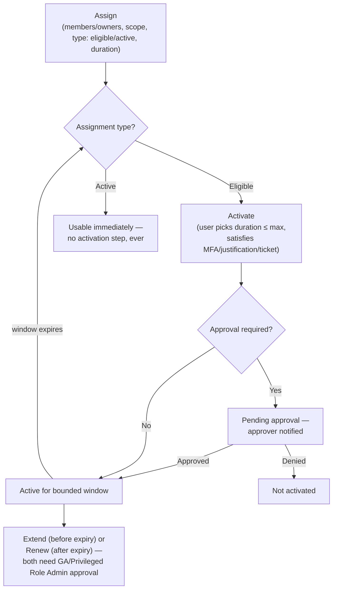

---
tags:
  - sc100
type: concept
domain:
  - ops-identity-compliance
aliases:
  - Privileged Identity Management
  - Microsoft Entra PIM
status: needs-verification
---

# Microsoft Entra Privileged Identity Management (PIM)

## Purpose

Time-based and approval-based just-in-time (JIT) role activation for Entra ID roles, Azure RBAC roles, and group membership — requires **Microsoft Entra ID P2** (see [[Entra ID]]). PIM's *architectural role* against entitlement management and CIEM is covered in [[Securing Privileged Access]]; this page is the mechanism itself, in full depth.

---

## Why Architects Choose It

- Standing privileged access is the single biggest lever an attacker or careless admin can pull — PIM removes it by default, replacing "always has the role" with "can get the role, for a bounded window, after friction."
- **There is no functional difference in what an eligible vs. permanent-active assignment grants once active** — the only difference is whether that access is standing (always on) or bounded (granted on demand). This is the exact fact your failed question turned on: eligible assignments aren't a *weaker* version of the role, they're the *same* role, gated.
- It directly operationalizes Zero Trust's "use least privilege access" and "verify explicitly" principles — see [[Zero Trust]] and [[Securing Privileged Access]]'s Enterprise Access Model.
- Every activation-time control (MFA, justification, approval, ticket, Conditional Access authentication context) is configured **per role**, independently — an architect composes exactly the friction a given role's blast radius justifies, not a single tenant-wide policy.

---

## Core Terminology

| Term | Category | Meaning |
| --- | --- | --- |
| **Eligible** | Assignment type | Requires the user to perform an action (activate) before using the role. No standing access. |
| **Active** | Assignment type | Requires **no action** to use the role — the user already has the privileges the moment the assignment exists. |
| **Activate** | Action | The process of turning an eligible assignment into a temporarily active one — may require MFA, justification, approval, and/or a ticket number, depending on role settings. |
| **Assigned** | State | A user with an *active* role assignment. |
| **Activated** | State | A user who was eligible, performed activation, and is now active for a preconfigured window. |
| **Permanent eligible** | Duration | Always eligible to activate — no expiry on the eligibility itself. |
| **Permanent active** | Duration | Always has the role active — no expiry, no activation ever required. **Avoid this for every role except emergency access accounts.** |
| **Time-bound eligible** | Duration | Eligible only between a start and end date. |
| **Time-bound active** | Duration | Active only between a start and end date — still requires no activation step during that window. |
| **Just-in-time (JIT) access** | Model | Temporary permissions granted only when needed, expiring automatically. |
| **Principle of least privilege** | Practice | Every user gets only the minimum privilege needed — minimizes standing Global Administrator count specifically. |

---

## Active vs. Eligible — the Core Distinction (read this twice)

| | Eligible | Active |
| --- | --- | --- |
| Standing access right now? | **No** | **Yes** |
| Action required before use? | **Yes** — activation (MFA/justification/approval/ticket per role settings) | **No** — none, ever, to *use* the role |
| Where friction can be applied | At **activation** time | At **assignment creation** time only (an admin can be required to MFA/justify when *granting* an active assignment — this doesn't touch the end user's usage) |
| Zero Trust recommendation | **Yes — this should be the default assignment type for almost every role** | Reserved for emergency access ("break glass") accounts only |

This distinction is precisely what the failed practice question tests:
- *"Permanent role assignments are required for privileged Entra tasks"* — **false**. PIM supports both permanent and eligible assignments for any role; nothing mandates permanent.
- *"Permanent role assignments should be configured as eligible"* — **true**, and the Zero-Trust-aligned recommendation: converts standing, always-on access into JIT access, which is the entire point of deploying PIM.
- *"Active role assignments require at least one activation step prior to use"* — **false**. That's the defining property of *eligible*, not active. Active means zero activation friction — the privilege is already live.
- *"Active role assignment creation can be configured to require MFA"* — **true**, but note *where*: the **"Require multifactor authentication on active assignment"** role setting forces the *administrator granting* the active assignment to MFA at grant time. It does **not** and *cannot* force MFA on every use, because active means the user is already privileged from the moment the assignment exists — PIM has nothing left to gate at usage time.
- *"Role activation can require justification or approval, but not both"* — **false**. Every activation-time control is an independent toggle — MFA, justification, approval, and ticket information can all be required simultaneously on the same role.

---

## Role Settings (a.k.a. PIM Policies)

Configured per role by a **Privileged Role Administrator** (Entra admin center → **ID Governance → Privileged Identity Management → Microsoft Entra roles → Roles → [role] → Role settings**). Settings are entirely independent per role — configuring Global Administrator doesn't touch Exchange Administrator.

### Activation settings (apply only to eligible assignments, at activation time)

| Setting | Detail |
| --- | --- |
| **Activation maximum duration** | Slider, **1–24 hours** — how long an activated assignment stays active before it must be reactivated. |
| **Require MFA on activation** | User must satisfy Entra multifactor authentication before activating. May be skipped if already satisfied via strong credentials or MFA earlier in the session. |
| **Require Microsoft Entra Conditional Access authentication context on activation** (public preview) | Ties activation to a Conditional Access policy — e.g., require a specific Authentication Strength, an Intune-compliant device, or Terms of Use acceptance. Layer this with **Authentication Strengths** when you need re-authentication with a *different* method than the one used to sign in to the machine (e.g., signed in with Windows Hello, but activation forces passwordless Authenticator). A 10-minute reauthentication grace window applies across Entra roles, Azure resource roles, and PIM for Groups once satisfied once. |
| **Require justification on activation** | Free-text business reason required to activate. |
| **Require ticket information on activation** | A support ticket number field — informational only, **not validated against any ticketing system**. |
| **Require approval to activate** | Gates activation behind a designated approver. Approvers need **no role themselves**. Select **at least one, recommended at least two**. **If none are configured, active Privileged Role Administrators/Global Administrators become the default approvers.** |

### Assignment duration settings (apply to both eligible and active, independently)

| Setting | Options |
| --- | --- |
| Eligible assignment duration | **Allow permanent eligible assignment**, or **Expire eligible assignment after** [fixed period]. |
| Active assignment duration | **Allow permanent active assignment**, or **Expire active assignment after** [fixed period]. |

These are two *separate* toggles — an org can allow permanent eligibility while forcing all active assignments (even post-activation ones) to expire, or any other combination.

### Active-assignment creation settings (apply only when an admin grants a NEW active assignment — never at usage time)

| Setting | Detail |
| --- | --- |
| **Require MFA on active assignment (creation)** | The admin *creating* the active assignment must MFA. PIM cannot enforce MFA when the assigned user later *uses* the role — they're already active from the moment of assignment. |
| **Require justification on active assignment (creation)** | The admin creating the active assignment must supply a business justification. |

### Notifications

Granular per-event control on the **Notifications** tab: turn an email off, limit it to specific addresses, send to both default recipients and extra addresses, or restrict to **critical emails only** (e.g., an approval request is critical; a routine "please extend your role" reminder is not). One event can notify up to **1000 recipients**; beyond that, only the first 1000 receive the email (doesn't affect anyone's actual permissions).

### Critical lockout warning

You will lock yourself out of the tenant if **all** of the following are true simultaneously: every Privileged Role Administrator/Global Administrator is eligible (none active), approval is required to activate, and **no approvers are configured**. Avoid this by always maintaining **emergency access ("break glass") accounts** and explicit named approvers.

---

## Assignment Lifecycle



- **Assign**: an admin sets members/owners, scope, assignment type (eligible/active), and duration (permanent or time-bound).
- **Activate**: for eligible assignments only — user picks an activation duration up to the configured maximum and satisfies whatever role settings require.
- **Approve/deny**: only relevant when "require approval" is on; delegated approvers get email notifications and can approve/deny individually or in bulk.
- **Extend/renew**: self-service, user-initiated, but **both always require Global Administrator or Privileged Role Administrator approval** — admins don't have to proactively manage expirations, they just approve/deny the requests that arrive.

---

## Who Can Manage What (a frequently-missed permission split)

| Scope | Can manage assignments for others | Can only view |
| --- | --- | --- |
| **Microsoft Entra roles** | Privileged Role Administrator, Global Administrator | Global Administrator, Security Administrator, Global Reader, Security Reader |
| **Azure resource roles** | Subscription Owner, resource Owner, or User Access Administrator | *(none of the Entra-role viewers above get automatic visibility here)* |

Privileged Role Administrator, Security Administrator, and Security Reader do **not** have default access to Azure resource role PIM assignments — Entra-role PIM and Azure-resource-role PIM are two separate permission universes, not one PIM permission that covers both.

---

## Assignable Principals

- **Users** — the normal case for both Entra roles and Azure roles.
- **Groups** — for Entra roles, must be a **cloud-only, role-assignable group**; for Azure roles, any Entra security group works.
- **Service principals** — **cannot** be assigned *eligible* for Entra roles, Azure roles, or PIM for Groups. They can only receive a **time-limited active** assignment.
- Max **500 role-assignable groups** per Entra tenant.

---

## PIM for Groups

- Solves a real productivity problem: a user eligible for 5–6 Entra roles individually has to activate each one separately; add tens/hundreds of Azure resource role assignments and it becomes unworkable.
- Instead, put the group itself under PIM: grant the **group** permanent active access to multiple roles, and make the **user's membership/ownership of that group** the one thing that's eligible/JIT. One activation → access to everything the group grants.
- Also extends JIT beyond directory/Azure roles entirely — to Intune, Azure Key Vault access policies, Azure Information Protection, or any SCIM-provisioned application (activating membership in an app-provisioning group triggers SCIM provisioning of the user into that app).
- Assigning or nesting one group inside another PIM-for-Groups group is **not recommended**.
- To manage a role-assignable group this way, it must first be **brought under management in PIM** ("discover groups").

---

## Architecture Decisions

```mermaid
flowchart TD
    Q1["Standing permanent active assignment<br/>on a privileged role?"] -->|Yes, not an emergency-access account| A1["Convert to eligible —<br/>Zero Trust default"]
    Q1 -->|Emergency access ('break glass') account| A2["Keep permanent active —<br/>the one sanctioned exception"]
    Q1 -->|No, already eligible| Q2["Need friction at activation time?"]
    Q2 -->|Yes| A3["Configure MFA / justification /<br/>approval / ticket — independently, any combination"]
    Q2 -->|No, but need friction when an admin GRANTS active access| A4["Require MFA / justification<br/>on active assignment CREATION"]
    Q3["User needs JIT access to multiple<br/>roles/apps at once (not just one role)?"] -->|Yes| A5["PIM for Groups"]
    Q4["All Privileged Role Admins/GAs eligible,<br/>approval required, no approvers set?"] -->|Yes| A6["Lockout risk — configure named<br/>approvers and emergency access accounts"]
```

---

## Deployment Plan

1. **Understand PIM** — what it manages (Entra roles, Azure roles, PIM for Groups), the four assignment states, and that service principals only ever get time-limited active (never eligible).
2. **Plan the project** — identify stakeholders; plan a **pilot** with a small user group first, verify expected behavior, only then roll to production; plan **communications** so users know their access experience is changing and how to get help.
3. **Plan testing** — create test users; build a test case table (role → expected activation behavior → actual result) before touching real users. Convention: for Entra roles, pilot with **Global Administrator first**; for Azure resources, pilot **one subscription at a time**.
4. **Plan rollback** — if PIM misbehaves in production, an admin can select the ellipsis on any eligible assignment and choose **"Make active"** to revert it back to standing access.
5. **Discover and mitigate** existing privileged roles — list current holders, remove anyone who no longer needs the role. Use **access reviews** to automate this discovery/recertification instead of a one-time manual pass.
6. **Determine which roles PIM manages** — prioritize by blast radius: **Global Administrator and Security Administrator first** (can do the most damage if compromised), then expand. The **Privileged** label on **Roles and administrators** in the Entra admin center flags high-privilege roles worth managing this way. For Azure, prioritize **Owner** and **User Access Administrator** on every subscription/resource, scoped by risk via management groups.
7. **Configure role settings** — draft settings per role. Microsoft's own worked example:

   | Role | MFA | CA context | Notification | Ticket | Approval | Approver | Duration | Permanent |
   | --- | --- | --- | --- | --- | --- | --- | --- | --- |
   | Global Administrator | ✔ | ✔ | ✔ | ✔ | ✔ | Another Global Administrator | 1 hour | Emergency access accounts only |
   | Exchange Administrator | ✔ | ✔ | ✔ | ✘ | ✘ | None | 2 hours | None |
   | Helpdesk Administrator | ✘ | ✘ | ✘ | ✔ | ✘ | None | 8 hours | None |

8. **Assign, activate, approve/deny, audit** — give eligible assignments, let users self-activate, route approvals, then review **audit history (30-day retention)** — read it weekly, export it monthly — and configure **security alerts** for suspicious activation patterns.
9. Repeat the discover → determine → configure → assign/activate → audit cycle separately for **Azure resource roles** and **PIM for Groups** — each has its own worked example settings table and its own permission model (see above).

---

## Comparison

| Compare | Difference |
| --- | --- |
| Eligible vs. Active assignment | Eligible: zero standing access, activation required before use. Active: full standing access, no activation step ever required to use it — friction (if any) only applies when the assignment is *created*, not when it's *used*. |
| Activation-time MFA vs. active-assignment-creation MFA | Activation-time MFA challenges the **end user** every time they activate an eligible role. Active-assignment-creation MFA challenges the **admin granting** a new active assignment, once, at grant time — it cannot recur on every use because there's no activation event to attach to. |
| Extend vs. Renew | Extend: requested **before** the assignment expires. Renew: requested **after** it has already expired. Both are self-service requests that still require Global Administrator/Privileged Role Administrator approval. |
| PIM for roles vs. PIM for Groups | PIM for roles gates one Entra ID or Azure RBAC role directly. PIM for Groups gates membership/ownership of a group, extending JIT to everything that group grants (app roles, SharePoint, Key Vault access policies, SCIM-provisioned apps) — broader reach through a single activation. |
| Entra-role PIM permissions vs. Azure-resource-role PIM permissions | Two separate admin universes: Privileged Role Administrator/Global Administrator manage Entra-role assignments; Owner/User Access Administrator manage Azure-resource-role assignments. Holding one doesn't grant visibility into the other. |
| PIM vs. Conditional Access MFA | Conditional Access can require MFA for *any* sign-in. PIM's activation MFA specifically gates *turning on* a privileged role — a narrower, role-scoped control layered on top of, not instead of, Conditional Access. |

---

## AZ-500 Review

AZ-500 already covers enabling PIM, assigning eligible roles, and basic activation. New for SC-100: the exact behavior split between activation-time controls and active-assignment-creation controls, the Entra-role vs. Azure-resource-role permission model split, PIM for Groups as a scaling mechanism, and sequencing a PIM rollout as a deployment project (pilot → test → rollback plan) rather than a one-time toggle.

---

## What's New for SC-100

- Architect **zero permanent active assignments** except emergency access accounts as the default design position, and justify it via Zero Trust least-privilege, not just "because Microsoft recommends it."
- Recognize that activation-time controls (MFA/justification/approval/ticket) and active-assignment-creation controls are **different settings gating different moments** — a frequent exam mix-up.
- Use **PIM for Groups** as the answer whenever a scenario describes JIT access sprawling across many roles or non-role resources (apps, Key Vault, SCIM-provisioned SaaS).
- Sequence a PIM rollout as a project — pilot, test plan, rollback plan — rather than assuming a single "enable PIM" step.

---

## Exam Tips

- "Require approval and MFA before an admin role becomes usable, only for a limited time" → PIM role **activation** settings, not Conditional Access MFA alone.
- "Extend JIT access to an app or SharePoint site, not just a directory role" → **PIM for Groups**.
- "Active role assignments require an activation step" → **false** — that's eligible. Active means no activation step, ever.
- "Permanent assignments are required for privileged tasks" → **false** — convert them to eligible; that's the Zero-Trust-aligned recommendation.
- "Role activation can require justification OR approval, not both" → **false** — every activation control is independent and combinable.
- "MFA can be required when creating an active assignment" → **true**, but it only fires at grant time, never at use time — don't confuse it with activation MFA.
- A scenario naming Privileged Role Administrator as able to view **Azure resource role** PIM assignments is a distractor — that permission universe belongs to Owner/User Access Administrator instead.
- A service principal described as "eligible" for a role is a distractor — service principals only ever get time-limited **active** assignments.

---

## Common Exam Confusion

- **Eligible vs. Active** — the core distinction; see the dedicated section above, this is the single most-tested PIM concept.
- **Activation-time MFA/justification vs. active-assignment-creation MFA/justification** — different moments, different settings, same-sounding names.
- **Extend vs. Renew** — before vs. after expiry; both still need approval.
- **Entra-role PIM permissions vs. Azure-resource-role PIM permissions** — two non-overlapping admin groups.
- **PIM for roles vs. PIM for Groups** — a single role vs. everything a group grants.

---

## Keywords

- Eligible, active, activate, assigned, activated
- Permanent eligible, permanent active, time-bound eligible, time-bound active
- Activation maximum duration (1–24 hours)
- Require MFA / justification / ticket information / approval on activation
- Require MFA / justification on active assignment (creation)
- Allow permanent eligible/active assignment vs. expire after
- Conditional Access authentication context on activation (preview), Authentication Strengths
- Emergency access ("break glass") accounts
- Extend vs. renew
- PIM for Groups, role-assignable group, SCIM provisioning trigger
- Privileged Role Administrator, Global Administrator, Owner, User Access Administrator
- Access reviews (recertification)
- Security alerts, audit history (30-day retention)

---

## Related Services

- [[Securing Privileged Access]]
- [[Entra ID]]
- [[Conditional Access]]
- [[Identity and Access Management (IAM)]]
- [[Identity Protection]]
- [[Zero Trust]]
- [[Privileged Access Tier Models]]
- [[Microsoft 365 Licensing]]
- [[Exam Objectives]]

---

## References

- [What is Microsoft Entra Privileged Identity Management?](https://learn.microsoft.com/en-us/entra/id-governance/privileged-identity-management/pim-configure) — Microsoft Learn
- [Configure Microsoft Entra role settings in PIM](https://learn.microsoft.com/en-us/entra/id-governance/privileged-identity-management/pim-how-to-change-default-settings) — Microsoft Learn
- [Plan a Privileged Identity Management deployment](https://learn.microsoft.com/en-us/entra/id-governance/privileged-identity-management/pim-deployment-plan) — Microsoft Learn
- [[Exam Objectives]]

---

## Verification Flag

Conditional Access authentication context on PIM activation is called out as **public preview** as of the source documentation — re-verify its GA status, and re-check the activation maximum duration bound (currently 1–24 hours) and the 1000-recipient notification cap, against Microsoft Learn close to exam date.
