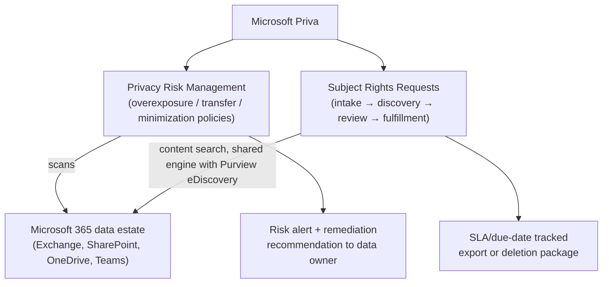
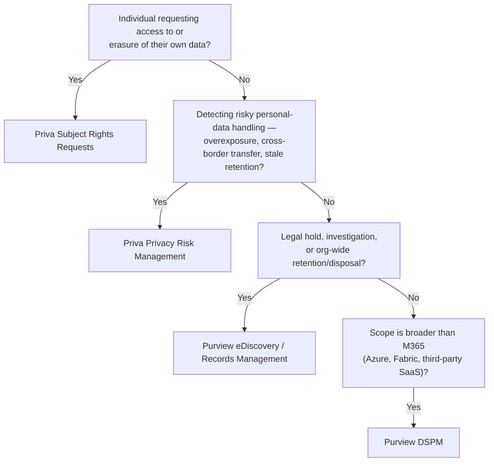

---
tags:
  - sc100
type: concept
domain:
  - ops-identity-compliance
aliases:
  - Priva
  - Microsoft Priva
status: needs-verification
---
# Microsoft Priva

## Purpose

Microsoft's privacy-management product — automating individual data-subject rights requests and proactively detecting privacy risk in how personal data is handled across the Microsoft 365 data estate — distinct from [[Purview]]'s organizational compliance solutions covered in [[Compliance and Privacy]].

---

## Why Architects Choose It

- Privacy law (GDPR, CCPA, and similar) creates individual-level obligations — respond to a named person's access/erasure request within a statutory deadline — that org-wide compliance tooling (audit, eDiscovery, records management) isn't built to fulfill at scale.
- Automates two of the highest-effort manual privacy processes: discovering everywhere a specific individual's personal data lives across Exchange/SharePoint/OneDrive/Teams, and proactively spotting risky personal-data handling *before* it becomes a breach or complaint.
- Shares the same Microsoft 365 content-search substrate as [[Purview]] eDiscovery for its discovery step, so an architect already familiar with eDiscovery search mechanics is learning a privacy-specific workflow wrapped around a known engine, not a second unrelated one.
- Scoped specifically to *personal-data risk*, not general sensitive-data exposure — complements, rather than replaces, [[Data Security Posture Management (DSPM)|DSPM]]'s broader security-exposure lens on the same data estate.

---

## When to Use

- Fulfilling a data subject access request (DSAR) or erasure request within a regulatory deadline — **Subject Rights Requests (SRR)**.
- Proactively detecting personal data that's overexposed (broad sharing links, excessive group access), moving across a defined boundary (department, region/country), or going stale/unused and should be minimized — **Privacy Risk Management**.
- Giving privacy/legal teams a purpose-built workflow (case tracking, SLA due dates, reviewer collaboration, redaction) instead of running DSARs as ad hoc eDiscovery cases.
- Feeding remediation recommendations (reduce access, notify the data owner, escalate) directly to the people who can act on a specific file or site, not just a central compliance dashboard.

---

## When NOT to Use

- As the answer for organization-wide compliance obligations — legal hold, litigation response, records retention/disposal — those are [[Purview]] eDiscovery and Data Lifecycle/Records Management, not Priva; see [[Compliance and Privacy]].
- Expecting Priva to cover the full data estate — its scope is the Microsoft 365 collaboration data set (Exchange, SharePoint, OneDrive, Teams); it doesn't natively scan Azure data stores or third-party SaaS the way [[Data Security Posture Management (DSPM)|Purview DSPM]]'s unified experience does.
- Treating Privacy Risk Management alerts as enforcement — like DSPM, it discovers and recommends; actually blocking or restricting sharing still runs through DLP/sensitivity labels ([[Data Classification and Protection]]).
- As a substitute for legal interpretation of what a given regulation requires — Priva operationalizes a request/risk workflow a privacy/legal team has already defined the scope for.

---

## Architecture

---

## Architecture Decisions

---

## Comparison

| Compare | Difference |
| --- | --- |
| Priva vs. [[Purview]] compliance solutions | Priva addresses individual privacy rights (subject requests) and proactive privacy-risk detection for personal data. Purview compliance addresses organizational obligations — audit, legal hold, retention, records — full breakdown in [[Compliance and Privacy]]. |
| Priva Subject Rights Requests vs. Purview eDiscovery | Both search Microsoft 365 content with the same underlying engine, but SRR is purpose-built for one data subject's DSAR/erasure request with SLA tracking; eDiscovery is a general-purpose legal case/investigation workflow across many custodians. |
| Priva Privacy Risk Management vs. [[Data Security Posture Management (DSPM)\|Purview DSPM]] | Both proactively flag risky data exposure in the M365 estate, but through different lenses: Privacy Risk Management flags *privacy-law-specific* patterns (personal-data overexposure, cross-border transfer, retention minimization); DSPM flags *general sensitive-data* security exposure across a wider estate (M365, Azure, Fabric, third-party SaaS). Overlapping on oversharing, but scoped and framed differently — pick based on whether the driver is privacy regulation or general data security posture. |

---

## AZ-500 Review

AZ-500 doesn't cover Priva at all — privacy-specific tooling is entirely new territory for SC-100, same as the rest of the Purview compliance/privacy stack (see [[Compliance and Privacy]]).

---

## What's New for SC-100

- Recognize Priva as the exam's dedicated answer for *individual* privacy-rights scenarios — a named person's access/erasure request, or proactive personal-data risk detection — distinct from Purview's org-wide compliance solutions.
- Know Priva's two core products by name and function: Privacy Risk Management (proactive risk detection via overexposure/transfer/minimization policies) and Subject Rights Requests (DSAR/erasure fulfillment workflow).
- Understand Priva's scope boundary: Microsoft 365 collaboration data, not the full multicloud/SaaS data estate — a design requiring privacy-risk coverage of Azure or third-party SaaS data needs [[Data Security Posture Management (DSPM)|Purview DSPM]] instead or in addition.
- Priva licensing is separate from Purview's compliance features bundled into Microsoft 365 E5 Compliance — treat it as its own add-on decision, not something that comes free with an existing compliance license (verify current SKU/bundling before the exam).

---

## Exam Tips

- "An individual is requesting a copy of, or deletion of, their personal data" → Priva Subject Rights Requests, not eDiscovery.
- "Detect employees oversharing personal data externally, or personal data crossing a regional boundary" → Priva Privacy Risk Management.
- A scenario needing privacy-risk coverage across Azure or third-party SaaS, not just Microsoft 365 → Purview DSPM, not Priva — Priva's scope is M365 collaboration data.
- "Preserve content for litigation" or "retain records for N years" is not a Priva scenario — that's eDiscovery legal hold or Records Management.

---

## Common Exam Confusion

- **Priva vs. Purview compliance solutions** — individual privacy rights vs. organizational compliance obligations; full comparison above.
- **Priva Subject Rights Requests vs. eDiscovery** — purpose-built DSAR workflow with SLA tracking vs. general-purpose legal case/investigation tooling, both on the same search engine.
- **Priva Privacy Risk Management vs. Purview DSPM** — privacy-law-specific risk lens on M365 data vs. general sensitive-data security exposure across a wider estate.

---

## Keywords

- Microsoft Priva, Privacy Risk Management, Subject Rights Requests (SRR)
- Data subject access request (DSAR), right to erasure
- Data overexposure / data transfer / data minimization policies
- Privacy risk alert, remediation recommendation
- SLA/due-date tracking, review set, redaction
- Compliance portal (compliance.microsoft.com)

---

## Related Services

- [[Compliance and Privacy]]
- [[Purview]]
- [[Data Security Posture Management (DSPM)]]
- [[Data Classification and Protection]]
- [[Security Scoring Dashboards]]
- [[Exam Objectives]]

---

## References

- [Microsoft Priva overview](https://learn.microsoft.com/en-us/privacy/priva/priva-overview) — Microsoft Learn
- [Priva Privacy Risk Management](https://learn.microsoft.com/en-us/privacy/priva/risk-management) — Microsoft Learn
- [Priva Subject Rights Requests](https://learn.microsoft.com/en-us/privacy/priva/subject-rights-requests-overview) — Microsoft Learn
- [[Exam Objectives]]

---

## Verification Flag

Priva's licensing/SKU bundling, and any newer capabilities beyond Privacy Risk Management and Subject Rights Requests (Microsoft has previewed additional privacy-assessment and consent-tracking features under the Priva/Purview umbrella), may have changed since this note was written (2026-08-19). Re-verify the current product list, scope boundary (M365-only vs. expanded), and licensing before the exam.
