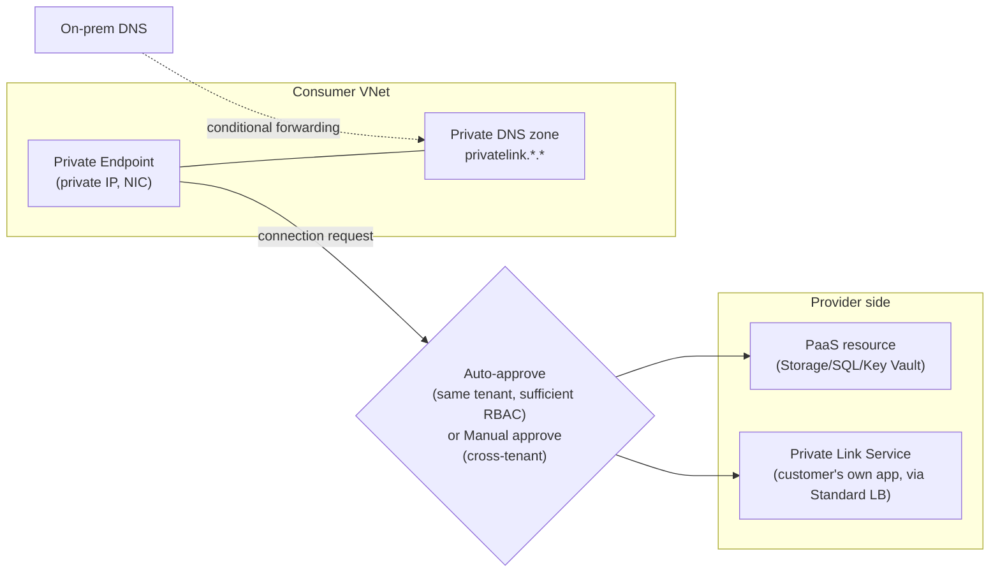

---
tags:
  - sc100
type: cheat-sheet
domain:
  - infrastructure
---

# Azure Private Link

Gives a PaaS resource (or a customer's own service) a private IP inside a consumer's VNet, removing it from the public endpoint path entirely. The *when to use it vs. Service Endpoint* decision already lives in [[Securing IaaS and PaaS Services]] — this page is the mechanism itself.

## Core Capabilities

- **Private Endpoint** — a NIC with a private IP, created in the *consumer's* subnet, mapped to one specific resource instance (a single storage account, SQL server, Key Vault, API Management instance, etc.) — not the whole service, and not the whole subnet the way a Service Endpoint applies. APIM's inbound Private Link use case (Premium tier) is covered in [[API Management and Security]].
- **Private Link Service** — the *provider* side: exposes a Standard Load Balancer-fronted service (the customer's own app/service, not just Microsoft PaaS) to other consumers via Private Link — this is how an organization offers Private Link connectivity to its own multi-tenant service across subscriptions or tenants.
- **Private DNS integration** — resolution of the resource's public FQDN to its new private IP depends on an **Azure Private DNS zone** (`privatelink.<service>.<suffix>`), either auto-registered via the private endpoint's DNS zone group or resolved from on-prem via conditional forwarding.
- **Connection approval workflow** — **Auto-approve** when the consumer has sufficient RBAC on the target resource (same tenant/subscription); **Manual approve** when the provider must explicitly accept each connection request (typical for cross-tenant Private Link Service scenarios) — least-privilege by default for anything outside the provider's own control boundary.
- **Reach** — a private endpoint is reachable from peered VNets, on-prem over ExpressRoute/VPN, and across regions — anywhere the private IP is routable, unlike a Service Endpoint which stops at the Azure backbone.

## Architecture

## Key Facts

- One private endpoint maps to one resource instance — a fleet of storage accounts needs a private endpoint per account, not one shared across a subnet (that's the Service Endpoint model instead).
- A missing or misconfigured Private DNS zone is the most common reason a private endpoint "doesn't work" — the client still resolves the public FQDN to the public IP unless DNS is wired correctly.
- On-prem clients need either conditional forwarding from their own DNS servers to Azure Private DNS, or **Azure DNS Private Resolver**, to resolve `privatelink.*` names.
- Billed per private endpoint-hour plus data processed — a cost factor at scale (many resources = many endpoints) that a flat, free Service Endpoint doesn't carry.
- NSGs can be applied to a private endpoint's subnet (network policies for private endpoints), but this is an opt-in per-subnet setting, not automatic.

## Exam Notes

- "A partner tenant needs to reach a service we host, without a VPN, and we must approve each connection" → Private Link Service with manual connection approval, not a public endpoint with IP allow-listing.
- "Private endpoint is provisioned but the client still reaches the public endpoint" → check the Private DNS zone/registration first — the classic exam trap.
- "Resolve a private-linked resource's name from an on-prem network" → conditional forwarding to Azure Private DNS (or Azure DNS Private Resolver), not a public DNS record edit.
- Decision-level "Private Link vs. Service Endpoint" (when to recommend each) is covered in [[Securing IaaS and PaaS Services]] — don't re-derive it here, this page is the underlying mechanism.

## Comparison

| Compare | Difference |
| --- | --- |
| Private Endpoint vs. Private Link Service | Private Endpoint is the *consumer*-side object — a private IP a VNet uses to reach someone else's service. Private Link Service is the *provider*-side object — what a customer stands up (behind a Standard Load Balancer) to expose their own service to other consumers over Private Link. Consuming Microsoft PaaS only needs a Private Endpoint; offering a private-linked service of your own needs a Private Link Service. |

## Related

- [[Securing IaaS and PaaS Services]]
- [[Network Security Architecture]]
- [[Azure Arc]]
- [[Identity as the Security Perimeter]]
- [[Azure Landing Zones]]
- [[Azure Landing Zones (Beginner Explainer)]]
- [[Zero Trust]]
- [[API Management and Security]]
- [[Exam Objectives]]

## References

- [What is Azure Private Link?](https://learn.microsoft.com/en-us/azure/private-link/private-link-overview) — Microsoft Learn
- [Azure Private Endpoint DNS configuration](https://learn.microsoft.com/en-us/azure/private-link/private-endpoint-dns) — Microsoft Learn
- [Create a Private Link service](https://learn.microsoft.com/en-us/azure/private-link/create-private-link-service-portal) — Microsoft Learn
