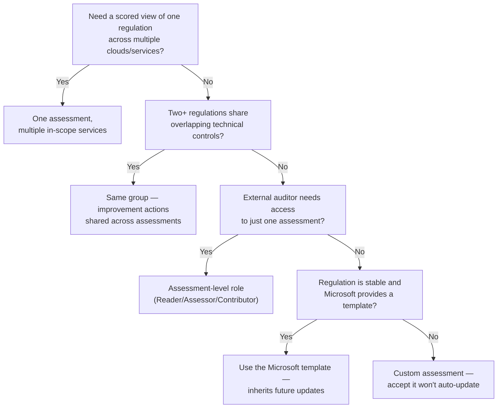

---
tags:
  - sc100
type: concept
domain:
  - ops-identity-compliance
aliases:
  - Compliance Manager
  - Control (Compliance Manager)
  - Assessment (Compliance Manager)
  - Regulatory template
---
# Purview Compliance Manager

## Purpose

Unpacks the four data elements [[Compliance and Privacy]] mentions only by name — **Control**, **Assessment**, **Group**, and **Regulatory Template** — the objects Compliance Manager uses to turn a named regulation into a scored, tracked compliance posture.

---

## Why Architects Choose It

- It formalizes the [[Shared Responsibility Model]] at the level of an individual regulatory requirement: every control is explicitly typed as **Microsoft managed**, **customer managed**, or **shared**, so a design can show exactly who owns implementation for each clause of a regulation, not just "cloud vs. on-prem" in general.
- One assessment can span multiple services — Microsoft 365, Azure, AWS, GCP, and third-party SaaS via connectors — so a single GDPR or ISO 27001 posture view doesn't require stitching together per-cloud tools.
- **Groups** are a pure organizational decision made *before* assessment creation and can't be changed afterward — the grouping strategy (by year, by regulation, by business unit) is itself an architecture choice with a real consequence if gotten wrong.
- Improvement actions can be **shared** across assessments in the same group, so overlapping regulatory requirements (e.g., ISO 27001 and ISO 27018) get satisfied once instead of duplicated — a real effort-reduction lever, not just a reporting convenience.
- Assessment-level role assignment (Reader/Assessor/Contributor) lets an architect grant an external auditor or a specific compliance owner access to exactly one assessment, without a tenant-wide Compliance Manager role.

---

## When to Use

- Translating a named regulation (GDPR, ISO 27001, NIST CSF, HIPAA, one of 360+ available templates) into a trackable, scored set of controls and improvement actions.
- Producing a single compliance view across multiple clouds/services for one regulation — one assessment, multiple in-scope services, not one assessment per cloud.
- Reducing duplicate remediation effort where two or more regulations share overlapping technical controls — group the assessments together so shared improvement actions update everywhere at once.
- Giving an external auditor or regulator scoped, time-bound access to review evidence for one specific assessment.
- Assessing AI-specific regulatory exposure (EU AI Act, ISO/IEC 23894/42001, NIST AI RMF) via the premium AI regulation templates, optionally auto-synced from Azure AI Foundry evaluation results — see [[AI and Copilot Security Architecture]].

---

## When NOT to Use

- As the technical resource-configuration scoring engine — that's [[Azure Policy]]/[[Microsoft Cloud Security Benchmark (MCSB)]] driving Defender for Cloud's Secure Score and regulatory compliance dashboard (mechanics in [[Security Posture Assessments]] and [[Security Scoring Dashboards]]). Compliance Manager scores process/attestation-style controls; it doesn't replace technical posture scoring.
- As a substitute for legal interpretation of a regulation — it operationalizes controls a legal/compliance team has already mapped, not the other way around.
- Granting Global Administrator just so someone can create assessments — use the narrower **Compliance Manager Administrator** or **Compliance Manager Assessor** roles.
- Building a fully custom assessment when a Microsoft-provided regulatory template exists and the regulation may change — custom assessments **do not** receive Microsoft's automatic template/control-mapping updates; only assessments built from (and kept synced to) a Microsoft template do.
- Assuming a group provides any security boundary — groups have no security properties of their own; all permissions live on the assessment.

---

## Architecture

```mermaid
flowchart TD
    Reg["Regulatory template<br/>(360+ prebuilt, or custom)"] -->|basis for| Assess["Assessment<br/>(in-scope services + controls + score)"]
    Assess -->|belongs to exactly one, permanent| Group["Group<br/>(organizational container, no security boundary)"]
    Assess --> Ctrl["Controls<br/>(Microsoft managed / your / shared)"]
    Ctrl --> IA["Improvement actions<br/>(assigned, evidence, test status)"]
    IA -->|completing actions earns points, rolls up to| Score["Compliance score"]
    IA -.->|shared within same group<br/>(technical actions: tenant-wide)| IA
```

- **Regulatory template** → the pre-mapped blueprint (controls + recommended improvement actions) for a specific regulation, standard, or policy. Over 360 provided; custom templates can be authored for unique requirements.
- **Assessment** → the instantiated, scoped, trackable object built from a template (or fully custom): it names the in-scope services, holds the controls, and carries the assessment score. This is the actual unit of work — the only object assessment-level roles (Reader/Assessor/Contributor) attach to.
- **Control** → a single requirement of the regulation. Tracked as **Microsoft managed** (Microsoft implements it for its cloud services), **your/customer managed** (your organization implements it), or **shared** (both). A control's status (Passed/Failed/None/In progress/Out of scope) rolls up from its improvement actions.
- **Improvement action** → the concrete task that satisfies (all or part of) one or more controls — a technical change (e.g., enable MFA) or a non-technical one (e.g., a written policy), with assignable owners, evidence, notes, and test status. One improvement action can satisfy multiple controls across multiple assessments.
- **Group** → a pure organizational container for assessments (by year, regulation family, business unit, geography). Not scored, not a security boundary, can't be deleted, must always contain at least one assessment, and — critically — **an assessment's group assignment is permanent once set**.

---

## Groups: Rules Worth Knowing

- A group can be created inline while creating an assessment, or reused for a new one.
- Group names must be unique in the tenant; groups themselves are never directly deletable (only by deleting every assessment inside them).
- Once an assessment is added to a group, it **cannot be moved to a different group**.
- Adding a new assessment to an existing group **copies** relevant shared information from the group's other assessments into the new one.
- A group can hold multiple assessments for the *same* regulation only if each targets a different product/certification pairing (e.g., two different certifications), never two assessments for the identical product+regulation pair.
- **Shared improvement actions**: within a group, a *technical* improvement action's status update applies tenant-wide across every assessment that includes it (any group); a *non-technical* action's update applies only within the group where it was updated.

---

## Architecture Decisions



---

## Comparison

| Compare | Difference |
| --- | --- |
| Control vs. Improvement action | A **control** is the regulatory requirement itself (a line item tied to a clause of the standard). An **improvement action** is the concrete task/evidence that satisfies it — a many-to-many relationship, since one action can close several controls across several assessments. |
| Assessment vs. Regulatory template | A **template** is the reusable, Microsoft-maintained (or custom) blueprint. An **assessment** is the scoped, tenant-specific, scored, access-controlled instance created *from* a template — the object you actually work in and delete/export. |
| Group vs. Assessment | A **group** is an unscored, undeletable organizational folder with no security properties. An **assessment** is the scored, permission-bearing, deletable unit of work — groups exist purely to organize assessments and share their improvement actions. |
| Microsoft managed vs. your (customer managed) vs. shared controls | Same three-way split as the Shared Responsibility Model, applied per control: Microsoft implements it (you get implementation detail + audit results), you implement it, or both share it. |
| Compliance Manager vs. Defender for Cloud Regulatory Compliance dashboard | Compliance Manager scores process/attestation-style organizational controls, spans Microsoft 365 + multicloud. Defender for Cloud's dashboard scores technical resource configuration against the same named standards. Full detail in [[Security Posture Assessments]]. |
| Assessment built from Microsoft template vs. fully custom assessment | A template-based assessment inherits Microsoft's control-mapping and scoring updates when the regulation changes (you accept or defer each update). A custom assessment never receives those automatic updates — you own keeping it current. |

---

## AZ-500 Review

AZ-500 doesn't cover Purview or Compliance Manager at all — it's scoped to Azure infrastructure security. All of Compliance Manager's object model (controls, assessments, groups, templates, improvement actions) is new territory for SC-100.

---

## What's New for SC-100

- Know the four core data elements by name — **Control, Assessment, Regulatory template, Improvement action** — plus **Group** as the organizational container around assessments.
- Recognize groups as purely organizational (no security boundary, permanent assignment, can't be deleted) — a frequent "which layer enforces access" trap, since all permissions actually live on the assessment.
- Understand the shared-improvement-action mechanic as the deliberate answer to "avoid duplicating remediation work across overlapping regulations" — plan the grouping strategy *before* creating assessments, since it can't be undone per assessment.
- Know that custom assessments trade away automatic Microsoft template updates — a design choosing "custom" for a regulation that changes frequently is accepting an ongoing maintenance burden.
- Recognize the three control types (Microsoft managed / your / shared) as the Shared Responsibility Model made operational and auditable at the per-requirement level.
- Recognize the premium AI regulation templates (EU AI Act, ISO/IEC 23894:2023, ISO/IEC 42001:2023, NIST AI RMF) and their Azure AI Foundry evaluation-action sync as the exam's AI-governance answer within Compliance Manager.

---

## Exam Tips

- "Single compliance view for GDPR across Microsoft 365, AWS, and GCP" → one assessment with multiple in-scope services, not three separate assessments.
- "Reduce duplicate work implementing ISO 27001 and ISO 27018, which overlap" → put both assessments in the same group so shared improvement actions update together.
- "Give an external auditor access to only the PCI-DSS assessment" → assign them a role (Reader/Assessor/Contributor) scoped to that one assessment, not a tenant-wide Compliance Manager role.
- "Grouping strategy hasn't been decided yet, and assessments are about to be created" → flag this — the assessment-to-group assignment is permanent once made.
- "A regulation changes frequently and the org wants to stay current automatically" → use the Microsoft-provided template (and accept updates), not a fully custom assessment.
- "Which entity actually score-gates and holds security roles" → the **assessment**, never the group.

---

## Common Exam Confusion

- **Control vs. Improvement action** — the requirement vs. the task that satisfies it; full breakdown above.
- **Assessment vs. Regulatory template** — the scored instance vs. the reusable blueprint.
- **Group vs. Assessment** — unscored organizational folder vs. the actual scored, permission-bearing unit.
- **Compliance Manager vs. Defender for Cloud Regulatory Compliance dashboard** — process/attestation scoring vs. technical resource configuration scoring; see [[Compliance and Privacy]].
- **Microsoft template-based vs. custom assessment** — automatic regulatory update inheritance vs. none.

---

## Keywords

- Compliance Manager, control, assessment, group, regulatory template, improvement action
- Microsoft managed control, your/customer managed control, shared control
- Compliance score, Data Protection Baseline assessment
- Compliance Manager Administrator, Assessor, Reader, Contributor roles
- Assessment update, control mapping, template inheritance
- Connectors (AWS, GCP, Salesforce, Zoom, non-Microsoft services)
- Premium AI regulation templates, Azure AI Foundry evaluation actions

---

## Related Services

- [[Purview]] — this is the Risk & Compliance solution area's scoring engine.
- [[Compliance and Privacy]] — where Compliance Manager sits against Priva and other compliance solutions.
- [[Security Posture Assessments]] — the technical-configuration counterpart (Defender for Cloud).
- [[Security Scoring Dashboards]] — which score answers which question.
- [[Shared Responsibility Model]] — the model this note's control types operationalize.
- [[Azure Policy]]
- [[Microsoft Cloud Security Benchmark (MCSB)]]
- [[AI and Copilot Security Architecture]] — AI regulation templates.
- [[Priva]]
- [[Assigning Regulatory Compliance Standards]] — the Defender for Cloud technical assignment workflow whose resource-level results now surface automatically into a matching Compliance Manager assessment.

---

## References

- [Microsoft Purview Compliance Manager](https://learn.microsoft.com/en-us/purview/compliance-manager) — Microsoft Learn
- [Build and manage assessments in Microsoft Purview Compliance Manager](https://learn.microsoft.com/en-us/purview/compliance-manager-assessments) — Microsoft Learn
- [Creating regulation templates in Compliance Manager](https://learn.microsoft.com/en-us/purview/compliance-manager-create-template) — Microsoft Learn
- [[Exam Objectives]]
