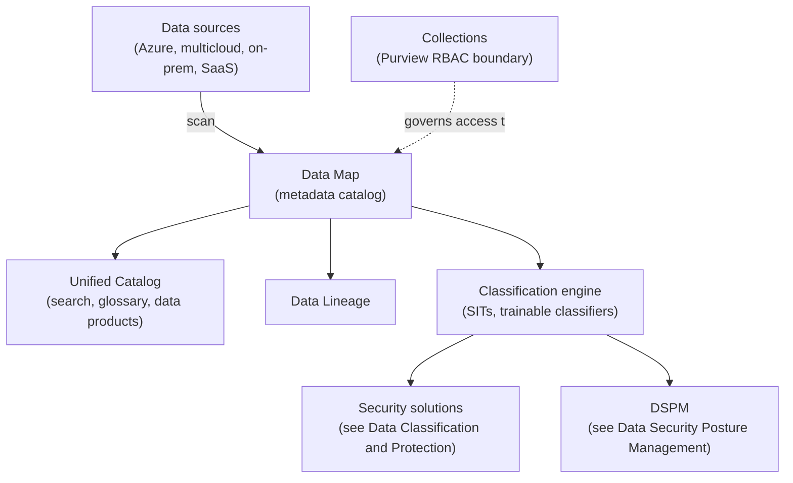

---
tags:
  - sc100
type: cheat-sheet
domain:
  - ops-identity-compliance
  - apps-data
---
# Microsoft Purview

Unified data governance, security, and compliance platform, organized into three solution areas: **Data Governance** (catalog/map/lineage — detailed below), **Data Security** (detailed in [[Data Classification and Protection]] and [[Data Security Posture Management (DSPM)]]), and **Risk & Compliance** (detailed in [[Compliance and Privacy]]). This page is the orientation map only, matching the pattern set by [[Microsoft Defender]].

## Core Capabilities

- **Data Map** — automated scanning and classification of the data estate (Azure, multicloud, on-prem, SaaS) into a metadata catalog; the substrate everything else in Purview is built on.
- **Unified Catalog / Data Catalog** — a business-friendly search and discovery layer over the Data Map: glossary terms, data products, data quality/health signals — "what data do we have and what does it mean," not "is it protected."
- **Data Lineage** — tracks how data moves and transforms across sources (e.g., a pipeline from Data Factory into Synapse), so an architect can trace how far a sensitive dataset's copies/derivatives actually spread.
- **Collections** — Purview's own internal permission boundary (a nested hierarchy, separate from Azure RBAC) controlling who can scan, browse, or manage metadata for which sources.
- **Security solutions** — DLP, Information Protection (sensitivity labels), Insider Risk Management, Data Security Investigations, DSPM — mechanics in [[Data Classification and Protection]], DSPM-specific comparison in [[Data Security Posture Management (DSPM)]].
- **Compliance solutions** — Audit, eDiscovery, Communication Compliance, Compliance Manager, Data Lifecycle Management, Records Management — full detail in [[Compliance and Privacy]].

## Architecture

## Key Facts

- **Collections** are Purview's own permission model — a nested hierarchy independent of Azure RBAC — controlling who can register sources, run scans, or browse catalog metadata; don't assume Azure RBAC on a resource automatically grants Purview access to it.
- Scanning uses a **managed identity** for Azure-native sources; **private/on-prem sources** (on-prem SQL, file shares) need a **self-hosted integration runtime** deployed on a machine with network access to the source — a common gap when a design forgets non-Azure data stores.
- The **classification engine** (Sensitive Information Types, trainable classifiers) is shared infrastructure underneath Data Map scanning, DSPM, and Information Protection — one taxonomy, defined once, recognized consistently by every Purview/Defender consumer of it.
- Data Map/Unified Catalog answers "what data exists and what does it mean" — it does not by itself score exposure or risk; that's DSPM's job, layered on top of what the Data Map already discovered.

## Exam Notes

- "Catalog and give business context to our entire data estate" → Data Map/Unified Catalog, not DSPM — DSPM scores risk on data that's already been discovered/cataloged, it doesn't replace cataloging.
- A design that only lists Azure-native sources but the org also runs on-prem SQL Server → flag the missing self-hosted integration runtime requirement.
- Full security-mechanism depth (DLP/labels/handling/encryption) lives in [[Data Classification and Protection]]; full DSPM product comparison lives in [[Data Security Posture Management (DSPM)]]; full compliance/privacy depth lives in [[Compliance and Privacy]] — this page only orients across the three areas.
- Purview's Collections hierarchy is a frequent "which RBAC system governs this" exam trap — it's Purview-specific, not Azure RBAC or Entra ID roles.

## Comparison

| Compare | Difference |
| --- | --- |
| Data Map/Unified Catalog vs. DSPM | Data Map/Catalog discovers and describes the data estate (what exists, lineage, business meaning). DSPM (see [[Data Security Posture Management (DSPM)]]) scores exposure/risk on top of what's already discovered. Cataloging is the substrate; DSPM is one of several consumers of it. |
| Collections (Purview RBAC) vs. Azure RBAC | Collections govern who can scan/manage/browse *within Purview itself* — a separate permission model. Azure RBAC governs access to the underlying Azure *resources* being scanned. Having Azure RBAC on a storage account doesn't grant Purview collection access to catalog it, and vice versa. |
| Managed identity scanning vs. self-hosted integration runtime | Managed identity scans Azure-native sources directly, no extra infrastructure. A self-hosted integration runtime is required for sources Purview can't reach directly — on-prem or private-network data stores — analogous to the pattern of needing an on-ramp for anything not natively reachable from Azure. |

## Related

- [[Data Security Posture Management (DSPM)]]
- [[Data Classification and Protection]]
- [[Compliance and Privacy]]
- [[Identity and Access Management (IAM)]]
- [[Microsoft Defender]]
- [[Exam Objectives]]

## References

- [Microsoft Purview overview](https://learn.microsoft.com/en-us/purview/purview) — Microsoft Learn
- [Microsoft Purview Data Map](https://learn.microsoft.com/en-us/purview/concept-data-map) — Microsoft Learn
- [Microsoft Purview Unified Catalog](https://learn.microsoft.com/en-us/purview/unified-catalog-overview) — Microsoft Learn
- https://aka.ms/perview
