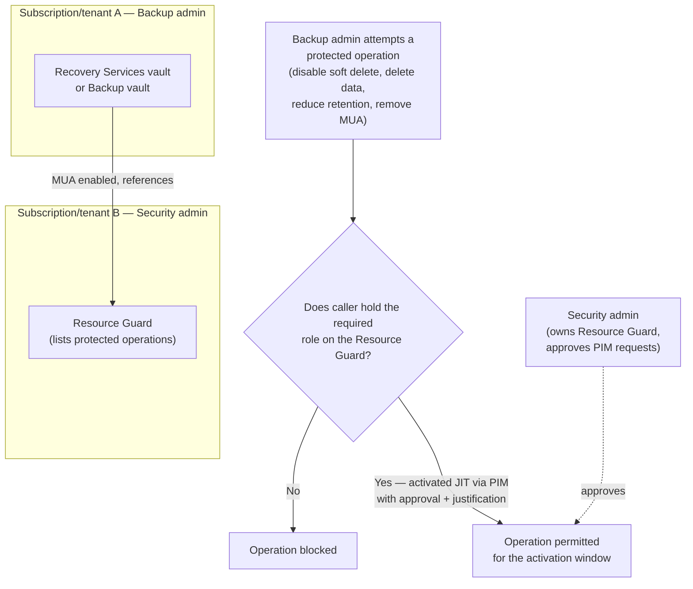
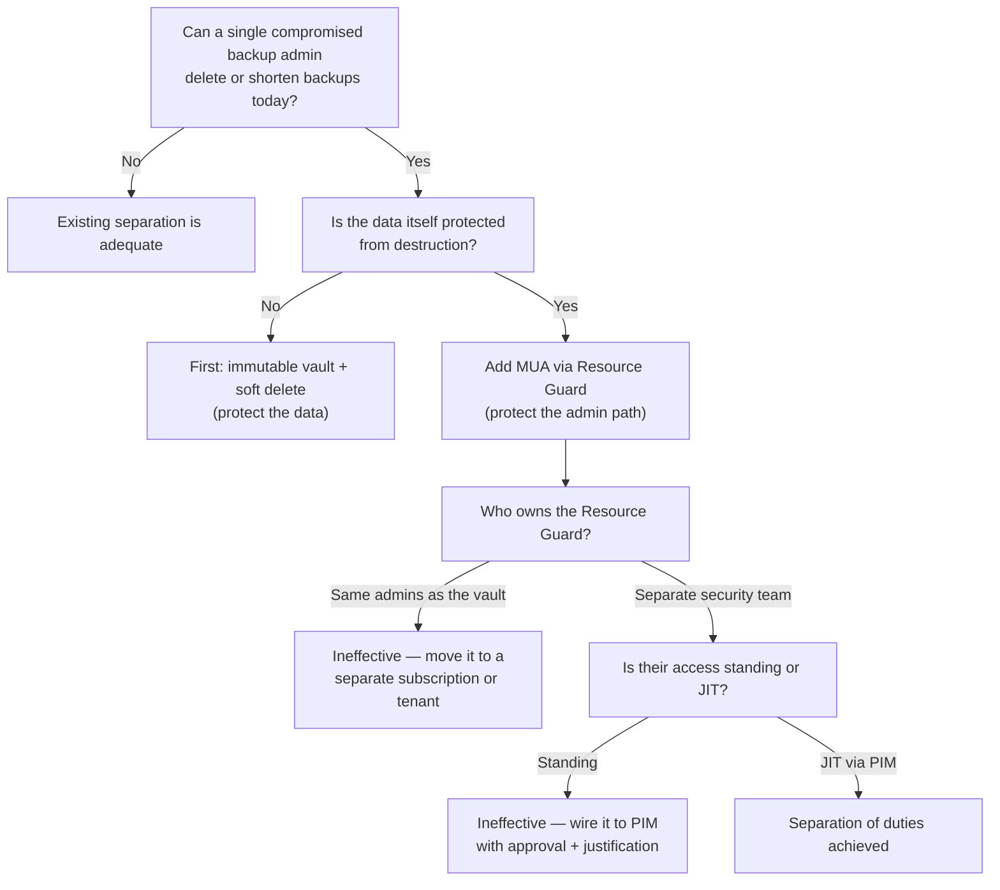

---
tags:
  - sc100
type: service
domain:
  - infrastructure
aliases:
  - Multi-User Authorization
  - MUA
  - Multi-user authorization for Azure Backup
status: needs-verification
---

# Resource Guard

## Purpose

A separate Azure resource that enforces **Multi-User Authorization (MUA)** on a Recovery Services vault or Backup vault — destructive backup operations fail unless the requester holds a second, independently owned permission on the Resource Guard.

---

## Why Architects Choose It

- Closes the gap [[Ransomware Resiliency and BCDR]] identifies as the core ransomware failure mode: an attacker who reaches **Backup Contributor** can disable soft delete, shorten retention, or stop-and-delete backups, then encrypt production with no recovery path. RBAC alone cannot stop this — the role legitimately holds those permissions.
- Introduces **separation of duties as an Azure control**, not a process document: the Backup admin owns the vault, a different Security admin owns the Resource Guard, and neither can act destructively alone.
- Composes with [[PIM]] to keep the second approval **just-in-time** — the Backup admin is *eligible* for access on the Resource Guard, activates with approval and justification for a bounded window, then loses it again. Standing dual-permission would defeat the purpose.
- Placing the Resource Guard in a **different tenant** raises the bar further: a single compromised tenant's Global Administrator cannot grant themselves the second permission.

---

## When to Use

- Any production backup estate where a single compromised identity currently has enough privilege to destroy recoverability.
- Ransomware-resilience designs that already have immutability and soft delete but no control over the *administrative* path to disabling them.
- Regulated workloads that must demonstrate separation of duties over data destruction.
- Multi-tenant or MSP scenarios where the customer wants the backup operator (possibly a partner) unable to unilaterally destroy backup data.

---

## When NOT to Use

- As a substitute for **immutability or soft delete** — MUA governs *who may perform* the destructive operation; immutable vaults and soft delete govern *whether the data can be destroyed at all*. Layer all three.
- Without [[PIM]] or an equivalent JIT/approval path — if the Backup admin permanently holds the Resource Guard role, MUA is theatre. The design only works when the second permission is time-bound and approved.
- With the Resource Guard in the same subscription and under the same admins as the vault — a compromise of that admin boundary defeats it.
- For non-backup resources — this is an Azure Backup / Azure Site Recovery construct, not a general-purpose approval gate. Org-wide "deny this action" belongs to [[Azure Policy]]; accidental-deletion protection belongs to resource locks.

---

## Architecture

**Placement, weakest to strongest:**

| Placement | Strength |
| --- | --- |
| Same subscription as the vault | Weakest — one admin boundary; largely symbolic. |
| Different subscription, same tenant | Good — separates RBAC, still one Entra tenant to compromise. |
| **Different tenant** | Strongest — cross-tenant authentication required; a compromised source-tenant Global Admin cannot self-grant. |

The Resource Guard must be in the **same region** as the vault it protects.

---

## Protected (Critical) Operations

Operations that MUA can gate, chosen when the Resource Guard is created:

| Operation | Why it matters |
| --- | --- |
| **Disable soft delete** | Always protected (mandatory) — removes the recovery window for deleted backup items. |
| **Remove MUA protection / unregister the Resource Guard** | Always protected (mandatory) — otherwise an attacker simply turns off the control first. |
| Modify backup policy (reduce retention) | Silently shortens the recoverable history without deleting anything visibly. |
| Modify protection / stop backup **with delete data** | The direct path to destroying recovery points. |
| Delete a protected backup instance | Same, at the item level (Backup vaults). |

The two mandatory operations are the ones that would otherwise let an attacker disarm the rest — everything else is optional and selected per Resource Guard.

---

## Roles and the JIT Flow

- The Backup admin needs an explicit role **on the Resource Guard** (Azure Backup provides dedicated MUA roles — an admin-level role to create/manage the Resource Guard and an operator-level role that can authorize protected operations but cannot delete the Resource Guard itself; `Contributor` on the Resource Guard also satisfies the check).
- Correct pattern: assign that role as a **[[PIM]]-eligible** assignment requiring approval, MFA, and justification, with a short activation window — see [[Securing Privileged Access]].
- Cross-tenant: the Backup admin must be able to authenticate into the Resource Guard's tenant (guest identity plus PIM there, or delegated access via [[Network Watcher and Lighthouse|Azure Lighthouse]]).
- Anti-pattern: granting Owner/Contributor on the Resource Guard's *subscription* to the same team that owns the vault — it re-merges the duties MUA was meant to split.

---

## Architecture Decisions

---

## Comparison

| Compare | Difference |
| --- | --- |
| **Resource Guard / MUA vs. Azure resource lock** | A `CanNotDelete` lock stops deletion of the *resource* and is removable by anyone with the right permission on that same resource — no second party involved. MUA gates *backup-specific data-destructive operations* and requires a permission on a **different resource owned by different people**. |
| **Resource Guard / MUA vs. soft delete** | MUA controls *who may perform* the destructive operation. Soft delete gives a recovery window *after* it happens. MUA prevents disabling soft delete — they are designed to be layered. |
| **Resource Guard / MUA vs. immutable vault** | Immutability makes recovery points unmodifiable/undeletable for their retention period regardless of identity; MUA governs the administrative actions around the vault (including attempts to unlock immutability). Immutability protects the data, MUA protects the controls. |
| **Resource Guard / MUA vs. RBAC least privilege** | RBAC decides which identity may act; MUA requires **two independently held** authorizations for the same act. Least privilege alone still leaves a single legitimate identity able to destroy backups. |
| **Resource Guard / MUA vs. [[Azure Policy]] deny** | Azure Policy denies an operation outright, org-wide, with no approved path — good for prohibitions. MUA allows the operation through a controlled, auditable, time-bound approval — good for legitimate-but-dangerous operations. |
| **MFA/security PIN (MARS/classic) vs. MUA** | The security PIN protects backup operations for the legacy MARS agent / classic experience with a shared PIN. MUA is the ARM-native, RBAC-and-PIM-integrated successor pattern for vault-level protection. |

---

## AZ-500 Review

AZ-500 covers Recovery Services vaults, backup RBAC roles (Backup Contributor/Operator/Reader), soft delete, and resource locks at an implementation level. Resource Guard/MUA is generally beyond that scope — the separation-of-duties construct and its PIM pairing are new here.

---

## What's New for SC-100

- Recognize that **RBAC least privilege is insufficient** for backup destruction risk, and that Microsoft's answer is a second, independently owned authorization rather than a tighter role.
- Design the **placement** of the Resource Guard (subscription vs. tenant) as a deliberate blast-radius decision, not a deployment detail.
- Combine MUA with [[PIM]] so the second authorization is JIT and approved — the exam's privileged-access thinking applied to a data-protection control.
- Slot MUA into the layered ransomware model from [[Ransomware Resiliency and BCDR]]: immutability + soft delete protect the *data*; MUA protects the *controls* over that data.

---

## Exam Tips

- "A compromised backup administrator could disable soft delete and delete backups — how do you prevent this?" → **Multi-User Authorization using a Resource Guard**, not a resource lock, not a tighter RBAC role.
- "Ensure the security team must approve destructive backup operations" → Resource Guard in a **separate subscription/tenant**, access granted **just-in-time via [[PIM]]**.
- A Resource Guard in the same subscription, owned by the same admins, is a distractor — the answer must include the ownership separation.
- Resource Guard and vault must be in the **same region**; the Resource Guard is a distinct ARM resource, not a vault setting.
- Disabling soft delete and removing MUA are always protected operations — an answer implying an attacker could simply turn MUA off first is wrong.
- MUA also applies to **Azure Site Recovery**, not just Azure Backup.

---

## Common Exam Confusion

- **MUA vs. resource lock** — two-party authorization on backup operations vs. a single-party, self-removable delete guard.
- **MUA vs. immutability** — control over the administrator's action vs. control over the data's mutability.
- **Resource Guard vs. Key Vault purge protection** — different services, same idea: prevent a privileged identity from permanently destroying recovery material (see [[Key Vault]]).
- **"Enable MUA" as a vault checkbox** — it requires creating and referencing a *separate* Resource Guard resource, ideally outside the vault's own control plane.

---

## Keywords

- Multi-User Authorization (MUA), Resource Guard
- Protected / critical operations
- Separation of duties, two-person rule for backups
- Backup admin vs. Security admin
- Cross-subscription / cross-tenant Resource Guard
- JIT authorization via PIM, approval + justification
- Disable soft delete, stop backup with delete data, reduce retention
- Immutable vault, soft delete, Cross Region Restore
- Azure Site Recovery MUA

---

## Related Services

- [[Ransomware Resiliency and BCDR]]
- [[PIM]]
- [[Securing Privileged Access]]
- [[Identity and Access Management (IAM)]]
- [[Key Vault]]
- [[Azure Policy]]
- [[Zero Trust]]
- [[Network Watcher and Lighthouse]]
- [[Microsoft Defender for Cloud]]

---

## References

- [Multi-user authorization using Resource Guard (Azure Backup)](https://learn.microsoft.com/en-us/azure/backup/multi-user-authorization) — Microsoft Learn
- [Configure multi-user authorization using Resource Guard](https://learn.microsoft.com/en-us/azure/backup/multi-user-authorization-concept) — Microsoft Learn
- [Immutable vaults for Azure Backup](https://learn.microsoft.com/en-us/azure/backup/backup-azure-immutable-vault-concept) — Microsoft Learn
- [[Exam Objectives]]

---

## Verification Flag

The exact set of protected operations differs between Recovery Services vaults and Backup vaults, and Azure Backup's dedicated MUA role names (vs. plain `Contributor` on the Resource Guard) have been revised since the feature shipped. Re-verify the mandatory-vs-optional operation list and the current role names against Microsoft Learn before relying on them for an exam answer.
