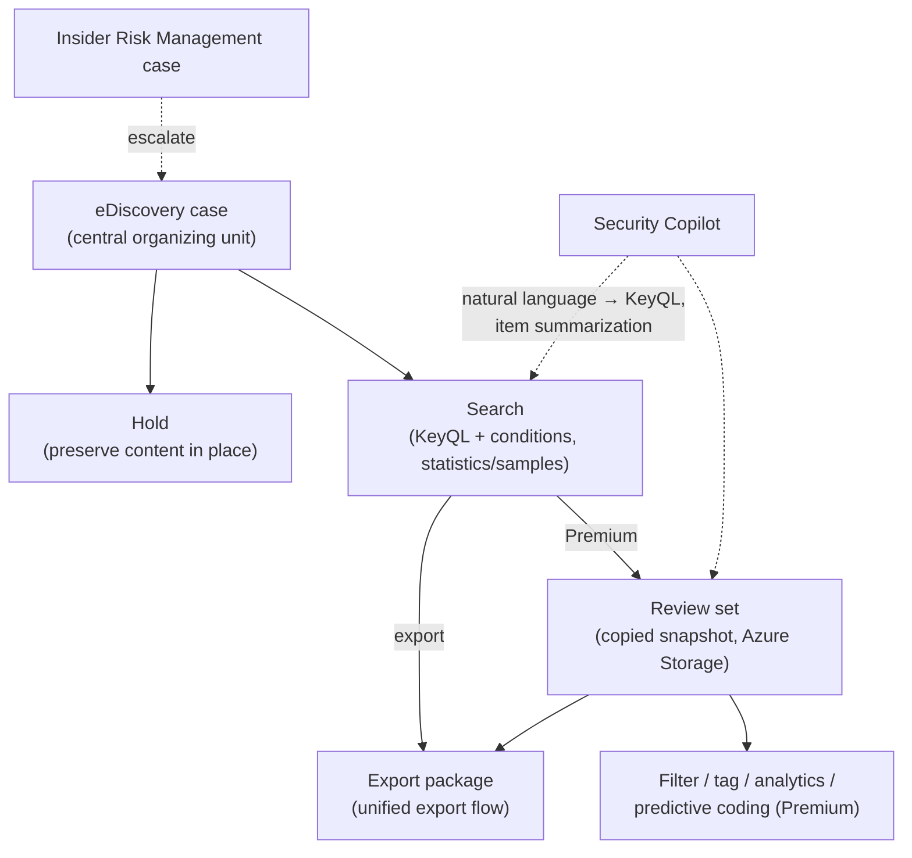
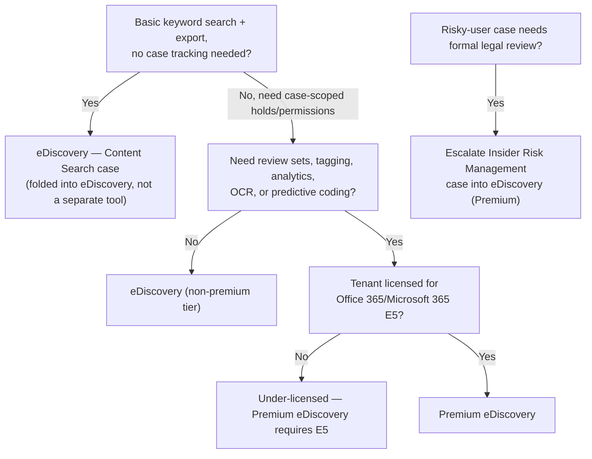

---
tags:
  - sc100
type: concept
domain:
  - ops-identity-compliance
aliases:
  - Microsoft Purview eDiscovery
  - Content Search
status: needs-verification
---

# Microsoft Purview eDiscovery

## Purpose

Identify, preserve, collect, review, and export electronically stored information (ESI) across Exchange, Teams, SharePoint, OneDrive, Microsoft 365 Groups, and Viva Engage for legal cases and investigations — in the **current, unified Microsoft Purview portal experience**, not the classic Content Search/Standard/Premium tools it replaced.

---

## Why Architects Choose It

- Litigation, regulatory investigation, and internal HR/legal inquiries need a **preserve-first** workflow — a **hold** stops content from being deleted or modified the moment a case opens, before anyone has searched or reviewed anything.
- Centralizing search, hold, and export in one case-scoped tool with **role-based permissions** keeps legal/investigation access separate from general admin access — an eDiscovery manager only sees the cases they're a member of.
- Integration with **Insider Risk Management** means a risky-user case can escalate directly into a legal-grade eDiscovery case without re-collecting evidence from scratch.
- **Security Copilot** inside eDiscovery turns natural language into KeyQL search syntax and summarizes review-set items — lowers the skill floor for building precise searches without learning query syntax first.

---

## Classic eDiscovery Is Retired — Know This First

Microsoft retired **all classic eDiscovery experiences on August 31, 2025**: classic **Content Search**, classic **eDiscovery (Standard)**, and classic **eDiscovery (Premium)**. That three-tier model (Content Search → Standard → Premium) is now **legacy** and applies only to organizations hosted in **Microsoft 365 operated by 21Vianet (China)**. Everywhere else, eDiscovery lives in the **Microsoft Purview portal** as two tiers: **eDiscovery** and **Premium eDiscovery**.

If a scenario or older study material names "**eDiscovery (Standard)**" or "**eDiscovery (Premium)**" or treats "**Content Search**" as a separate standalone tool, it's describing the retired model — the current answer is the unified Purview portal experience below.

---

## Current Model: eDiscovery vs. Premium eDiscovery

| Capability | eDiscovery | Premium eDiscovery |
| --- | --- | --- |
| Search content, KeyQL queries/conditions | ✔ | ✔ |
| Search statistics and samples | ✔ | ✔ |
| Export search results | ✔ | ✔ |
| Role-based permissions | ✔ | ✔ |
| Case management | ✔ | ✔ |
| Place content locations on **hold** | ✔ | ✔ |
| Search and **delete** data (mail, Teams chat, Copilot/AI app data) | ✔ | ✔ |
| Graph API — delegated auth | ✔ | ✔ |
| Advanced indexing | — | ✔ |
| Review sets (+ import external data into them) | — | ✔ |
| Cloud attachments / SharePoint version support | — | ✔ |
| Optical character recognition (OCR) | — | ✔ |
| Conversation threading | — | ✔ |
| Decryption (Purview Message Encryption, sensitivity labels, Azure RMS) | — | ✔ |
| Review set filtering, saved queries | — | ✔ |
| Review set KQL queries (preview), Query Report (preview) | — | ✔ |
| Tagging | — | ✔ |
| Analytics (near-duplicate detection, email threading, themes) | — | ✔ |
| Computed document metadata | — | ✔ |
| Guest user access (preview) | — | ✔ |
| Security Copilot (KeyQL drafting, item summarization) | — | ✔ |
| Graph API — app-only auth | — | ✔ |

**Licensing**: base eDiscovery is broadly included; **Premium eDiscovery requires Office 365 E5 or Microsoft 365 E5** (or the related E5 compliance add-ons) — same licensing-gate pattern as everywhere else in [[Microsoft 365 Licensing]].

---

## What Changed vs. the Retired Classic Model

| Classic concept | Current equivalent | What actually changed |
| --- | --- | --- |
| **Collections** (immutable estimate, added to a review set) | **Statistics** in Search | Searches are **no longer immutable** — you can update a search at any time, even after its results are already in a review set. There's no separate "commit a collection" step. |
| **Advanced indexing** (a manual, separate reindex step before searching) | **Advanced indexing** (automatic) | Now runs **automatically, just-in-time**, during search, when adding results to a review set, or on export — no more stale-index problem from search and indexing running as separate sequential steps. |
| **Content Search** (a standalone tool) | Folded into eDiscovery | All Content Search functionality lives inside a **system-generated eDiscovery case** available by default to **eDiscovery Manager** and **Administrator** role group members, or you can spin up a dedicated **Content Search case** — same capabilities as any other case (holds, review sets, etc.), not a separate tool anymore. |
| **Custodians** as the primary workflow unit | **Cases** as the primary workflow unit | People, groups, and data sources are still added to investigations, but the **case** — not the custodian — is now the central organizing object. |
| **Jobs** (tasks/activities/reports) | **Processes** | Renamed only — same long-running-task tracking concept, now with a dedicated **Process report** across cases, searches, review sets, and holds. |
| Export flow | Unified export | One export structure shared across premium and non-premium features, with faster performance, detailed reporting, and flexible options (metadata, native files, text, tags, redacted PDFs, or straight to a customer-owned Azure Storage account — Premium only). |

---

## Core Concepts (Current Experience)

- **Case** — the central container: holds, searches, review sets, and members all belong to a case. Members control who can access and view that case's content — the same access-scoping role Purview **Collections** play for data governance generally (see [[Purview]]).
- **Hold** — preserves content in place (Exchange, SharePoint, OneDrive, Teams, etc.) against deletion or modification for the duration of the case. This is the "stop the shredder" step and should happen **before** deep searching/review, not after.
- **Search** — KeyQL keyword queries plus conditions, scoped to specific locations; results carry **statistics** (counts, sizes, top locations) and a representative **sample** — and can be re-run/updated at any time.
- **Review set** *(Premium only)* — a static, copied-in snapshot of selected search results in Microsoft-managed Azure Storage, where you filter, tag, run analytics, and apply predictive prioritization without touching the live source data.
- **Search and delete data** — eDiscovery isn't only preserve/collect; it can also search for and **delete** specific mail messages, Teams chat messages, or Copilot/AI application data found to be harmful or high-risk — a removal capability, not just an evidence-collection one.

---

## Architecture

---

## Architecture Decisions

---

## Comparison

| Compare | Difference |
| --- | --- |
| eDiscovery vs. Premium eDiscovery | Base tier: search, hold, case management, export, delete. Premium adds review sets, advanced indexing, tagging/analytics/predictive coding, OCR, decryption, Security Copilot, and app-only Graph API auth — gated behind Office 365/Microsoft 365 E5. |
| eDiscovery vs. eDiscovery (Standard)/(Premium) *(retired)* | The retired names described a three-tier classic model (Content Search → Standard → Premium) that ended 2025-08-31 outside 21Vianet China. The current model is two-tier (eDiscovery / Premium eDiscovery) inside the unified Purview portal — don't recommend the retired names for a current-state design. |
| eDiscovery hold vs. [[Data Classification and Protection\|Records Management retention]] | Hold = reactive preservation for a specific, active legal case. Retention/records management = proactive, planned disposal/retention schedule applied org-wide regardless of any particular case — see [[Compliance and Privacy]]'s existing eDiscovery-vs-Records-Management row. |
| eDiscovery vs. Priva Subject Rights Requests | eDiscovery collects evidence for organization-side legal cases/investigations. Subject Rights Requests fulfills an *individual's* data access/erasure request under privacy law — different legal basis entirely; see [[Priva]]. |
| Collections (retired) vs. Statistics | Collections were an immutable, one-time estimate you committed to a review set. Statistics are live and re-runnable — the underlying search can be updated at any point, even after results already sit in a review set. |

---

## AZ-500 Review

AZ-500 does not cover eDiscovery at all — it's a Microsoft 365 compliance capability outside AZ-500's Azure-infrastructure scope. Everything here, including the classic-to-current terminology shift, is new for SC-100.

---

## What's New for SC-100

- Recognize the classic Content Search/Standard/Premium naming as **retired** (2025-08-31, except 21Vianet China) and recommend the current unified eDiscovery/Premium eDiscovery model instead.
- Map the terminology shift explicitly: Collections → Statistics, manual Advanced Indexing → automatic just-in-time indexing, standalone Content Search → a case type inside eDiscovery, Custodian-centric → Case-centric, Jobs → Processes.
- Treat **Premium eDiscovery's E5 licensing gate** as an explicit sizing decision, the same pattern used throughout [[Microsoft 365 Licensing]].
- Know the **Insider Risk Management → eDiscovery (Premium) escalation path** as a named integration, not a manual re-collection process.
- Recognize Security Copilot's role here is narrow — natural-language-to-KeyQL query drafting and review-set item summarization — not autonomous case management.

---

## Exam Tips

- A scenario naming "eDiscovery (Standard)" or "eDiscovery (Premium)" or "Content Search" as separate, current products is describing the **retired classic model** — the current answer is eDiscovery / Premium eDiscovery in the Purview portal.
- "Preserve content for litigation before it can be deleted" → a **hold**, not Records Management (which is planned retention/disposal, not litigation response).
- "Tag, filter, and run predictive coding across collected content" → **Premium eDiscovery** (review sets), not base eDiscovery.
- A tenant without Office 365/Microsoft 365 E5 requesting review sets, analytics, or predictive coding is under-licensed for Premium eDiscovery.
- "Escalate a risky-user investigation into a formal legal case" → Insider Risk Management case escalated **into eDiscovery (Premium)**, not a manually rebuilt eDiscovery case.
- "Draft a complex search query without knowing KeyQL syntax" → Security Copilot's natural-language-to-KeyQL feature, Premium only.

---

## Common Exam Confusion

- **Classic eDiscovery (Standard/Premium/Content Search) vs. current eDiscovery/Premium eDiscovery** — the single biggest trap here; the classic three-tier model is retired outside 21Vianet China.
- **Hold vs. Records Management retention** — reactive, case-scoped legal preservation vs. proactive, org-wide planned retention/disposal.
- **eDiscovery vs. Priva Subject Rights Requests** — organizational legal collection vs. an individual's privacy-rights request.
- **Collections (retired) vs. Statistics** — immutable one-time estimate vs. live, re-runnable search results.

---

## Keywords

- Microsoft Purview eDiscovery, Premium eDiscovery
- Retired: classic Content Search, eDiscovery (Standard), eDiscovery (Premium) — 2025-08-31, except 21Vianet China
- Case, hold, search, review set, custodian, statistics, sample
- KeyQL (Keyword Query Language), conditions
- Advanced indexing (automatic, just-in-time)
- Tagging, analytics, predictive coding, near-duplicate detection, email threading, themes
- OCR, conversation threading, decryption
- Guest user access (preview), Security Copilot (KeyQL drafting, summarization)
- Insider Risk Management escalation
- Office 365 E5 / Microsoft 365 E5 licensing gate (Premium)
- Search and delete data (mail, Teams chat, Copilot/AI app data)
- Processes (formerly Jobs)

---

## Related Services

- [[Purview]]
- [[Purview Compliance Manager]]
- [[Compliance and Privacy]]
- [[Priva]]
- [[Data Classification and Protection]]
- [[Microsoft 365 Licensing]]
- [[Microsoft Security Copilot]]
- [[Exam Objectives]]

---

## References

- [Learn about eDiscovery (current Purview portal experience)](https://learn.microsoft.com/en-us/purview/edisc) — Microsoft Learn
- [Microsoft Purview eDiscovery legacy solutions (retired, 21Vianet China only)](https://learn.microsoft.com/en-us/purview/ediscovery) — Microsoft Learn
- [[Exam Objectives]]

---

## Verification Flag

Several capabilities are explicitly marked **preview** in current documentation (review set KQL queries, Query Report, guest user access) and may reach GA, changing their feature-comparison row. Re-verify the eDiscovery vs. Premium eDiscovery capability table and preview statuses against Microsoft Learn close to exam date.
