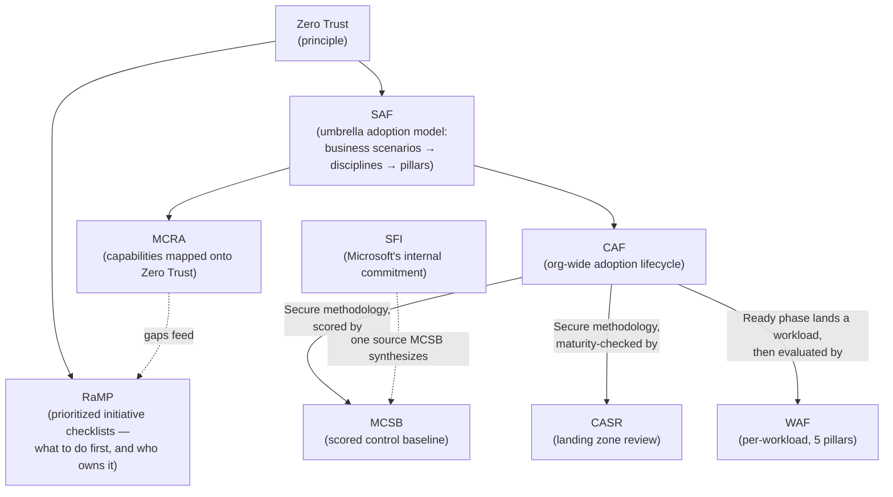

---
tags:
  - sc100
type: cheat-sheet
---
# Frameworks Cheat Sheet

Microsoft's overlapping strategy/architecture frameworks — one-line definitions + trigger keywords for fast recall. Full detail lives in each framework's own note; this page is the lookup table.

## Quick Reference Table

| Acronym | Full Name | One-liner | Recognize by (keywords) |
| --- | --- | --- | --- |
| [[Azure Well-Architected Framework (WAF)\|WAF]] | Azure Well-Architected Framework | Five pillars + self-assessment review evaluating **one workload's** architecture (Security is one of five pillars). | "Well-Architected Review", "five pillars", "per-workload", "trade-off analysis" |
| [[Cloud Adoption Framework (CAF)\|CAF]] | Cloud Adoption Framework | Seven-methodology roadmap sequencing **org-wide** adoption and ongoing governance/security. | "Strategy/Plan/Ready/Adopt/Govern/Secure/Manage", "[[Azure Landing Zones\|landing zone]]", "adoption lifecycle" |
| [[Cloud Adoption Security Review (CASR)\|CASR]] | Cloud Adoption Security Review | Checklist review scoring an **already baseline-secured** landing zone against CAF's Secure methodology. | "self-assessment vs. Microsoft-led", "CSAM", "baseline already met" |
| [[Microsoft Cloud Security Benchmark (MCSB)\|MCSB]] | Microsoft Cloud Security Benchmark | Scored, cross-cloud **control baseline**, pre-mapped to CIS/NIST/PCI-DSS; powers Secure Score. | "Domain / Control / Subcontrol", "pre-mapped to CIS/NIST/PCI-DSS", "Secure Score benchmark" |
| [[Microsoft Cybersecurity Reference Architectures (MCRA)\|MCRA]] | Microsoft Cybersecurity Reference Architectures | Downloadable deck mapping Microsoft (+ 3rd-party) **capabilities onto Zero Trust** — target-state / gap-analysis tool. | "capability reference architecture", "target-state architecture", "gap analysis", "CISO workshop" |
| [[Zero Trust]] | Zero Trust | Trust-verification **principle** (verify explicitly, least privilege, assume breach) used to evaluate any control. | "verify explicitly", "assume breach", "least privilege" |
| [[Rapid Modernization Plan (RaMP)\|RaMP]] | Rapid Modernization Plan | Zero Trust's **execution layer** — prioritized initiative checklists with deployment objectives and named accountable/responsible owners. | "where do we start", "quick wins", "30/90 days", "initiatives", "accountable and responsible" |
| [[Security Adoption Framework (SAF)\|SAF]] | Security Adoption Framework (Microsoft security adoption model) | Umbrella, role-aware model — business scenarios → security disciplines → technology pillars — unifying MCRA, SDL, Zero Trust/CISO workshops, IR playbooks. | "business scenarios / security disciplines / technology pillars", "SAF workshops", "security adoption model" |
| [[Secure Future Initiative (SFI)\|SFI]] | Secure Future Initiative | Microsoft's own internal engineering commitment — six pillars mapped to Zero Trust + NIST CSF; a source MCSB synthesizes. | "Secure by Design/Default/Operations", "six pillars", "NIST CSF mapping" |

## How the Frameworks Relate

Not eight competing choices — one principle, one umbrella model, and a set of roadmaps/scorecards that plug into each other:

- **[[Zero Trust]]** is the principle every other framework here is judged against — it has no scorecard of its own; **[[Rapid Modernization Plan (RaMP)|RaMP]]** is the checklist-level plan that sequences the work toward it, sitting below SAF and above product configuration.
- **[[Security Adoption Framework (SAF)\|SAF]]** is the umbrella: it integrates [[Microsoft Cybersecurity Reference Architectures (MCRA)\|MCRA]] (capability mapping), [[Cloud Adoption Framework (CAF)\|CAF]] (adoption lifecycle), SDL, and CISO workshops into one role-aware model — CAF and MCRA are inputs into SAF, not synonyms for it.
- **[[Cloud Adoption Framework (CAF)\|CAF]]** sequences *when* controls appear org-wide; its **Secure** methodology is what gets *scored* by [[Microsoft Cloud Security Benchmark (MCSB)\|MCSB]] and *maturity-checked* by [[Cloud Adoption Security Review (CASR)\|CASR]] once a landing zone is baseline-secure.
- **[[Azure Well-Architected Framework (WAF)\|WAF]]** picks up *after* CAF's Ready phase lands a workload in an application landing zone — it evaluates that one workload's architecture, CAF doesn't reach that depth.
- **[[Secure Future Initiative (SFI)\|SFI]]** is Microsoft's own internal engineering commitment, not something you adopt directly — it's one of the sources [[Microsoft Cloud Security Benchmark (MCSB)\|MCSB]] synthesizes into customer-facing controls.
- Net effect: **Zero Trust** sets the target, **SAF** sequences the org-wide modernization, **CAF** operationalizes it as an adoption lifecycle, **WAF** checks the resulting workload, and **MCSB/CASR** score how well any of it actually landed.

---

## Confusion Pairs

| Compare | Difference |
| --- | --- |
| WAF vs. CAF | WAF = one workload, five pillars. CAF = org-wide, seven methodologies. |
| CAF vs. CASR | CAF is the roadmap itself; CASR is the point-in-time review that scores a landing zone against CAF's Secure methodology. |
| MCSB vs. MCRA | MCSB = scored control baseline (compliance). MCRA = capability reference architecture (target-state design). Exam objective names them together — easy to conflate. |
| CASR vs. Well-Architected Review | CASR reviews landing zone security only; the Well-Architected Review evaluates one workload across all five WAF pillars. |
| WAF (framework) vs. [[Azure Firewall\|Azure Web Application Firewall]] | Identical acronym, unrelated: one is an architecture-evaluation framework, the other filters HTTP(S) traffic to web apps. |
| MCRA vs. Zero Trust | Zero Trust defines the principles; MCRA maps specific products onto those principles. |
| RaMP vs. MCRA | RaMP is the ordered plan of action with named owners; MCRA is the target-state capability picture. Plan vs. destination. |
| RaMP vs. SAF | RaMP is a tactical, checklist-level accelerator; SAF is the umbrella, role-aware adoption model RaMP sits inside. |
| SAF vs. MCRA | SAF is the umbrella adoption model (business scenarios → security disciplines → technology pillars); MCRA is one integrated input into it, not a synonym. |
| SAF vs. CAF | SAF is product-/cloud-agnostic, end-to-end security modernization; CAF's Secure methodology is the security track specifically within Azure's adoption lifecycle. |
| SFI vs. MCSB | SFI is Microsoft's own internal engineering commitment (a source); MCSB is the customer-facing scored control baseline that partly synthesizes it. |

## Decision Shortcut

| Question | Answer |
| --- | --- |
| One workload's architecture trade-offs? | [[Azure Well-Architected Framework (WAF)\|WAF]] (Well-Architected Review) |
| Org-wide adoption sequencing / landing zone design? | [[Cloud Adoption Framework (CAF)\|CAF]] |
| Landing zone already baseline-secure, need a maturity checkpoint? | [[Cloud Adoption Security Review (CASR)\|CASR]] |
| Need a scored, regulation-mapped control baseline? | [[Microsoft Cloud Security Benchmark (MCSB)\|MCSB]] |
| Need a capability/target-state diagram or gap analysis? | [[Microsoft Cybersecurity Reference Architectures (MCRA)\|MCRA]] |
| Evaluating whether a design satisfies trust principles? | [[Zero Trust]] |
| "Where do we start?" — a prioritized backlog with named owners and 30/90-day stages? | [[Rapid Modernization Plan (RaMP)\|RaMP]] |
| Need a role-aware, end-to-end security modernization roadmap (business → discipline → implementation)? | [[Security Adoption Framework (SAF)\|SAF]] |
| Explaining why Microsoft enforces a secure default or deprecates a legacy protocol? | [[Secure Future Initiative (SFI)\|SFI]] |

## Keywords Index (fast lookup)

- "five pillars", "per-workload" → WAF
- "seven methodologies", "landing zone", "adoption lifecycle" → CAF
- "self-assess a landing zone", "already baseline-secure" → CASR
- "pre-mapped to CIS/NIST/PCI-DSS", "Domain/Control/Subcontrol" → MCSB
- "capability mapping", "target-state architecture", "gap analysis" → MCRA
- "verify explicitly", "assume breach", "least privilege" → Zero Trust
- "where do we start", "quick wins", "30/90 days", "accountable and responsible owners" → RaMP
- "business scenarios / security disciplines / technology pillars", "SAF workshops" → SAF
- "Secure by Design/Default/Operations", "six pillars", "NIST CSF mapping" → SFI

## Related Services

- [[Cloud Adoption Framework (CAF)]]
- [[Azure Well-Architected Framework (WAF)]]
- [[Cloud Adoption Security Review (CASR)]]
- [[Microsoft Cloud Security Benchmark (MCSB)]]
- [[Microsoft Cybersecurity Reference Architectures (MCRA)]]
- [[Zero Trust]]
- [[Security Adoption Framework (SAF)]]
- [[Secure Future Initiative (SFI)]]
- [[Rapid Modernization Plan (RaMP)]]
- [[Security Posture Assessments]]
- [[Azure Landing Zones]]
